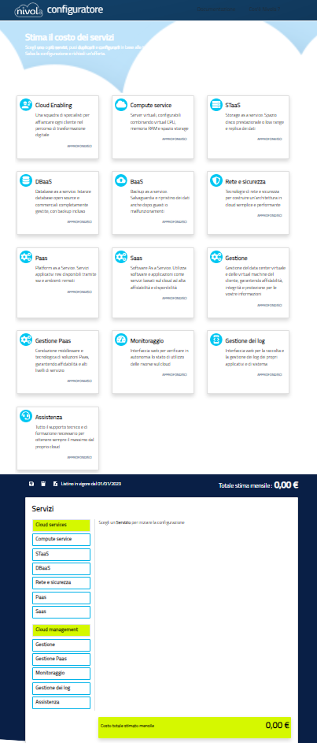

.. _Configuratore:

**Configuratore**
#################

MOOn è un servizio di modulistica cloud open source, reso disponibile sul cloud Nivola, che consente di costruire moduli on line per 
digitalizzare le richieste presentate da cittadini e imprese alle pubbliche amministrazioni. Con MOOn è possibile gestire l’iter di 
configurazione, pubblicazione e raccolta in formato digitale delle richieste, in modo trasversale rispetto alle tematiche trattate 
dagli enti pubblici (demografia, tributi, edilizia, servizi per il personale...). 
Viene fornito come soluzione pronta all’uso, con flussi e modelli standard, e possono essere configurati in autonomia modelli relativi 
a nuovi servizi digitale

Link esterno: https://pricing.nivolapiemonte.it/configuratore/config-cloud-home