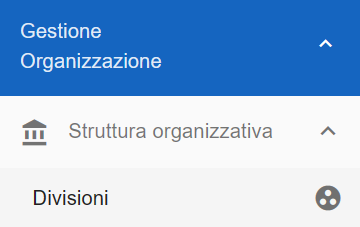
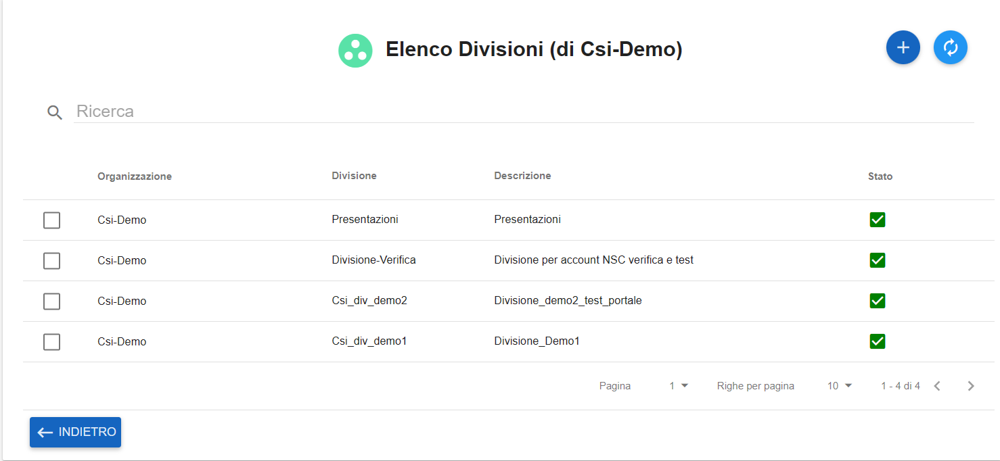
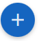
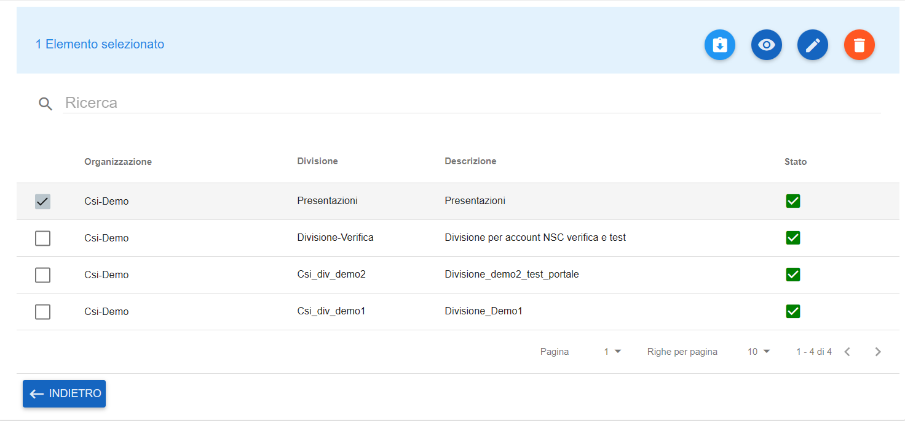
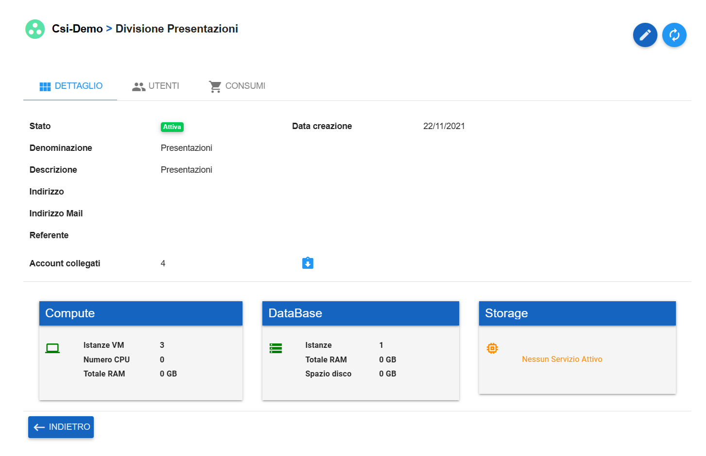
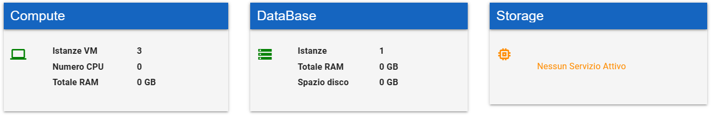
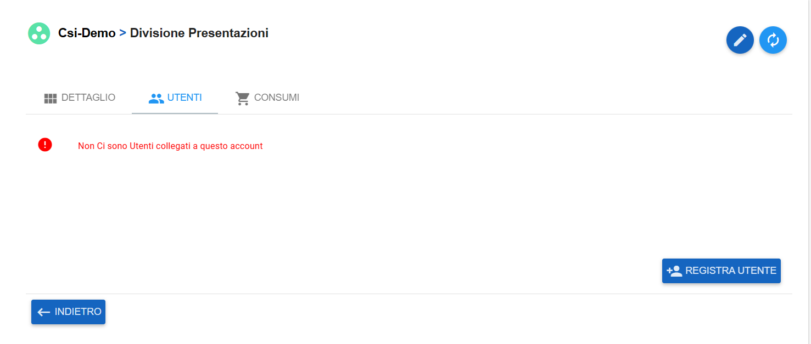
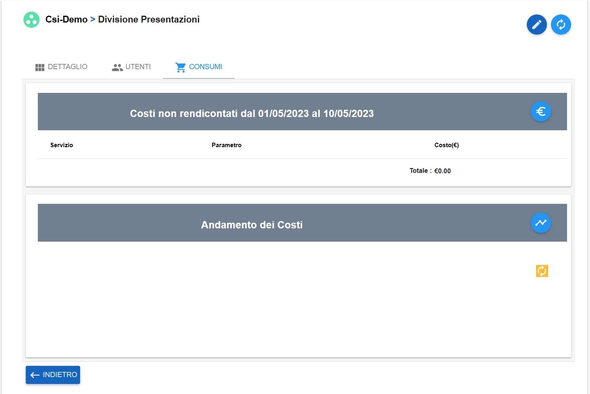

.. _Master_di_Organizzazione:

**Master di Organizzazione**
############################

Per visualizzare i **dettagli** delle **Divisioni** sotto un’ **Organizzazione** procedere nel seguente modo:

●	Accedere al **Service Portal** come Master di Organizzazione

●	Premere sulla scheda **Gestione Organizzazione → Struttura Organizzativa → Divisioni**

|

●	Cliccando su **Divisioni**, il portale restituisce un elenco delle divisioni appartenenti all’organizzazione gestita dall’utente

|

In questa pagina si possono vedere le **specifiche generali** delle divisioni:

●	Nome dell’organizzazione di origine

●	Nome delle divisione appartenente all’organizzazione

●	Descrizione della divisione

●	Stato della divisione

|

Le funzionalità disponibili in questa pagina sono:

●	Creazione di una nuova Divisione

●	Refresh dell’elenco Divisioni

|

Premendo sul checkbox a sinistra del Nome Organizzazione (uno solo alla volta) si abilitano delle funzioni 
specifiche per la divisione scelta:

●	Reindirizzamento agli account legati alla divisione

●	Dettaglio della divisione

.. image:: img/03_dettaglio.png

●	Modifica della divisione 

●	Eliminazione della divisione

|

Premendo il bottone **Dettaglio Divisione**, l’utente visualizza la pagina di Dettaglio della Divisione scelta:

|

|

La scheda **DETTAGLIO** fornisce all’utente informazioni dettagliate sulla divisione, quali:

●	Stato 

●	Denominazione 

●	Descrizione

●	Indirizzo geografico

●	Indirizzo Email

●	Referente 

●	Data Creazione

|

●	Account Collegati → il bottone   reindirizza l’utente all’elenco Account collegati alla divisione scelta

|

Sotto la prima parte di dettaglio si trovano i servizi di Compute, DataBase e Storage della divisione scelta

|

Nella scheda **UTENTI** si ritrova un elenco degli utenti abbinati alla divisione selezionata, 
con la possibilità di registrarne uno nuovo:

|

Nell’ultima scheda CONSUMI si ritrova un elenco dei costi e consumi specifici per la divisione scelta:

|

Il bottone arancione  serve a refreshare il grafico dell’Andamento dei Costi:

|

.. toctree::
   :maxdepth: 2

   40.0_Consultare_costi_e_consumi.rst
