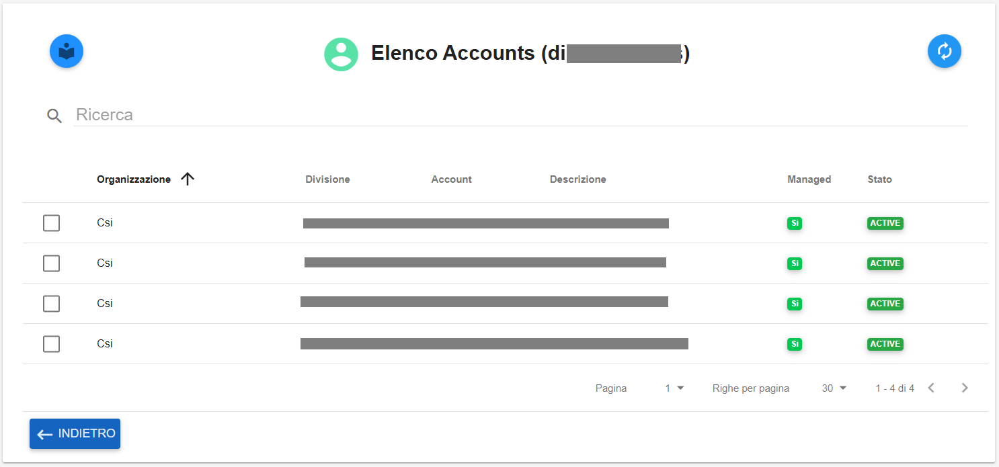

**Master di Organizzazione**
############################

Per visualizzare i **dettagli** delle **Divisioni** sotto un’ **Organizzazione** procedere nel seguente modo:

●	Accedere al Service Portal come **Master di Organizzazione**

●	Premere sulla scheda **Gestione Organizzazione → Struttura Organizzativa → Divisioni**

.. image:: img/03_Org1sx.png

|

●	Cliccando su **Divisioni**, il portale restituisce un elenco delle divisioni appartenenti all’organizzazione gestita dall’utente

.. image:: img/03_Org2dx.png

|

In questa pagina si possono vedere le **specifiche generali** delle divisioni:

●	Nome dell’organizzazione di origine

●	Nome delle divisioni appartenenti all’organizzazione

●	Descrizione della divisione

●	Stato della divisione

|

Le funzionalità disponibili in questa pagina sono:

●	Creazione di una nuova Divisione

.. image:: img/03_piu.png

|

●	Refresh dell’elenco Divisioni

.. image:: img/03_refresh.png

|

Selezionando una **Divisione** e selezionando il checkbox alla sua sinistra si abilitano le seguenti funzioni:

●	Reindirizzamento agli account legati alla divisione

.. image:: img/03_reindirizza.png

|

●	Dettaglio della divisione

.. image:: img/03_dettaglio.png

|    

●	Modifica della divisione 

.. image:: img/03_modifica.png

|    

●	Eliminazione della divisione

.. image:: img/03_elimina.png

|

|

:Dettaglio Divisione:

l’utente visualizza la pagina di Dettaglio della Divisione scelta:

.. image:: img/03_dettaglio_divisione.png

.. image:: img/03_dettaglio_divisioneDX.png

|

Il tab **DETTAGLIO** fornisce all’utente informazioni dettagliate sulla divisione, quali:

●	Stato 

●	Denominazione 

●	Descrizione

●	Indirizzo Email

●	Referente 

●	Data Creazione

|

|

:Account Collegati:

il pulsante reindirizza l’utente all’elenco Account collegati alla divisione scelta

.. image:: img/03_reindirizza.png

|

Nel tab **CONSUMI** si ritrova un elenco dei costi e consumi specifici per la divisione scelta:

.. image:: img/03_Consumi.png

|

Il pulsante arancione serve a refreshare il grafico dell’Andamento dei Costi:

.. image:: img/03_refresh2.png
