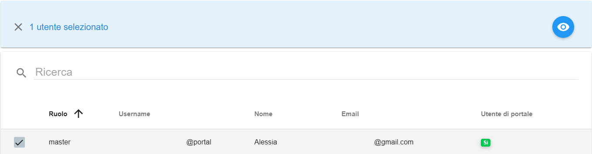

.. _Master_di_Division:

**Master di Division**
######################

Per visualizzare i **dettagli** degli **Account** sotto una **Divisione** procedere nel seguente modo:

●	Accedere al Service Portal come Master di Divisione

●	Premere sulla scheda **Gestione Organizzazione → Struttura Organizzativa → Accounts**

.. image:: img/04_GestDivSx.png

|

Premendo su Accounts, il portale restituisce un elenco degli account appartenenti alla divisione

.. image:: img/04_ElencoDx.png

|

In questa pagina si possono vedere le specifiche generali degli account:

●	Nome dell’organizzazione

●	Nome delle divisione

●	Nome dell’account

●	Descrizione dell’account

●	Gestione dell’account (SI/NO)

●	Stato dell’account 

|

Le funzionalità disponibili in questa pagina sono le seguenti:

●	Refresh dell’elenco Account

.. image:: img/04_refresh.png

|

Premendo sul checkbox a sinistra del Nome Organizzazione (uno solo alla volta) si abilitano delle funzioni specifiche per la divisione scelta:

●	Elenco Attività dell’account

.. image:: img/04_attivita.png

●	Visualizzazione dettaglio account

.. image:: img/04_dettaglio.png

|

.. image:: img/04_dettaglioDx.png

|

Premendo il bottone **Dettaglio Account**, l’utente visualizza la pagina di Dettaglio dell’Account selezionato:

.. image:: img/04_dettaglioDxOK.png

|

In questa sezione l’utente visualizza diverse pagine con diverse funzionalità:
Le funzionalità generali per tutte le finestre sono:

●	Refresh dei dati

.. image:: img/04_refresh.png

|

Ci sono diverse schede nel dettaglio account:

●	**DETTAGLIO** fornisce all’utente informazioni dettagliate sull’account

●	**UTENTI** fornisce l’elenco degli utenti con accesso all’account scelto con possibilità di maggiori dettagli selezionandoli dal checkbox e premendo il tasto “Dettagli” in alto a destra

●	**CONSUMI** per un dettaglio sulle spese dell’account

●	**SERVIZI** come elenco dei servizi aggiuntivi richiesti per l’account, che vanno da VM a DataBase, a Storage, ecc…

●	**QUOTE** 

●	**SERVIZI DI GESTIONE ABILITATI** per un elenco dei servizi di gestione dell’account richiesti o attivabili

●	**ALLEGATI**

●	**WBS**

|

Scendendo sotto la prima parte di dettaglio si trovano i servizi di Compute, DataBase e Storage dell’account scelto:

.. image:: img/04_ComDataStor.png
