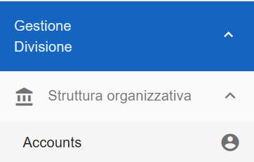
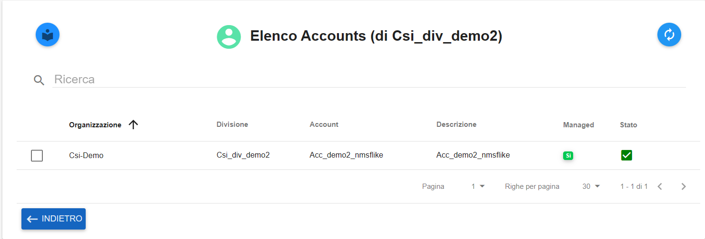
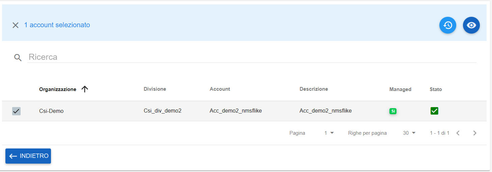
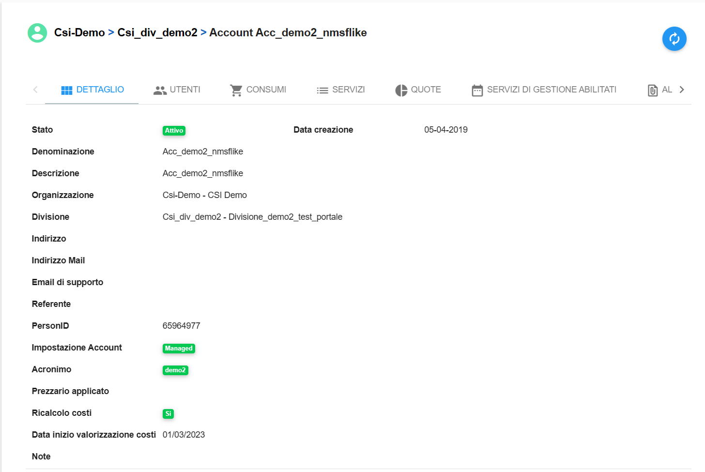
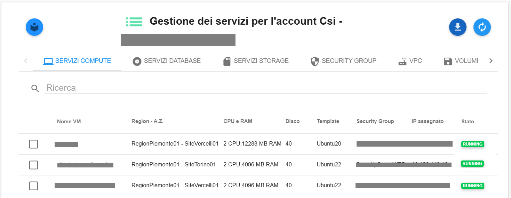
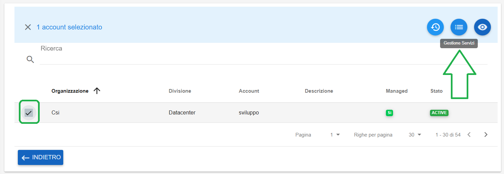

**Master di Division**
######################

Per visualizzare i **dettagli** degli **Account** sotto una **Divisione** procedere nel seguente modo:

●	Accedere al Service Portal come Master di Division

●	Premere sulla scheda **Gestione Divisione → Struttura Organizzativa → Accounts**

|

Premendo su **Accounts**, il portale restituisce l'elenco degli account appartenenti alla divisione

|

In questa pagina si possono vedere le specifiche generali degli account:

●	Nome dell’organizzazione

●	Nome delle divisione

●	Nome dell’account

●	Descrizione dell’account

●	Gestione dell’account (SI/NO)

●	Stato dell’account 

|

Le funzionalità disponibili in questa pagina sono le seguenti:

●	Refresh dell’elenco Account

.. image:: img/04_refresh.png

|

Selezionando un **Account** e selezionando il checkbox alla sua sinistra si abilitano le seguenti funzioni:

●	Elenco Attività dell’account

|

●	Visualizzazione dettaglio account

|

Premendo il pulsante **Dettaglio Account**, l’utente visualizza la pagina di Dettaglio dell’Account selezionato:

|

Ci sono diverse schede nel dettaglio account:

●	**DETTAGLIO** fornisce all’utente informazioni dettagliate sull’account

●	**UTENTI** fornisce l’elenco degli utenti con accesso all’account scelto con possibilità di maggiori dettagli selezionandoli dal checkbox e premendo il tasto “Dettagli” in alto a destra

●	**CONSUMI** per un dettaglio sulle spese dell’account

●	**WBS** con le relative ripartizioni

●	**SERVIZI** come elenco dei servizi aggiuntivi richiesti per l’account, che vanno da VM a DataBase, a Storage, ecc…

●	**QUOTE** 

●	**SERVIZI DI GESTIONE ABILITATI** per un elenco dei servizi di gestione dell’account richiesti o attivabili

●	**ANAGRAFICA PRODOTTI**

●	**ALLEGATI**

|

Accedendo al tab **Servizi** si trovano i servizi di Compute, DataBase, Storage, Security Group,  VPC, Volumi, Logging, Monitoraggi dell’account scelto:

|

Lo stesso percorso è raggiungibile selezionando l'account e cliccando su "Gestione Servizi" in alto a destra

