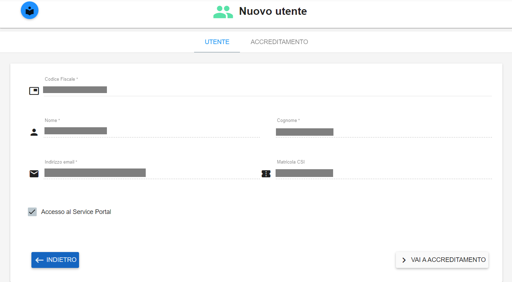
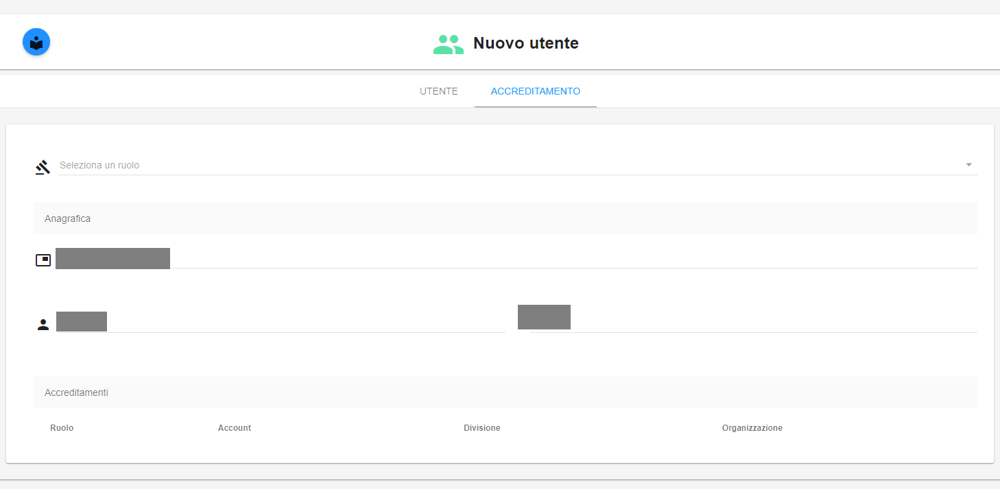
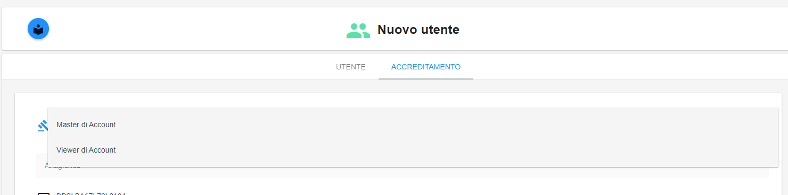
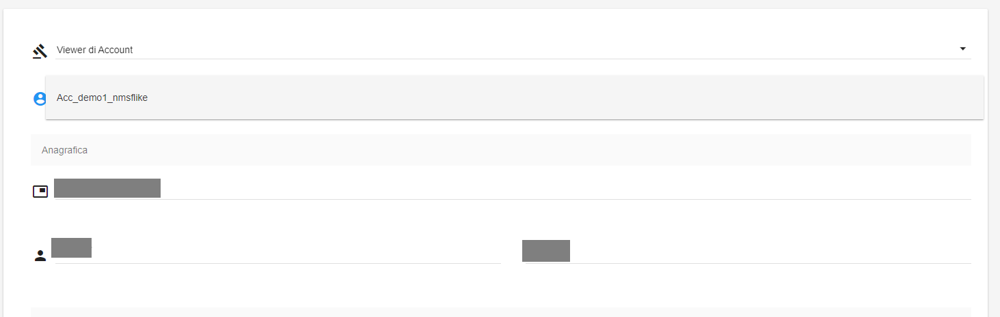
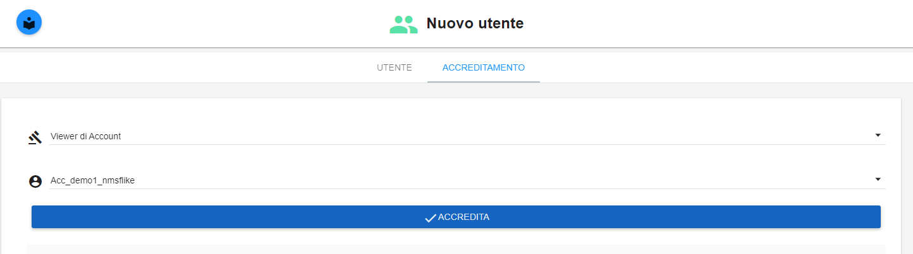

.. _Creare_Utente_in_SP:

**Creare Utente all’interno del Service Portal**
################################################

La funzione **Creazione di un utente** all’interno del Service Portal è attivabile sia dal ruolo di backoffice sia dal ruolo Master di Account.
|
|

**AMMINISTRATORE DI BACKOFFICE**

Con il ruolo **Amministratore di Backoffice** ci sono due modalità per creare un utente:

1.	Dal menù a sinistra selezionare **Amministrazione → Struttura Organizzativa → Registra Nuovo Utente** → si aprirà la pagina di creazione utente

   .. image:: img/05.10_utenteABOsx.png

|

2. Dal menù a sinistra selezionare **Amministrazione → Struttura Organizzativa → Lista Utenti Registrati → “+”** in alto a destra

   .. image:: img/05.10_utenteABOdx.png

In entrambi i casi, dopo aver attivato la funzione, compilare la form presentata dal sistema indicando: 
**Codice Fiscale, Nome, Cognome, Email e il tipo di accesso** 

Al termine premere il tasto **REGISTRA UTENTE**

   .. image:: img/05.10_Registra_Utente.png

La funzione **Accreditamento di utente** (da amministratore di backoffice) è attivabile accedendo all'elenco **Lista utenti Registrati** 
(all'interno dei menù  **Amministrazione -> Utenti**)

   .. image:: img/Utente_innesco_accredito.png

Dall'elenco selezionare l'utente da accreditare mettendo una spunta sulla Checkbox relativa

  .. image:: img/Utente_elenco.png

Premere sul pulsante **Accredita utente**

  .. image:: img/Utente_pulsante_accredito.png

Nella nuova form, sfruttando le Combo Box, indicare **Ruolo**, **Organizzazione**,
**Divisione**, **Account** e premere il tasto **Accredita**

  .. image:: img/Utente_form_accredito.png

L'utente sarà accreditato nel livello organizzativo e nel ruolo indicati.
|
|
|

**MASTER DI ACCOUNT**

Dal menù a sinistra selezionare **Gestione Account → Utenti -> Lista Utenti Accreditati**

   .. image:: img/05.10_utenteMAsx.png

|

Cliccare sul "+" in alto a destra

   .. image:: img/05.10_utenteMAdx.png

|

Dopo aver attivato la funzione, compilare la form presentata dal sistema indicando: 
**Codice Fiscale, Nome, Cognome, Email e il tipo di accesso**. Al termine premere il tasto **REGISTRA UTENTE**.

   .. image:: img/05.10_Nuovo_Utente.png

|

Premere il bottone **VAI A ACCREDITAMENTO** per proseguire con la configurazione dell’utente appena creato, assegnandogli uno o più ruoli.

La funzione **Accreditamento di utente** (da master di account) è attivabile dall'elenco **Lista utenti accreditati**
(all'interno dei menù  **Gestione account -> Utenti**)

.. image:: img/05.2_MAutente_innesco_accredito.png

Il Master di account può accreditare un utente se già presente a sistema, in caso contrario occorre procedere 
con la richiesta di relativa apertura ticket.

Premere sul pulsante **Nuovo utente**

Inserire il Codice Fiscale per identificare in modo univoco l’utente.
Se l’utente è già presente nel Database di Nivola appare un messaggio di conferma ed è possibile proseguire nella fase di accreditamento
cliccando sul pulsante **VAI A ACCREDITAMENTO**

Nella form per l’accreditamento selezionare semplicemente il ruolo da assegnare all’utente:

Selezionare **Viewer di account** oppure **Master di account**

Successivamente selezionare l’ **Account**:

Premere sul pulsante **Accredita**:

L’utente è correttamente accreditato con il ruolo scelto.
