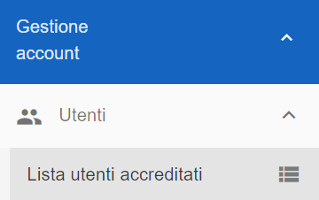

.. _Verificare_Accredi_Utente:

**Verificare Accrediti dell'Utente (master di account e amministratore di backoffice)**
#######################################################################################

La funzione **Accreditamento di utente** è attivabile attraverso due modalità, a seconda se si utilizza il ruolo **Amministratore di Backoffice** 
oppure il ruolo **Master di account**

1. tramite il ruolo il ruolo **Amministratore di Backoffice** accedere all'elenco **Lista utenti Registrati** 
(all'interno dei menù  **Amministrazione -> Utenti**)

   .. image:: img/Utente_innesco_accredito.png

Dall'elenco selezionare l'utente, del quale
si necessita consultare il dettaglio, mettendo una spunta sulla Checkbox relativa

  .. image:: img/Utente_elenco.png

Premere sul pulsante **Visualizza dettagli utente**

  .. image:: img/Pulsante_visualizza_dettagli.png

La prima pagina, esposta dal portale, è quella relativa all'**Anagrafica**

  .. image:: img/Utente_form_anagrafica.png

Sfruttando il tabstrip sarà visibile l'elenco
dei **Ruoli e i Permessi** attribuiti all'utente.

  .. image:: img/Utente_form_ruoli.png

|

2. tramite il ruolo il ruolo **Master di account** accedere all'elenco **Lista utenti accreditati**
(all'interno dei menù  **Gestione account -> Utenti**)

Dall'elenco selezionare l'utente, del quale
si necessita consultare il dettaglio, mettendo una spunta sulla Checkbox relativa

  .. image:: img/Utente_elenco.png

Premere sul pulsante **Visualizza dettagli utente**

  .. image:: img/Pulsante_visualizza_dettagli.png

La prima pagina, esposta dal portale, è quella relativa all'**Anagrafica**

  .. image:: img/Utente_form_anagrafica.png

Sfruttando il tabstrip sarà visibile l'elenco
dei **Ruoli e i Permessi** attribuiti all'utente.

  .. image:: img/Utente_form_ruoli.png
