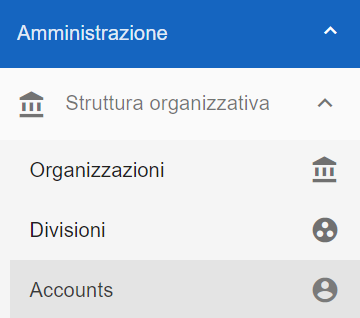
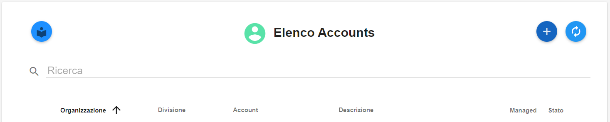
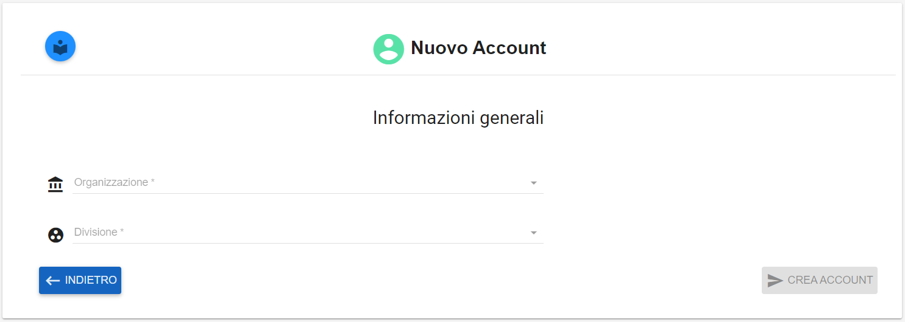

**Creare un Account (amministratore di backoffice)**
####################################################

La funzione è attivabile attraverso il ruolo **Amministratore di backoffice**. La **creazione di un account** è attivabile dalla parte
sinistra dello schermo, cliccando sulla label **Accounts** sotto **Struttura organizzativa**.

|

Dalla pagina **Elenco Accounts**

Cliccare in alto a destra sul simbolo "**+**"" (Crea un Nuovo Account) 

.. image:: img/03_piu.png

Dalla pagina **Nuovo Account** inserire le informazioni richieste tramite le relative combo box:

- Organizzazione
- Divisione
- Categoria

Quindi cliccare sul pulsante **CREA ACCOUNT** in basso a destra
