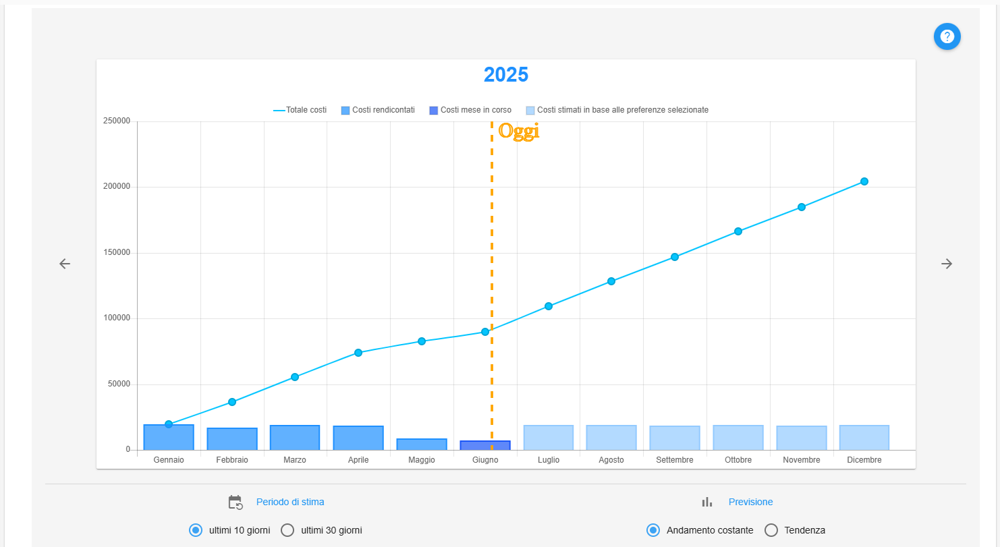
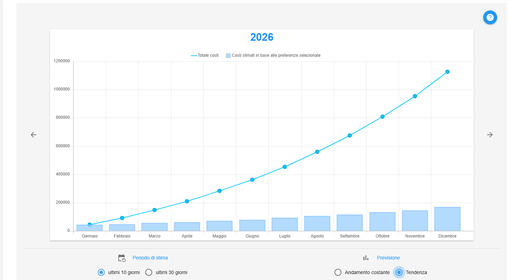

**Forecasting**
===============

La funzione rientra nella sezione **Gestione Account**. Il **Forecasting** 
è attivabile dalla parte sinistra dello schermo, cliccando sulla label **Forecasting**, sotto **Forecast e Avvisi**.

.. image:: img/9_ForecastSx.png

|

La sezione del forecasting consente di simulare una previsione di andamento dei propri consumi in base ai costi già registrati 
(funzionalità legata al ricalcolo dei costi).

|

A seguito di un click su **Forecasting**, il sistema popolerà la parte destra della pagina con il grafico 
dell'andamento dei costi dell'anno corrente (composto dai costi rendicontati fino alla data di ieri e dalle stime fino a fine anno) e dei prossimi due anni (stima).

La stima dei costi futuri viene composta in base alle selezioni sotto al grafico e le proiezioni possono essere di due tipi:

1) andamento medio;

2) andamento percentuale o tendenza;

In entrambi i casi gli andamenti possono essere calcolati in base i 10 o 30 giorni antecedenti.

