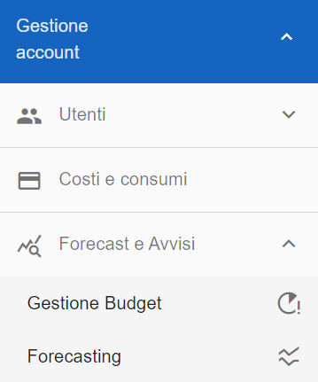
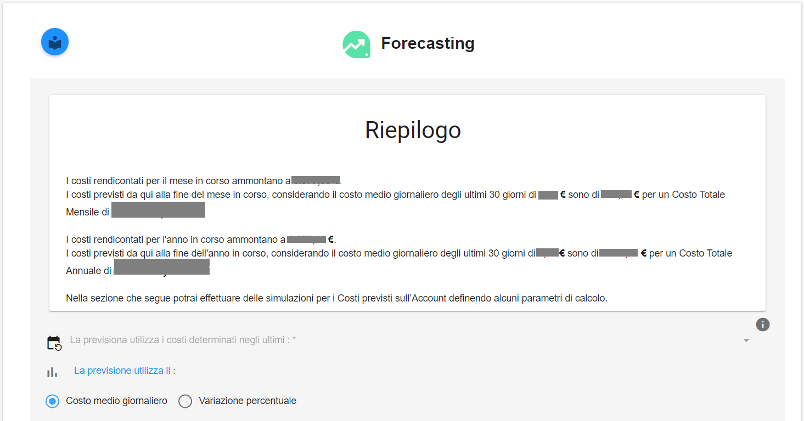
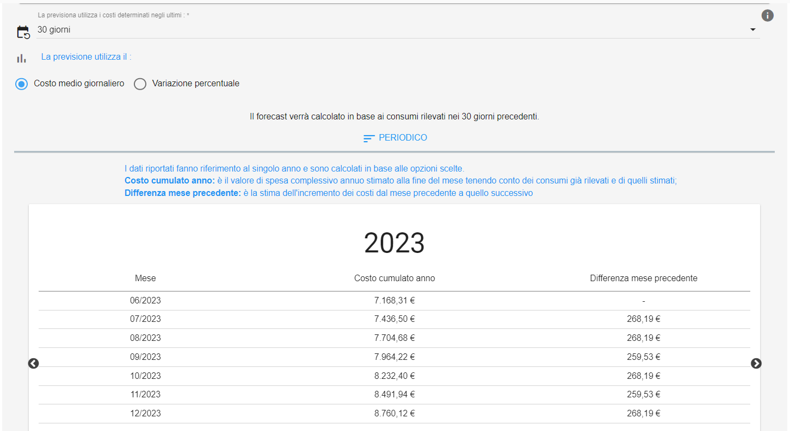

.. _Forecasting:

**Forescasting**
================

La funzione rientra nella sezione **Gestione Account**. La **creazione di un Budget** 
è attivabile dalla parte sinistra dello schermo, cliccando sulla label **Forecasting**, sotto **Forecast e Avvisi**.

|

La sezione del forecasting consente di simulare una previsione di andamento dei propri consumi in base ai costi già registrati 
(funzionalità legata al ricalcolo dei costi).

|

A seguito di un click su **Forecasting**, il sistema popolerà la parte destra della pagina 
web con il **Riepilogo** relativo a:

• Costi rendicontati per il mese in corso
• Costi previsti dal giorno corrente fino alla fine del mese in corso (considerando il costo medio giornaliero degli ultimi 30 giorni)
• Costi rendicontati per l'anno in corso
• Costi previsti dal giorno corrente fino alla fine dell'anno in corso (considerando il costo medio giornaliero degli ultimi 30 giorni)

|

Sotto al riepilogo è possibile scegliere il campione, precedente alla data attuale, sul quale verrà basata la previsione:

●	10 giorni
●	30 giorni

|

L’altro parametro di selezione sarà il tipo di previsione:

●	Valore medio dei costi nell’arco di tempo specificato
●	Andamento dei costi nel tempo specificato (delta di crescita)

|

**Previsione legata a Valore medio dei costi nell’arco di tempo specificato**

Cliccare nella combo box indicata dalla freccia per poter selezionare i valori **10 giorni** oppure **30 giorni**:

