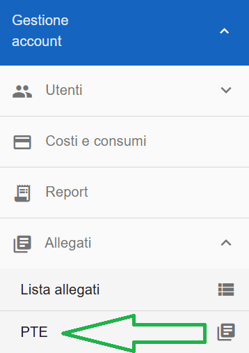
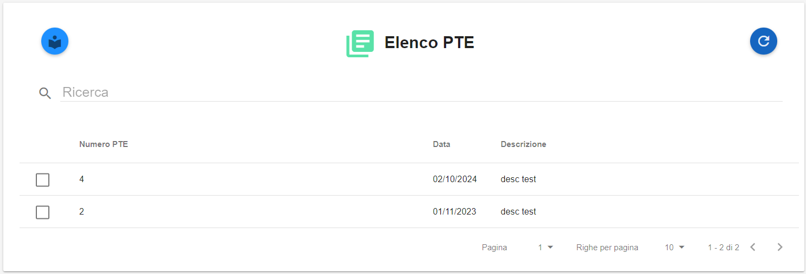
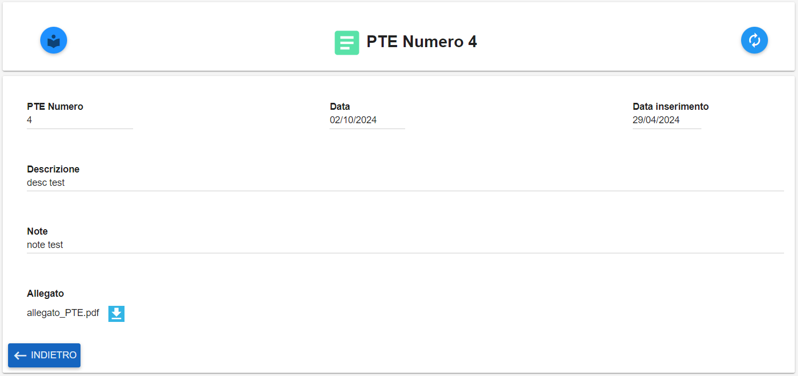

**PTE - Proposta Tecnico-Economica (master di account e master di division)**
=============================================================================

La PTE, Proposta Tecnico-Economica, è un documento che formalizza l’offerta di servizi Nivola che viene proposta al cliente e che specifica 
anche l'approvvigionamento di risorse e di servizi da realizzare a cura del Supporto di Nivola. 

La funzione rientra nella sezione **Gestione Account**. La **PTE** 
è attivabile dalla parte sinistra dello schermo, cliccando sulla label **PTE**, sotto **Allegati**.

|

A seguito di un click su **PTE**, il sistema popolerà la parte destra della pagina web con l'**Elenco PTE**

|

Selezionando una PTE e cliccando sull'icona **Visualizza Dettaglio PTE** (icona in alto a destra)

|

si accede al dettaglio della PTE selezionata

