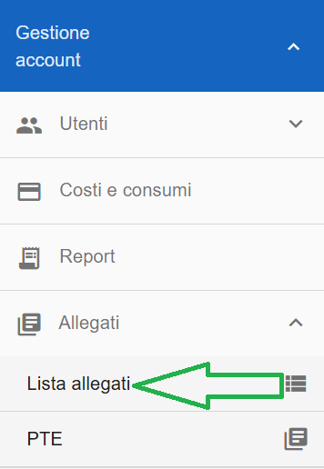
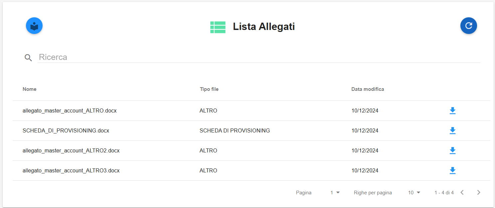

**Allegati (master di account e master di division)**
=====================================================

Gli allegati sono associabili puntualmente ad un account attraverso una apposità funzionalità presente da Amministratore di Backoffice. 

La funzione rientra nella sezione **Gestione Account**. Gli **Allegati** 
sono attivabili dalla parte sinistra dello schermo, cliccando sulla label **Lista allegati**, sotto **Allegati**.

|

A seguito di un click su **Lista allegati**, il sistema popolerà la parte destra della pagina web con la lista degli Allegati

|

Cliccando sull'icona a destra in fondo di ogni riga (a forma di freccia blu verso il basso):

è possibile scaricare l'allegato desiderato
