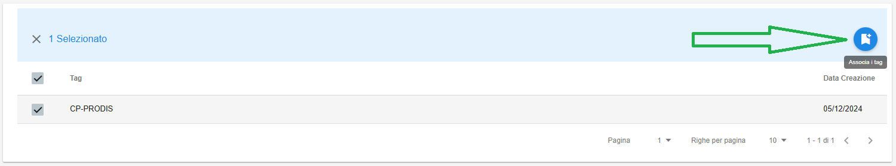
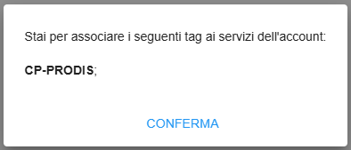
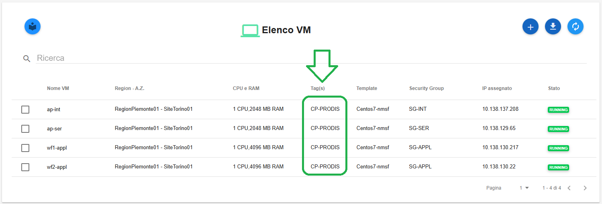

**Anagrafica Prodotti (master di account)**
===========================================

L'**Anagrafica prodotto** è visibile attraverso il menu posto alla
sinistra dello schermo, cliccando sulla label **Anagrafica prodotto**
sotto la label **Gestione account**

.. image:: img/10.7_AnaProdSX.png

A seguito del clic su **Anagrafica prodotto**, il sistema permetterà di verificare nella
parte destra del video l'eventuale presenza di codice-prodotto (associati dall'Amministratore di Backoffice all'account) 

.. image:: img/10.7_AnaProdDX.png

|

**E' possibile associare il codice prodotto afferente ad un account a tutte le risorse dell'account stesso (vm, dbaas)**

Per effettuare tale operazione è necessario selezionare il codice prodotto, quindi cliccare sul pulsante in alto a destra "Associa i tag"

|

Comparirà questa schermata intermedia, in cui è necessario cliccare sul tasto **CONFERMA**

|

Un messaggio in verde in alto a destra darà conferma dell'avvenuta operazione

|

Nell'elenco delle Virtual Machine e dei Database verrà quindi popolata la relativa colonna "Tags(s)":

