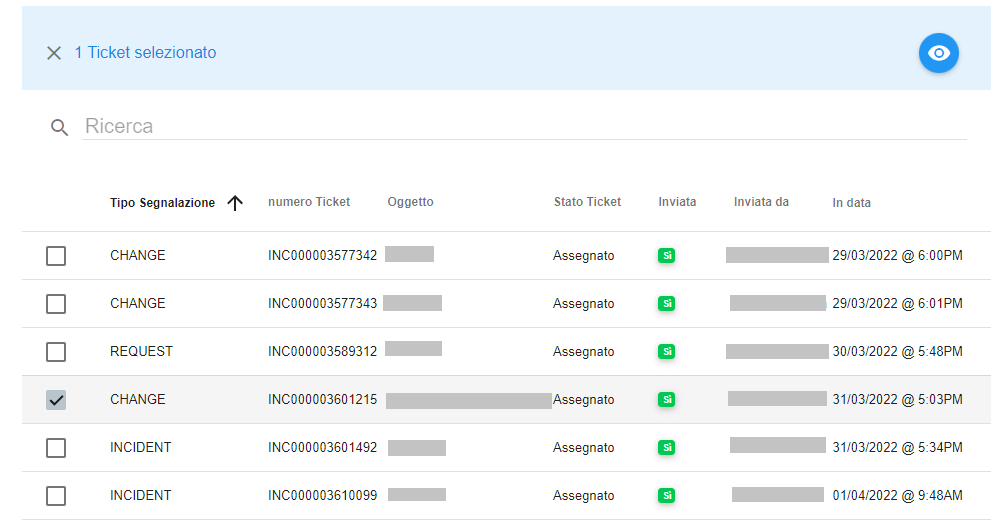

.. _Tickets_inviati:

**Cercare Ticket inviato**
===========================
La funzione rientra nel **servizio assistenza**. La lista dei **Tickets inviati** è attivabile dalla parte
sinistra dello schermo, cliccando sulla label **Tickets inviati** sotto **Assistenza**

.. image:: img/100.5_Elenco_Ticket_inviatiSX.png

A seguito di un clic su **Tickets inviati**, il sistema popolerà la parte destra del video con l'elenco dei **Tickets inviati**.

.. image:: img/100.5_ElencoTicketDX.png

1. Individuare il ticket dalla lista dei **Tickets inviati**, mettendo una spunta a fianco del nome;

    
2. Usare il bottone **Visualizza dettagli Ticket**;

.. image:: img/100.5_iconaDettagliTicket.png

3. Le informazioni del ticket sono presenti nel tab **RICHIESTA**;
    
.. image:: img/100.5_DettagliTicketTag1.png

4. Eventuali informazioni ulteriori aggiunte al ticket dopo la sua creazione sono presenti nel tag **NOTE AGGIUNTIVE**;

.. image:: img/100.5_DettagliTicketTag2.png

   