**Uso dei filtri**
==================

**Master di Account**
*********************

La funzione rientra nel **servizio assistenza**. Accedere alla lista dei tickets inviati cliccando sulla label **Tickets inviati** 
sotto **Assistenza**:

.. image:: img/100.5_Elenco_Ticket_inviatiSX.png

Il sistema popolerà la parte destra del video con l'elenco dei **Tickets inviati**:

.. image:: img/100.5_ElencoTicketDX.png

Cliccare sul simbolo in alto a destra la cui descrizione passandoci sopra col mouse è **Mostra filtri**

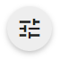

Comparirà la seguente schermata

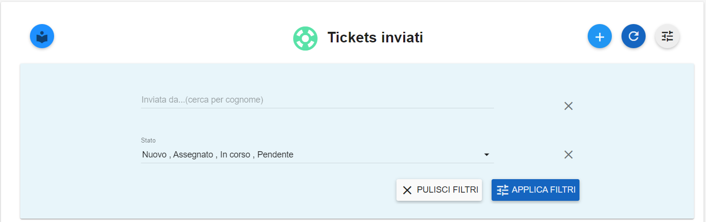

Alla primo caricamento dei ticket, gli stati filtrati sono quelli descritti nella voce "**Stato**"

.. image:: img/100.15_Filtro1rosso.png

Per modificare tali valori cliccare sulla freccia a destra in corrispondenza della voce **Stato** e selezionare gli stati desiderati

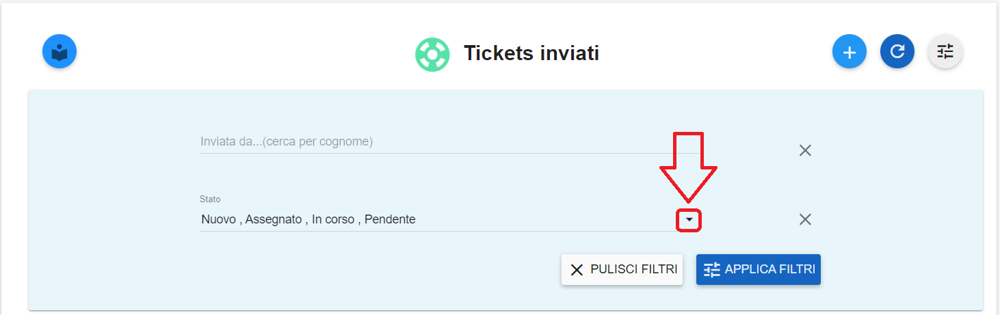

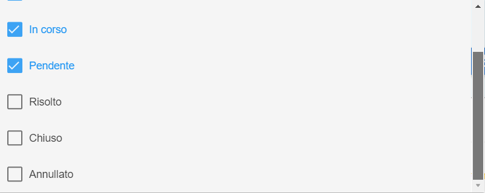

E' possibile effettuare una ricerca per **cognome** dell'utente che ha aperto il ticket attraverso la prima voce **Inviata da..(cerca per cognome)**

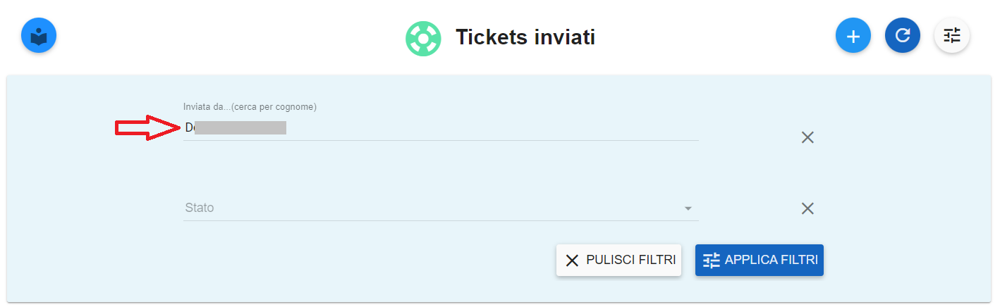

Quindi premere il pulsante **APPLICA FILTRI**

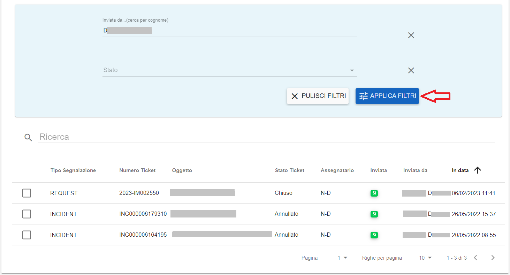

**Master di Division**
**********************

I filtri per **stato** e **cognome** sono comuni a quelli descritti sopra per i **Master di Account**

La ricerca per **account** è attivabile cliccando sul pulsante **SELEZIONA L'ACCOUNT**

Utilizzare la freccia per far comparire la lista degli **Account**

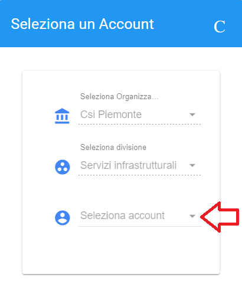

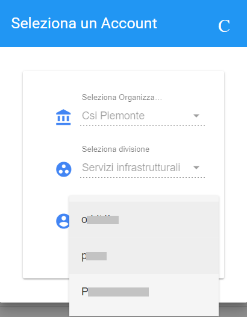

Quindi selezionare l'account desiderato e cliccare su **CONFERMA**

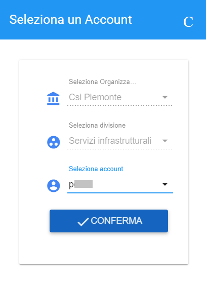

**Master di Organization**
**************************

I filtri per **stato** e **cognome** sono comuni a quelli descritti sopra per i **Master di Account**

La ricerca per **account** è attivabile cliccando sul pulsante **SELEZIONA L'ACCOUNT**

Utilizzare le frecce per far comparire le liste delle **Division** e degli **Account**

.. image:: img/100.15_Filtro1selezAccount2MO.png

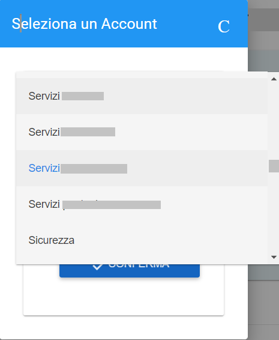

Quindi selezionare la division e l'account desiderati e cliccare su **CONFERMA**

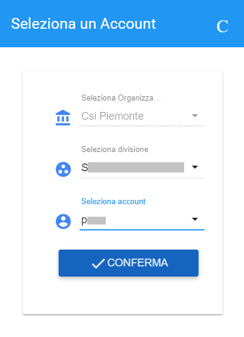
