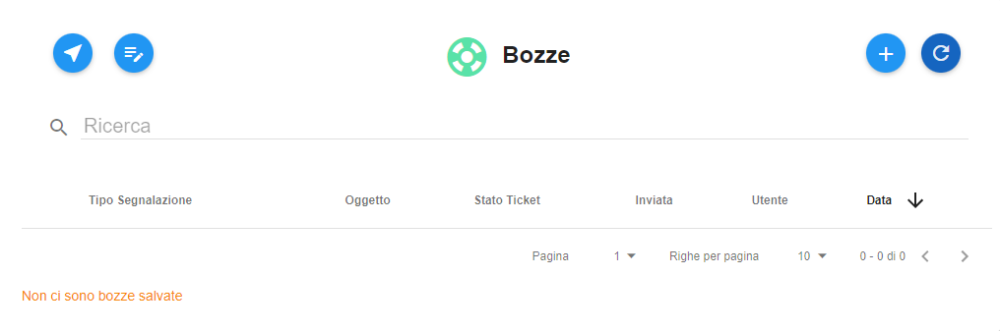

.. _Tickets_inviati:

**Elenco bozze**
===========================
La funzione rientra nel **servizio assistenza**. La lista delle **Bozze** è attivabile dalla parte
sinistra dello schermo, cliccando sulla label **Bozze** sotto **Assistenza**:

.. image:: img/100.25_Elenco_BozzeSX.png

A seguito di un clic su **Bozze**, il sistema popolerà la parte destra del video con l'elenco delle **Bozze**:

.. image:: img/100.25_ElencoBozzeDX.png

In caso di primo utilizzo della funzionalità la lista risulterà vuota, e in basso comparirà il messaggio "Non ci sono bozze salvate":

   