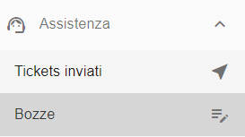
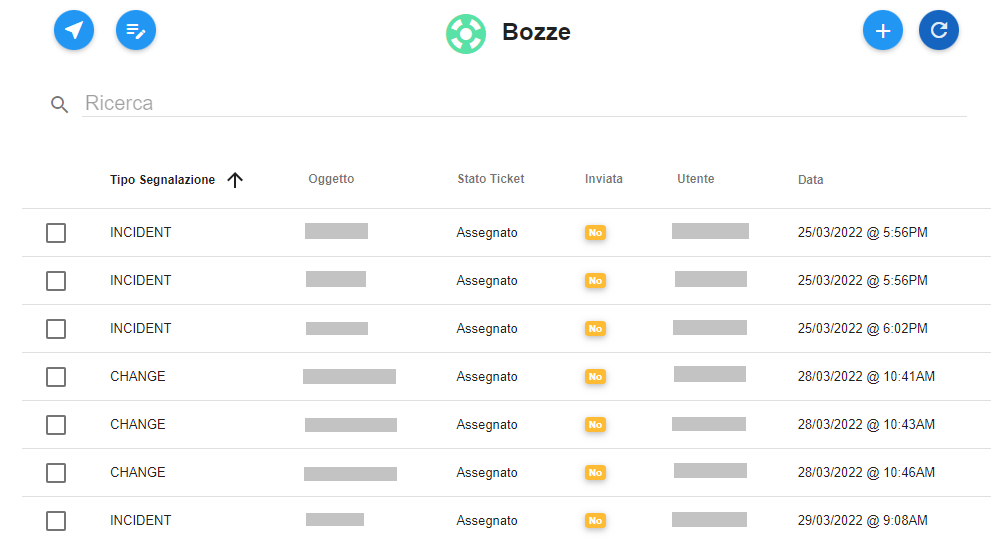

.. _Tickets_inviati:

**Cercare e visualizzare bozze**
===========================
La funzione rientra nel **servizio assistenza**. Accedere alla lista delle bozze cliccando sulla label **Bozze** 
sotto **Assistenza**

Il sistema popolerà la parte destra del video con l'elenco delle **bozze**.

   
All’interno di ciascun Account è possibile fare ricerche su tutti i ticket precedentemente inviati. 
La ricerca è eseguita tramite una stringa inserita dall’operatore. 
Nivola ricerca il set di caratteri nella colonna "**numero Ticket**". 
Per eseguire una ricerca è necessario procedere in questo modo:

1. Inserire la stringa da usare come chiave di ricerca, sotto la label «Ricerca» e premere invio;

.. image:: img/100.5_RicercaStringaBozzeDX.png