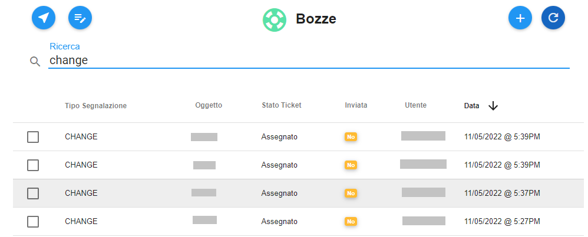
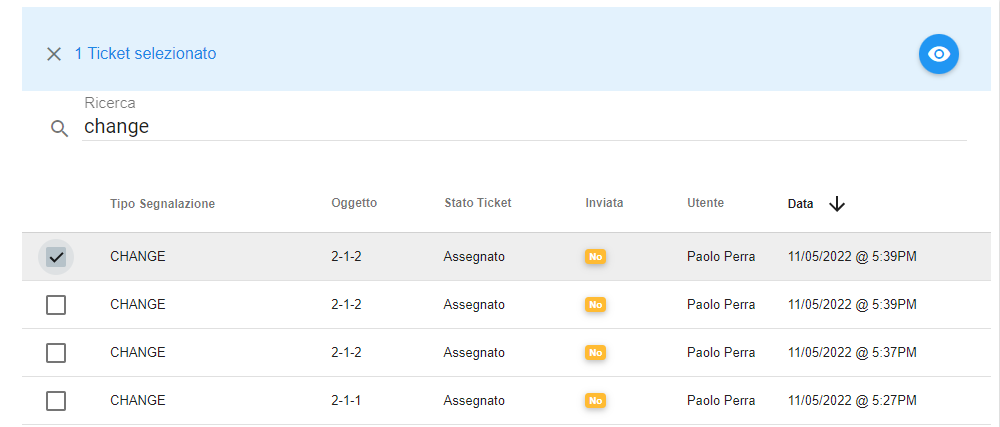
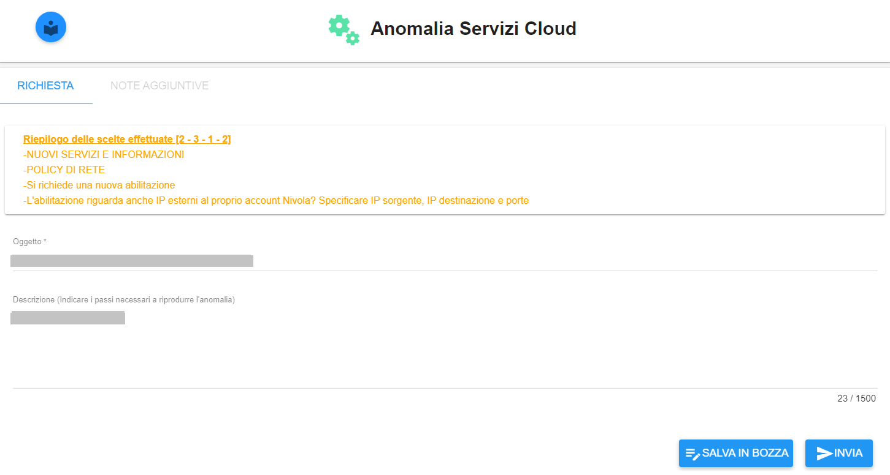

.. _Tickets_inviati:

**Cercare, visualizzare e inviare bozza**
===========================

La funzione rientra nel **servizio assistenza**. Accedere alla lista delle bozze cliccando sulla label **Bozze** 
sotto **Assistenza**:

.. image:: img/100.25_Elenco_BozzeSX.png

Il sistema popolerà la parte destra del video con l'elenco delle **Bozze**:

.. image:: img/100.25_ElencoBozzeDX.png

All’interno di ciascun Account è possibile fare ricerche su tutte le bozze precedentemente create. 
La ricerca è eseguita tramite una stringa inserita dall’operatore. 
Per eseguire una ricerca è necessario procedere in questo modo:

1. Inserire la stringa da usare come chiave di ricerca sotto la label «Ricerca»: il sistema automaticamente popolerà lo schermo 
con le bozze che soddisfano il criterio di selezione;

2. Individuare la bozza dalla lista, mettendo una spunta a fianco del nome;

    
3. Usare il bottone **Visualizza dettagli Ticket**;

.. image:: img/100.5_iconaDettagliTicket.png

4. Verranno visualizzate le informazioni della bozza, contenute nel tab **RICHIESTA**;
    

E' possibile integrare e/o modificare l'oggetto e la descrizione;

Utilizzando il tasto "**SALVA IN BOZZA**" è possibile salvare le modifiche: comparirà il seguente messaggio di conferma;

Utilizzando il tasto "**INVIA**" è possibile trasformare la bozza in un ticket ed effettuarne l'invio all'assistenza: 
comparirà il seguente messaggio di conferma;

.. image:: img/richiesta_assistenza_inviata_correttamente.png