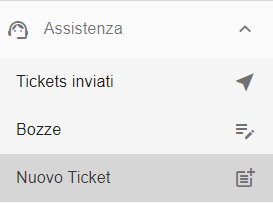
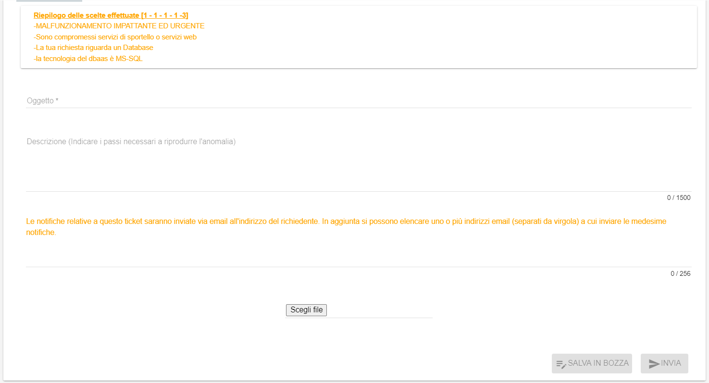
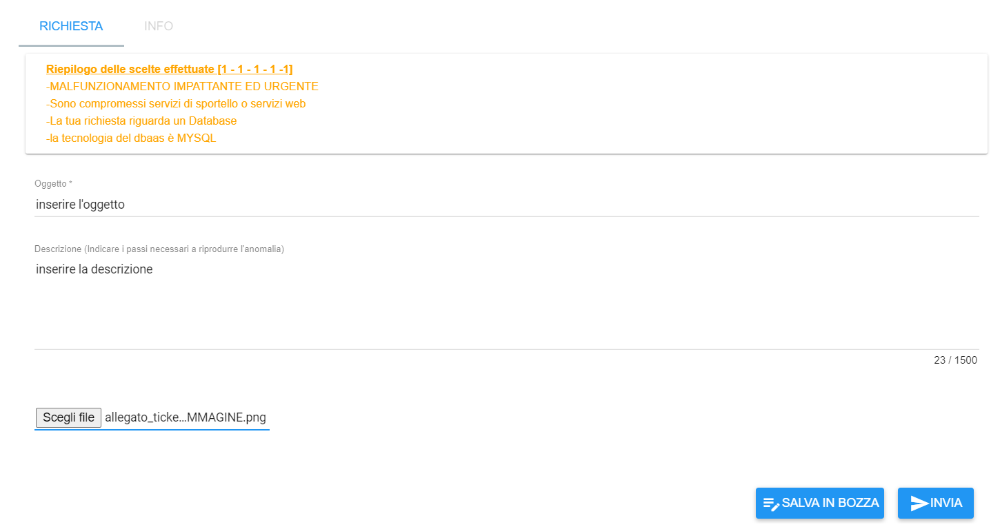
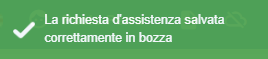
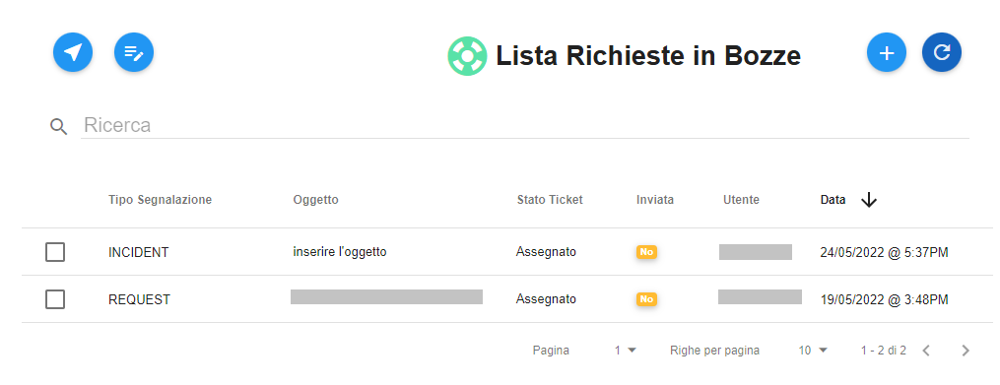
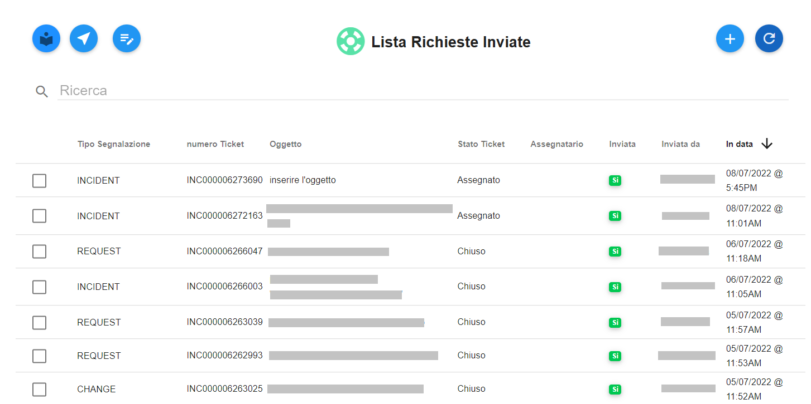
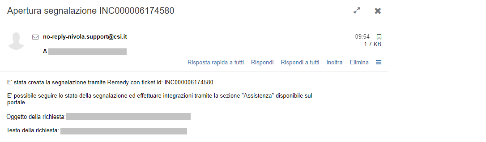

.. _Tickets_inviati:

**Creazione di un nuovo ticket**
===========================

La funzione rientra nel **servizio assistenza**. Accedere al menù di creazione di un nuovo ticket cliccando sulla label **Nuovo Ticket** 
sotto **Assistenza**:

Il sistema popolerà la parte destra del video con l'elenco delle scelte guidate suddivise per macro argomenti e livelli di urgenza.
Selezionando attraverso un click ogni macro argomento, si aprono delle scelte successive che incanalano la scelta in maniera sempre
più coerente e specifica in relazione al problema o richiesta da segnalare.

Al termine del percorso di scelte guidato si arriva al form attraverso il quale aprire ed inviare il ticket.

La voce in alto "**Riepilogo delle scelte effettuate**" riporta il riassunto delle scelte effettuate in precedenza:

Inserire l'oggetto, la descrizione e l'eventuale allegato (ad esempio lo screenshot di un eventuale messaggio di errore) attraverso il tasto in basso a 
destra "**Scegli file**":

Se si desidera salvare la richiesta come bozza (per poterla inviare in un secondo momento) occorre selezionare il tasto in 
basso a destra "**SALVA IN BOZZA**". Apparirà il seguente messaggio di conferma:

E si verrà reindirizzati nel menù "**Bozze**" in cui sarà presente la bozza appena salvata:

Se invece si desidera aprire la segnalazione ed inviare subito il ticket occorre selezionare il tasto in basso a destra
"**INVIA**. Apparirà il seguente messaggio di conferma:

E si verrà reindirizzati nel menù "**Tickets inviati**" in cui sarà presente il ticket appena creato e inviato:

In automatico si riceverà sulla propria casella di posta elettronica una mail a conferma dell'avvenuta apertura del ticket:

