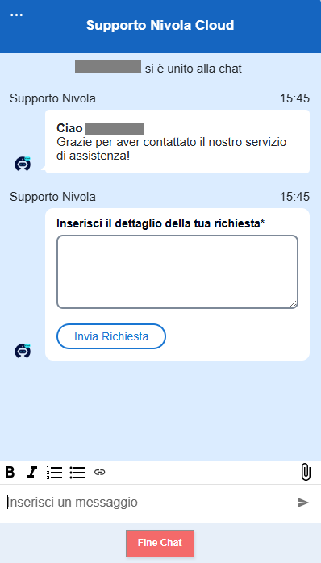
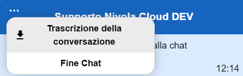
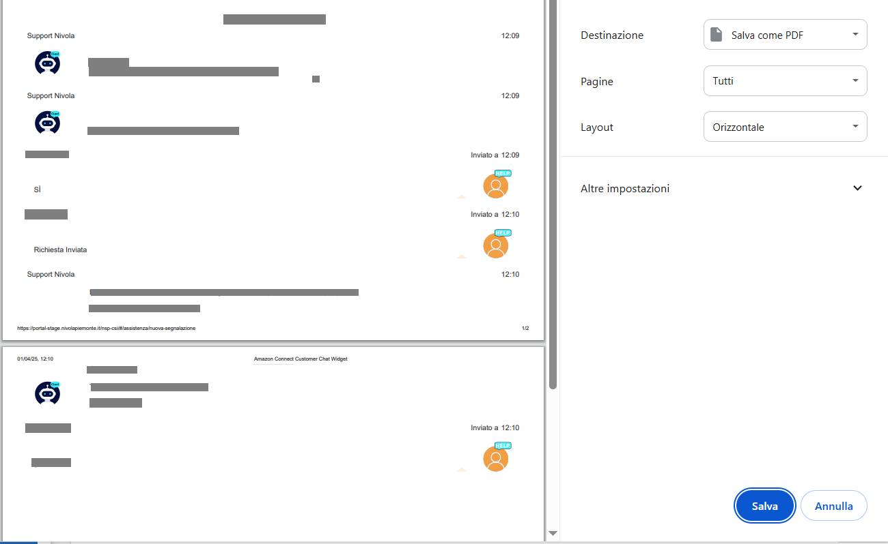
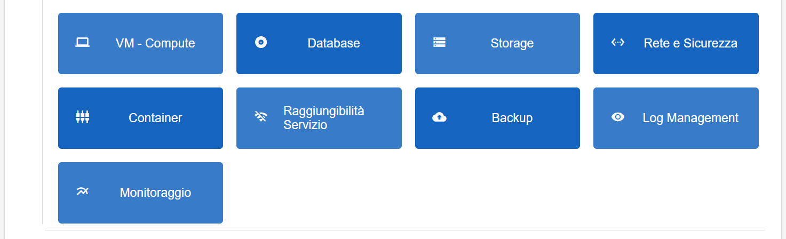
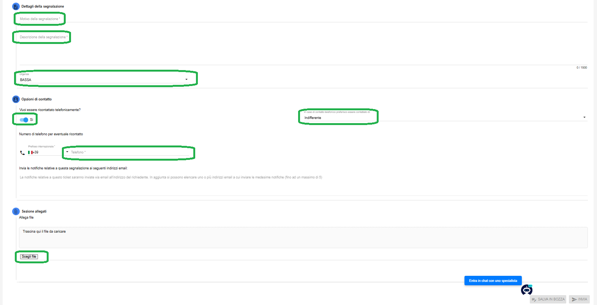

**Creazione di un nuovo ticket**
================================

La funzione rientra nel servizio **Assistenza**. Accedere al menù di creazione di un nuovo ticket cliccando sulla label **Nuova Richiesta** 
sotto **Assistenza**:

.. image:: img/100.35_Nuovo_TicketSX.png

Il sistema popolerà la parte destra del video con l'elenco delle scelte guidate suddivise per macro argomenti.
Selezionare una delle seguenti voci a seconda del tipo di problema/necessità:

- **Malfunzionamento**

- **Rallentamento**

- **Nuovo servizio**

- **Modifica servizio**

- **Dismissione servizio**

- **Backup e ripristino**

- **Informazioni**

|

Nel caso si selezionino le prime due voci, **Malfunzionamento** e **Rallentamento**, comparirà la seguente schermata di scelta:

.. image:: img/100.35_Nuovo_Ticket2.png

|

Selezionando la prima opzione **CHATTA CON UNO SPECIALISTA** verrà aperta la chat

con cui sarà possibile interagire con l'operatore.

**Ricordiamo che l'orario di servizo della chat è dalle 9 alle 18, dal lunedì a venerdì. Al di fuori di tali orari il servizio non è attivo, in conseguenza l'apertura della relativa finestra non avverrà.**

|

Cliccando sui tre puntini in alto a sinistra è possibile scaricare la conversazione avvenuta, quindi cliccare su **Salva** in basso a destra

Infine per chiudere la chat, cliccare sul pulsante in basso **Fine Chat**

.. image:: img/100.35_Chat7.png

L'icona relativa alla chat sarà comunque sempre presente sulla destra e la funzionalità richiamabile in qualsiasi momento cliccandoci sopra
(ricordiamo solamente in relazione alle voci **Malfunzionamento** e **Rallentamento**)

|

Selezionando invece la seconda opzione **CONTINUA CON LA COMPILAZIONE** oppure nel caso si sia selezonato inizialmente una delle altre voci 
(Nuovo servizio, Modifica servizio, Dismissione servizio, Backup e ripristino, Informazioni) verranno visualizzati tutti, oppure una sottoparte, 
dei seguenti bottoni:

|

Una volta selezionato il bottone relativo all'argomento interessato, si apre il vero e proprio form di compilazione del ticket:

|

Di seguito il dettaglio dei dati di input richiesti:

•  Motivo della segnalazione -> *oggetto della richiesta*
 
•  Descrizione della segnalazione -> *descrizione della richiesta*
 
•  Urgenza -> *il dato potrebbe essere fisso o modificabile. Fisso nel caso che le scelte del tipo di ticket prevedano un unico livello di urgenza. Quando invece modificabile, i valori potranno essere i seguenti (da selezionare attraverso le relativa combo box): BASSA, MEDIA, ALTA, CRITICA.*

•  Vuoi essere ricontattato telefonicamente? -> *il default è "No". Selezionando "Sì" compariranno le seguenti ulteriori voci:*

        - *In caso di contatto telefonico preferisco essere contattato di -> i valori potranno essere i seguenti (da selezionare attraverso le relativa combo box): Indifferente (valore di default), Mattina, Pomeriggio.*
        - *Telefono -> inserire il numero di telefono in caso di ricontatto*
 
•  Scegli file -> *da utilizzarsi nel caso si necessario allegare un file alla richiesta (ad esempio screenshot dell'errore)*

Se si desidera salvare la richiesta come bozza (per poterla inviare in un secondo momento) occorre selezionare il tasto in 
basso a destra "**SALVA IN BOZZA**". Apparirà il seguente messaggio di conferma:

.. image:: img/richiesta_assistenza_salvata_correttamente_in_bozza.png

E si verrà reindirizzati nel menù "**Lista Richieste in Bozze** in cui sarà presente la bozza appena salvata:

.. image:: img/100.35_ListaBozze_da_Nuovo_TicketDX.png

Se invece si desidera aprire la segnalazione ed inviare subito il ticket occorre selezionare il tasto in basso a destra
**INVIA**. Apparirà il seguente messaggio di conferma:

.. image:: img/richiesta_assistenza_inviata_correttamente.png

E si verrà reindirizzati nel menù "**Richieste inviate**" in cui sarà presente il ticket appena creato e inviato:

.. image:: img/100.35_ListaTicket_da_Nuovo_TicketDX.png

|

In automatico si riceverà sulla propria casella di posta elettronica una mail a conferma dell'avvenuta apertura del ticket:

.. image:: img/100.35_Mail_da_Nuovo_Ticket.png
