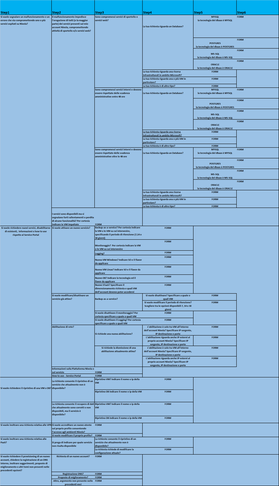
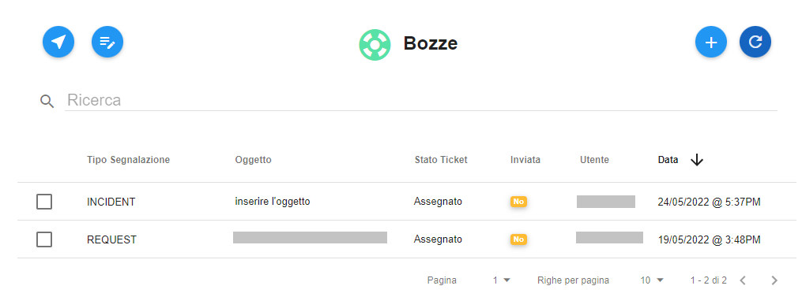

.. _Tickets_inviati:

**Creazione di un nuovo ticket**
===========================

La funzione rientra nel **servizio assistenza**. Accedere al menù di creazione di un nuovo ticket cliccando sulla label **Nuovo Ticket** 
sotto **Assistenza**

.. image:: img/100.35_Nuovo_TicketSX.png

Il sistema popolerà la parte destra del video con l'elenco delle scelte guidate suddivise per macro argomenti e livelli di urgenza.
Selezionando attraverso un click ogni macro argomento, si aprono delle scelte successive che incanalano la scelta in maniera sempre
più coerente e specifica in relazione al problema o richiesta da segnalare.
Riportiamo l'elenco completo di tale alberatura delle scelte:

Indipendentemente dalle scelte effettuate si arriva al form attraverso il quale aprire ed inviare il ticket.

La voce in alto "**Riepilogo delle scelte effettuate**" riporta il riassunto delle scelte effettuate in precedenza.

.. image:: img/100.35_Form_Nuovo_TicketDX.png

Inserire l'oggetto, la descrizione e l'eventuale allegato attraverso il tasto in basso a destra "**Scegli file**";

.. image:: img/100.35_FormOK_Nuovo_TicketDX.png

Se si desidera salvare la richiesta come bozza, per inviarla in un secondo momento occorre 
selezionare il tasto in basso a destra "**SALVA IN BOZZA**" 

.. image:: img/richiesta_assistenza_salvata_correttamente_in_bozza.png

E si verrà reindirizzati nel menù "**Bozze**" in cui è presente la bozza appena salvata;

da finire con scelta di creazione e invio ticket (e mettere anche che arriva una mail in automatico)

