**Creazione di un nuovo ticket**
================================

La funzione rientra nel servizio **Assistenza**. Accedere al menù di creazione di un nuovo ticket cliccando sulla label **Nuova Richiesta** 
sotto **Assistenza**:

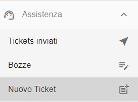

|

Apparirà sulla destra il Chatbot del Supporto Nivola Cloud, con in primo piano l'Informativa sulla Privacy:

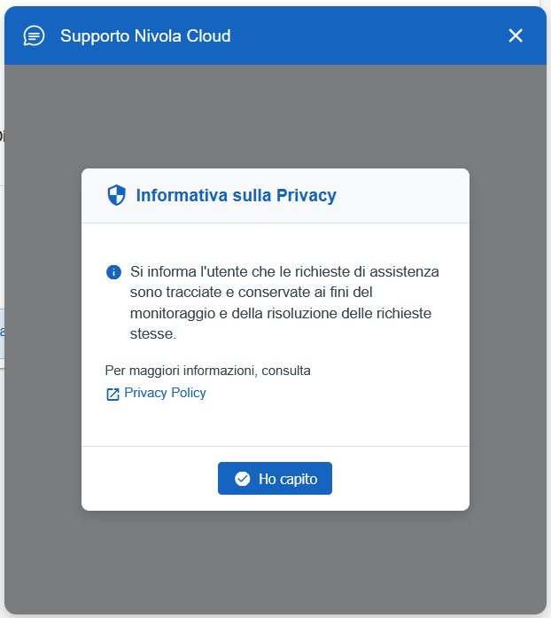

|

Dopo aver cliccato su "Ho capito" verrà mostrata la schermata di partenza in cui, oltre al messaggio di benvenuto,
viene ricordato l'attuale account in uso:

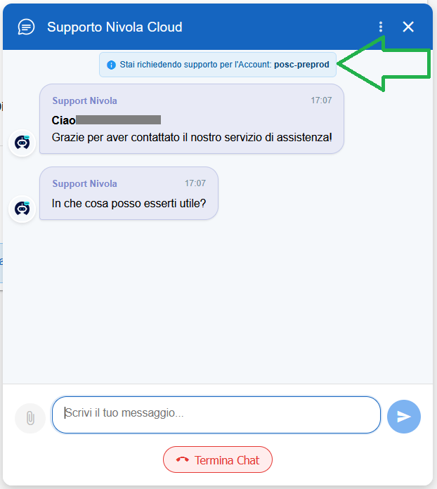

|

Utilizzare il campo di input in basso per digitare le proprie domande / esigenze, quindi cliccare sulla
corrispondente freccia blu sulla destra:

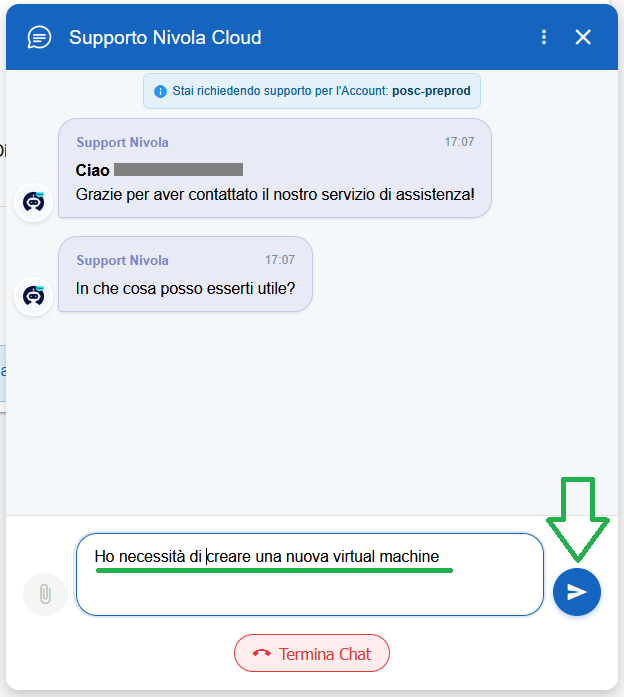

|

Percorriamo il caso specifico, per fornire un esempio utile di come utilizzarlo per aprire un ticket:

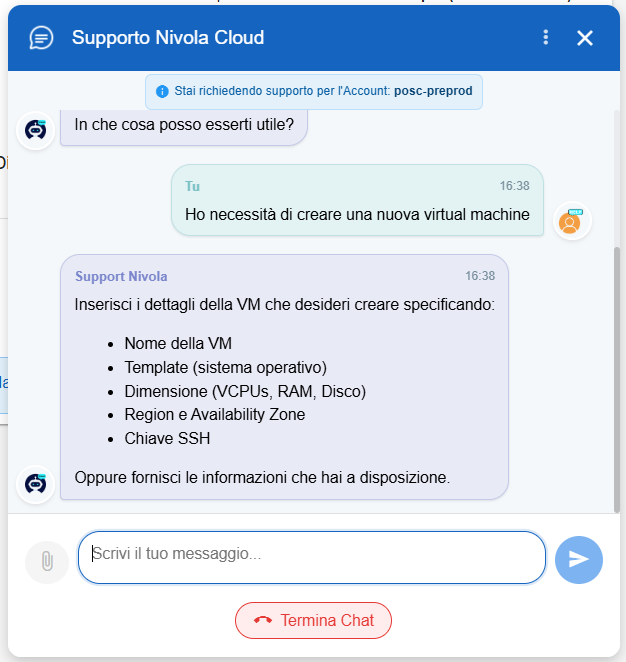

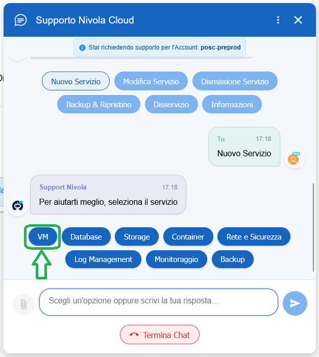

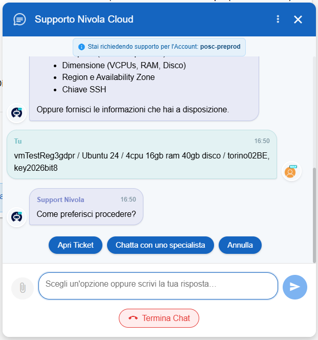

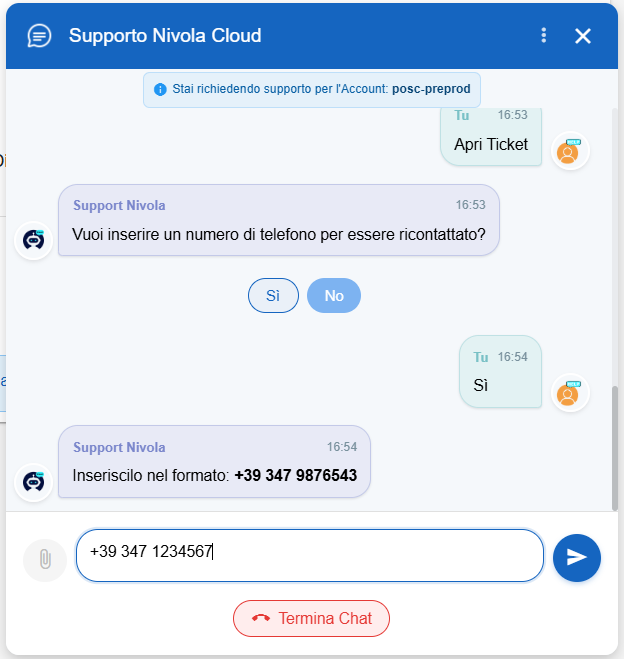

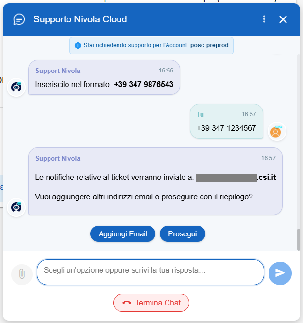

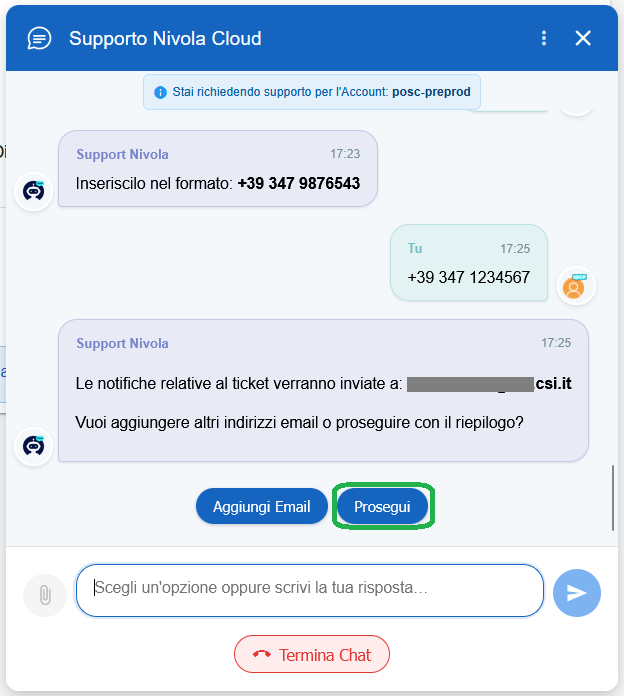

|

Al termine verrà mostrata la schermata riassuntiva dei dati inseriti e con i quali verrà aperto il ticket:

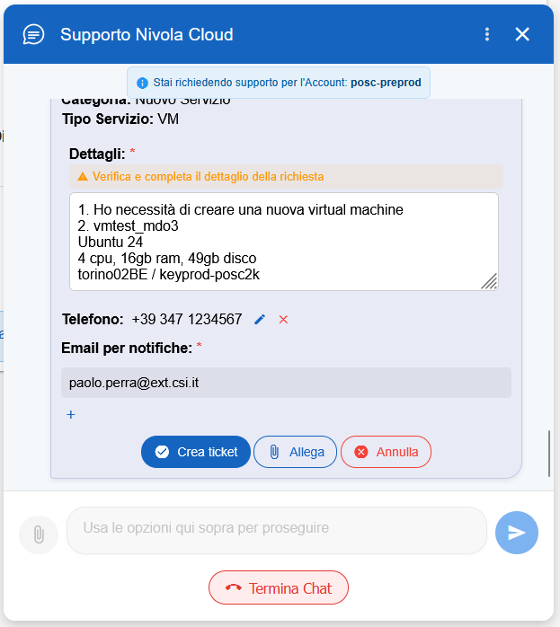

|

Cliccando su **Crea ticket** il ticket verrà aperto:

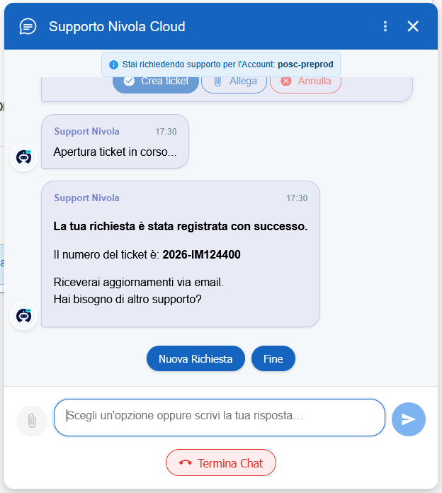

|

Dopo aver cliccato su **Fine** sarà possibile scaricare la trascrizione, aprire una nuova chat, oppure chiudere la 
finestra del Chatbot:

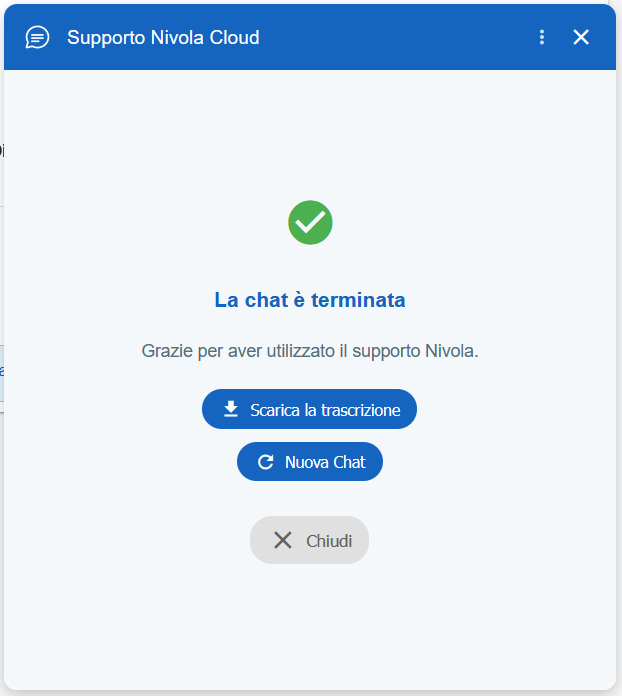

|

E' comunque possibile richiamare il Chatbot in qualsiasi momento, cliccando sull'icona in basso a destra:

|

|

Se invece di decide di seguire le scelte guidate da menù, cliccare subito su **Termina Chat** per chiudere la finestra 
del Chatbot in modo da lasciare in primo piano il menù:

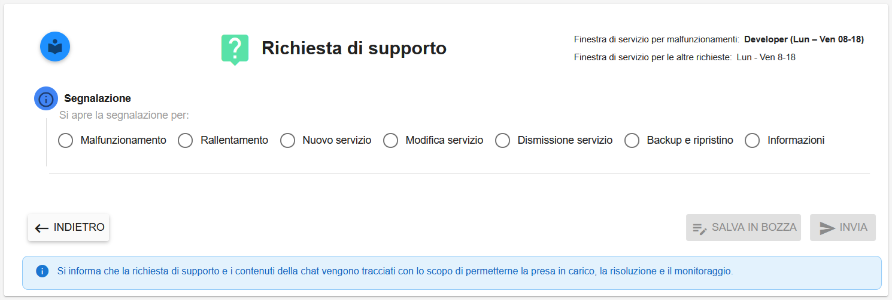

|

Cliccando su una della voci presenti verranno visualizzati tutti, oppure una sottoparte, 
dei seguenti bottoni (l'esempio sottostante è relativo al caso si selezioni la voce "Malfunzionamento"):

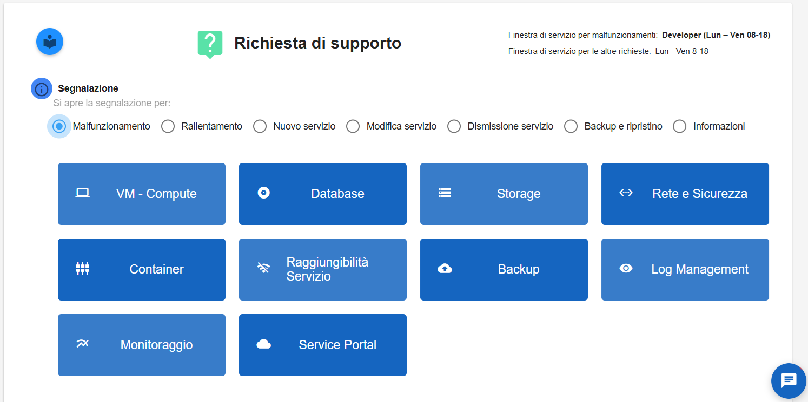

|

Una volta selezionato il bottone relativo all'argomento interessato, si apre il vero e proprio form di compilazione del ticket:

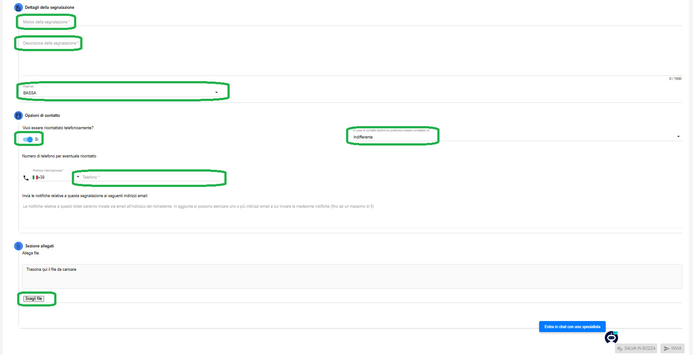

|

Di seguito il dettaglio dei dati di input richiesti:

•  Motivo della segnalazione -> *oggetto della richiesta*
 
•  Descrizione della segnalazione -> *descrizione della richiesta*
 
•  Urgenza -> *il dato potrebbe essere fisso o modificabile. Fisso nel caso che le scelte del tipo di ticket prevedano un unico livello di urgenza. Quando invece modificabile, i valori potranno essere i seguenti (da selezionare attraverso le relativa combo box): BASSA, MEDIA, ALTA, CRITICA.*

•  Vuoi essere ricontattato telefonicamente? -> *il default è "No". Selezionando "Sì" compariranno le seguenti ulteriori voci:*

        - *In caso di contatto telefonico preferisco essere contattato di -> i valori potranno essere i seguenti (da selezionare attraverso le relativa combo box): Indifferente (valore di default), Mattina, Pomeriggio.*
        - *Telefono -> inserire il numero di telefono in caso di ricontatto*
 
•  Scegli file -> *da utilizzarsi nel caso si necessario allegare un file alla richiesta (ad esempio screenshot dell'errore)*

Se si desidera salvare la richiesta come bozza (per poterla inviare in un secondo momento) occorre selezionare il tasto in 
basso a destra "**SALVA IN BOZZA**". Apparirà il seguente messaggio di conferma:

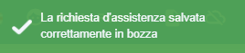

E si verrà reindirizzati nel menù "**Lista Richieste in Bozze** in cui sarà presente la bozza appena salvata:

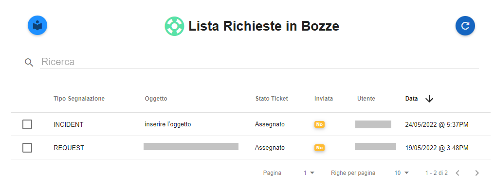

Se invece si desidera aprire la segnalazione ed inviare subito il ticket occorre selezionare il tasto in basso a destra
**INVIA**. Apparirà il seguente messaggio di conferma:

E si verrà reindirizzati nel menù "**Richieste inviate**" in cui sarà presente il ticket appena creato e inviato:

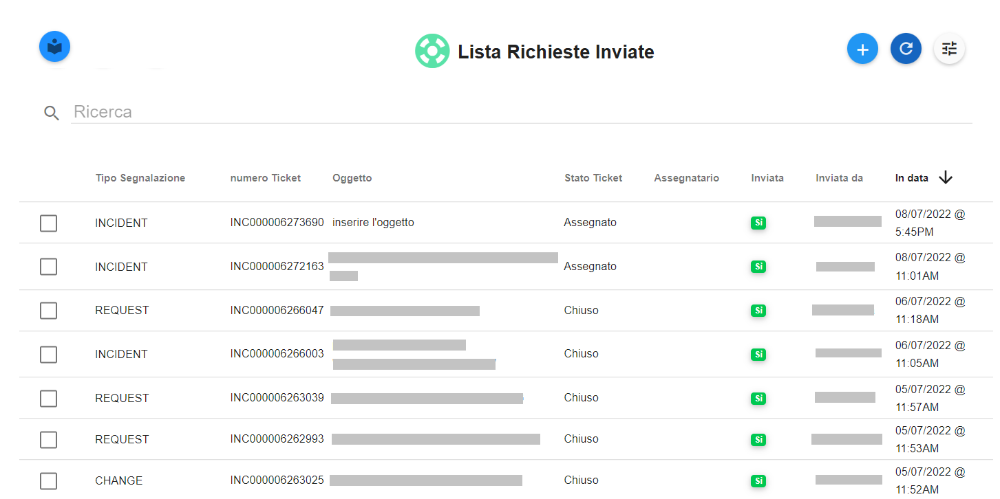

|

In automatico si riceverà sulla propria casella di posta elettronica una mail a conferma dell'avvenuta apertura del ticket:

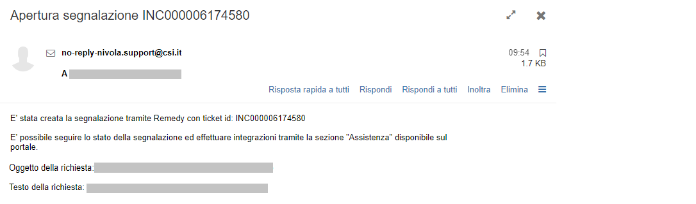
