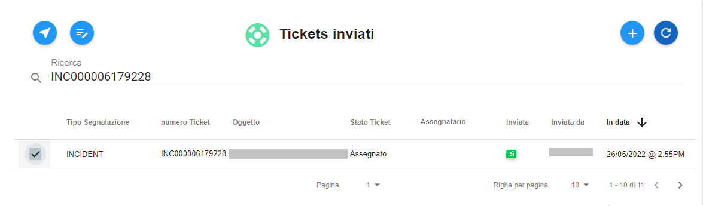
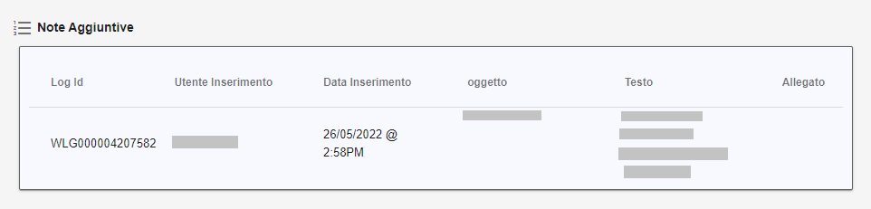
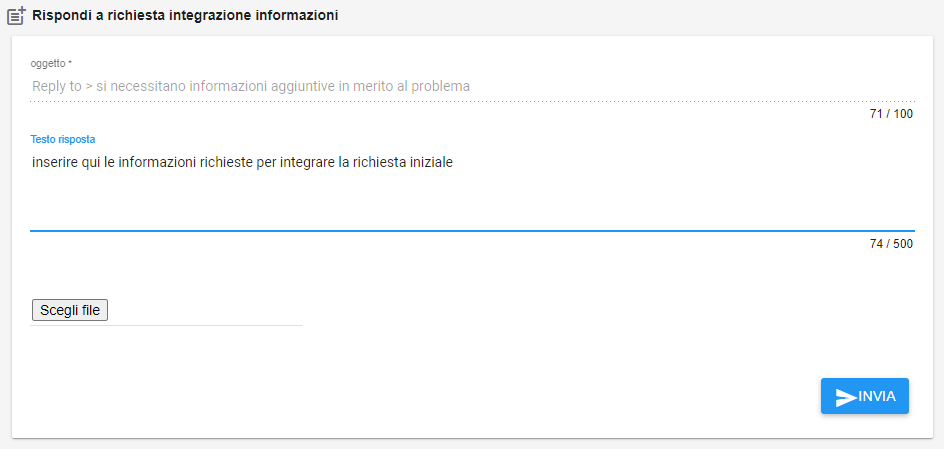
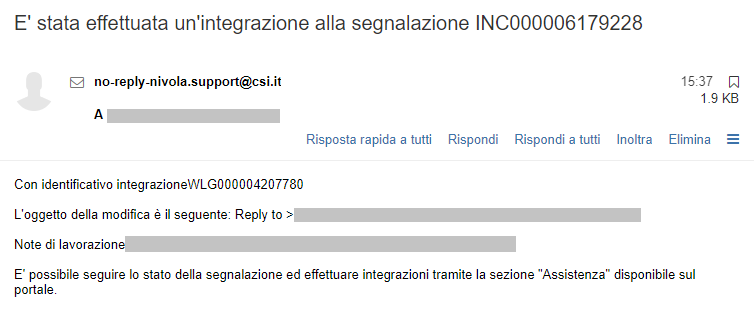

.. _Rispondere_richiesta_integrazione_informazioni:

**Rispondere a una richiesta di integrazione informazioni**
===========================================================

La ricezione di una mail, simile alla seguente, con oggetto "**E' stata effettuata un'integrazione alla segnalazione INC00000xxxxxxx**"": 

.. image:: img/100.40_Mail_da_Richiesta_Integrazione.png

indica che il gruppo che ha in carico la richiesta ha ritenuto necessario chiedere ulteriori informazioni in merito.
Occorre quindi cercare tale richiesta utilizzando il numero del ticket **INC00000xxxxxxx** come chiave di ricerca da inserire sotto 
la label «Ricerca» all'interno della lista dei **Tickets inviati**:

Mettere una spunta sulla Checkbox relativa:

    
Usare il bottone **Visualizza dettagli Ticket**:

.. image:: img/100.5_iconaDettagliTicket.png

Verranno visualizzate le informazioni del ticket, contenute nel tab **RICHIESTA**:
    
.. image:: img/100.5_DettagliTicketTag1.png

Quindi spostarsi nel tag **NOTE AGGIUNTIVE** dove sarà possibile visualizzare l'oggetto e il testo della richiesta di integrazione
che ci è pervenuta:

Per rispondere a tale richiesta di integrazione informativa, utilizzare il box sottostante "**Rispondi a richiesta integrazione informazioni**":

.. image:: img/100.40_Rispondi_Richiesta_Integrazione_Informazioni.png

Una volta inserite le informazioni richieste nel campo "**Testo risposta**", premere il tasto "**INVIA**"

Comparirà il seguente messaggio di conferma:

Ad ulteriore conferma arriverà una mail:

