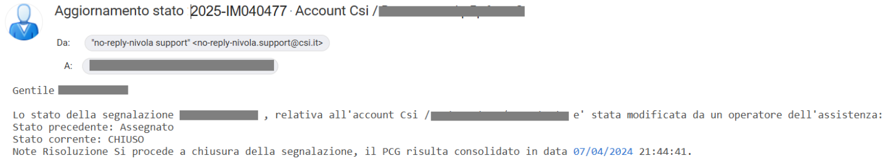
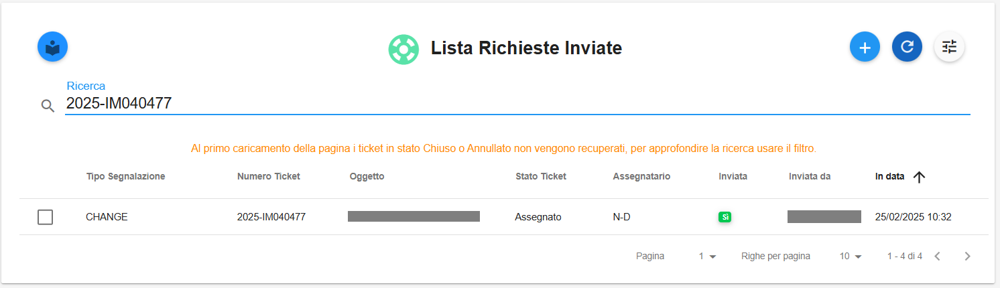
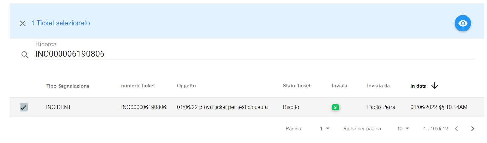
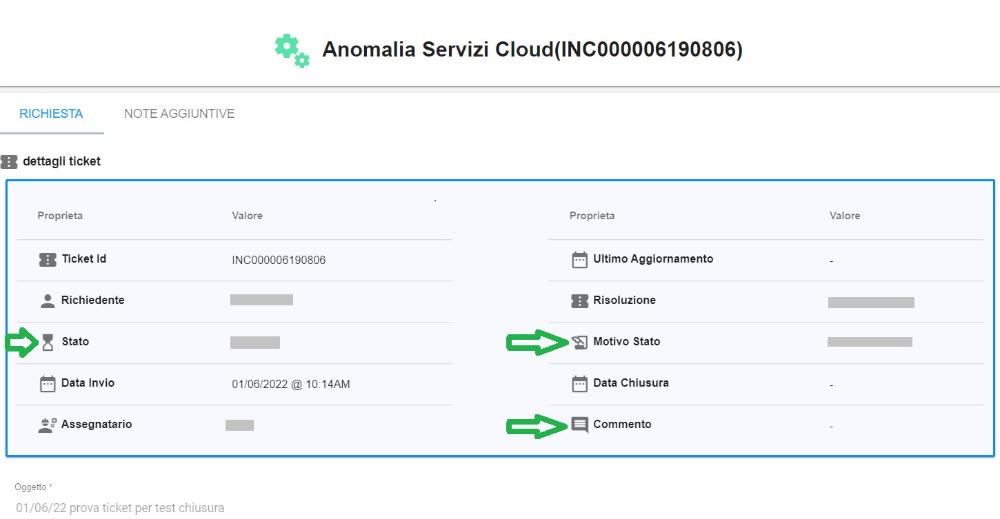

**Cambio di stato oppure Chiusura del ticket**
==============================================

La ricezione di una mail, simile alla seguente, con oggetto "**Aggiornamento stato 2025-IM.... Account ....**"

indica che il gruppo che aveva in carico il ticket ha modificato lo stato oppure ha chiuso la richiesta.

Gli stati previsti sono i seguenti:

**ASSEGNATO**

**IN CORSO**

**PENDENTE**

**RISOLTO**

**CHIUSO**

**ANNULLATO**

|

E' possibile cercare tale richiesta utilizzando il numero del ticket **2025xxxxxxx** come chiave di ricerca da inserire sotto 
la label **Ricerca** all'interno della **Lista Richieste Inviate**:

Mettere una spunta sulla Checkbox relativa:

    
Usare il pulsante **Visualizza dettagli Ticket**:

.. image:: img/100.5_iconaDettagliTicket.png

|

Verranno visualizzate le informazioni del ticket:

