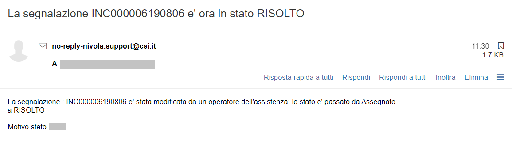

.. _Tickets_inviati:

**Chiusura del Ticket**
===========================

La ricezione di una mail, simile alla seguente, con oggetto "**E' stata effettuata un'integrazione alla segnalazione INC00000xxxxxxx**"": 

indica che il gruppo che ha in carico la richiesta ha risolto e chiuso il ticket.
Occorre quindi cercare tale richiesta utilizzando il numero del ticket **INC00000xxxxxxx** come chiave di ricerca da inserire sotto 
la label «Ricerca» all'interno della lista dei **Tickets inviati**:

.. image:: img/100.45_RicercaStringaTicketDX.png

Mettere una spunta sulla Checkbox relativa:

.. image:: img/100.45_RicercaStringaTicketOkDX.png
    
Usare il bottone **Visualizza dettagli Ticket**:

.. image:: img/100.5_iconaDettagliTicket.png

Verranno visualizzate le informazioni del ticket, contenute nel tab **RICHIESTA**. Nel informazioni di chiusura del ticket sono presenti
nel campo "**Risoluzione**", ed eventualmente nel campo "**Commento**".
