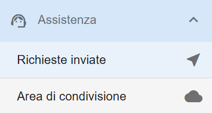
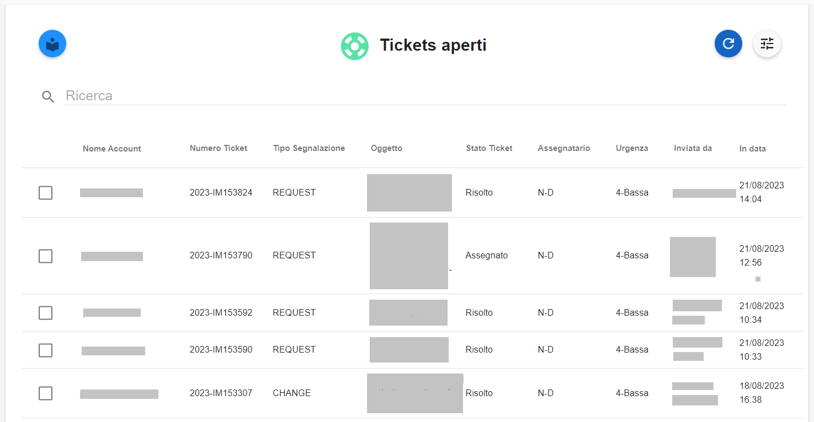
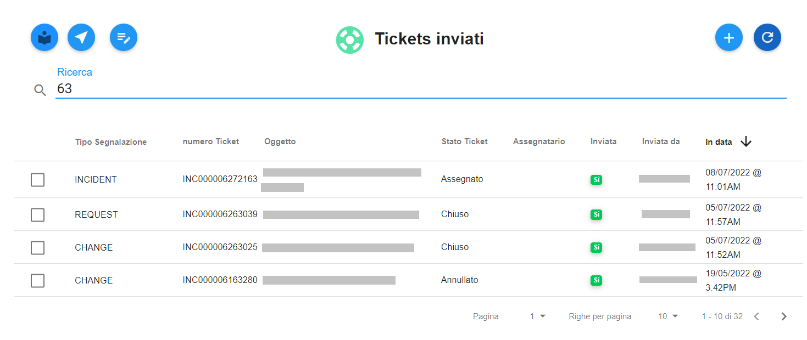
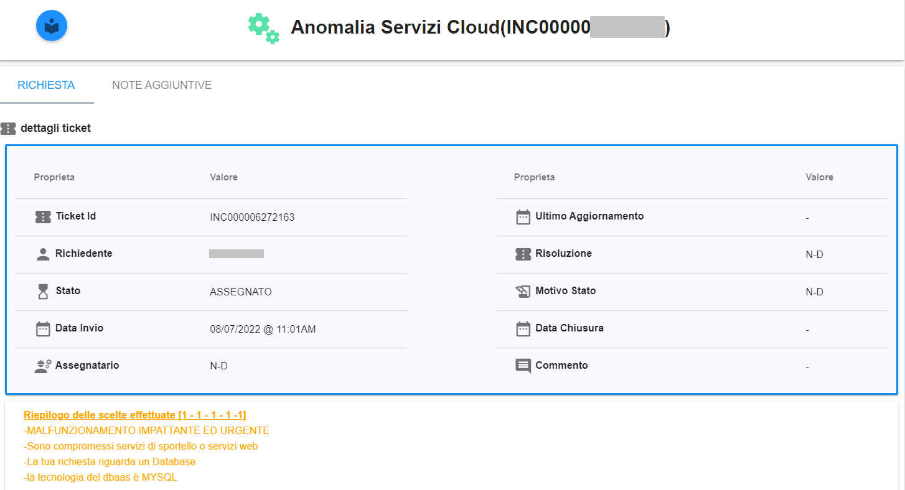
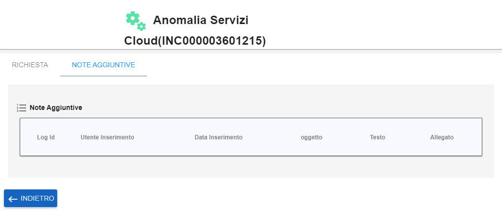

.. _Cercare_E_Visualizzare_Ticket:

**Cercare e visualizzare Ticket**
=================================

La funzione rientra nel **servizio assistenza**. La lista dei **Tickets aperti** è attivabile dalla parte
sinistra dello schermo, sotto **Assistenza**:

A seguito di un clic su **Tickets aperti**, il sistema popolerà la parte destra del video con l'elenco dei **Tickets aperti**:

E' possibile fare ricerche su tutti i ticket precedentemente aperti da qualsiasi account. 
La ricerca è eseguita tramite una stringa inserita dall’operatore.
Per eseguire una ricerca è necessario procedere in questo modo:

1. Inserire la stringa da usare come chiave di ricerca sotto la label «Ricerca»: il sistema automaticamente popolerà lo schermo 
con i ticket che soddisfano il criterio di selezione;

2. Individuare il ticket dalla lista, mettendo una spunta a fianco del nome;

.. image:: img/100.5_RicercaStringaTicketOkDX.png
    
3. Usare il bottone **Visualizza dettagli Ticket**;

4. Verranno visualizzati le informazioni del ticket, contenute nel tab **RICHIESTA**;
    

5. Eventuali informazioni aggiunte al ticket successivamente alla sua creazione sono presenti nel tag **NOTE AGGIUNTIVE**;

