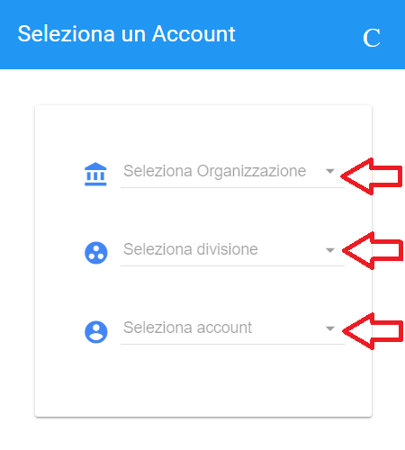
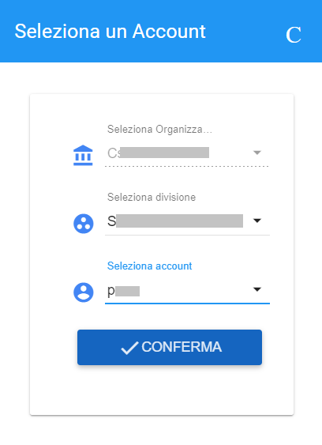

**Uso dei filtri (amministratore di backoffice)**
=================================================

I filtri per **stato** e **cognome** sono comuni a quelli descritti nella sezione relativa ai **Master di Account**

La ricerca per **account** è attivabile cliccando sul pulsante **SELEZIONA L'ACCOUNT**

.. image:: img/100.15_Filtro1selezAccount.png

Utilizzare le frecce per far comparire le liste delle **Organization**, **Division** e **Account**

Quindi selezionare l'organization, la division e l'account desiderati e cliccare su **CONFERMA**

