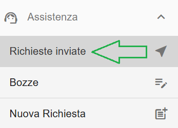
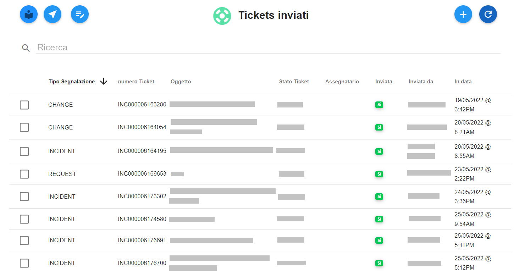
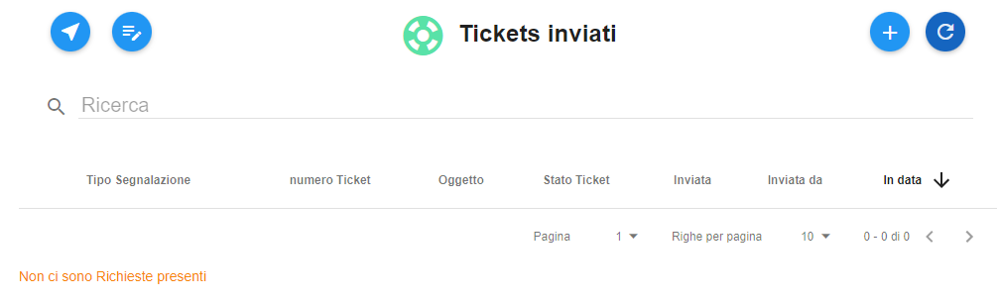

**Elenco Ticket inviati**
==========================
La funzione rientra nel **servizio assistenza**. La lista delle **Richieste inviate** è attivabile dalla parte
sinistra dello schermo, cliccando sulla label **Richieste inviate** sotto **Assistenza**:

A seguito di un clic su **Richieste inviate**, il sistema popolerà la parte destra del video con l'elenco dei **Lista Richieste inviate**:

In caso di primo utilizzo della funzionalità la lista risulterà vuota, e in basso comparirà il messaggio "Non ci sono Richieste presenti":

   