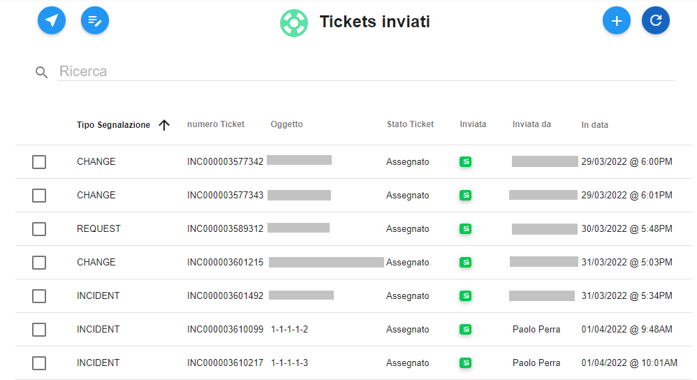

.. _Tickets_inviati:

**Tickets inviati**
===========================
La funzione rientra nel **servizio assistenza**. La lista dei **Tickets inviati** è attivabile dalla parte
sinistra dello schermo, cliccando sulla label **Tickets inviati** sotto **Assistenza**

.. image:: img/Assist_TicketInviati.png

A seguito di un clic su **Tickets inviati**, il sistema popolerà la parte destra del video con l'elenco dei **Tickets inviati**.

In caso di primo utilizzo della funzionalità la lista risulterà vuota, e in basso comparirà il messaggio "Non ci sono Richieste presenti"

.. image:: img/Assist_NoTicket.png
   