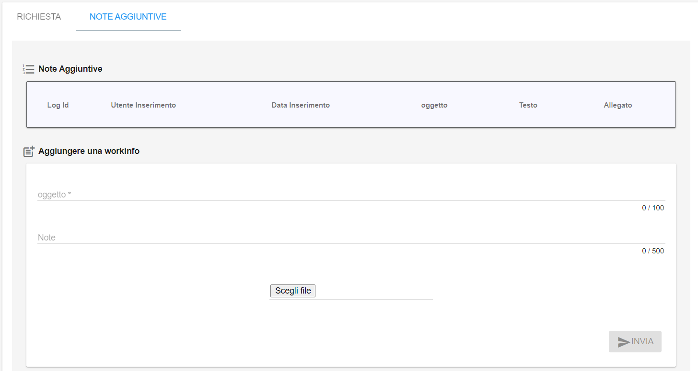
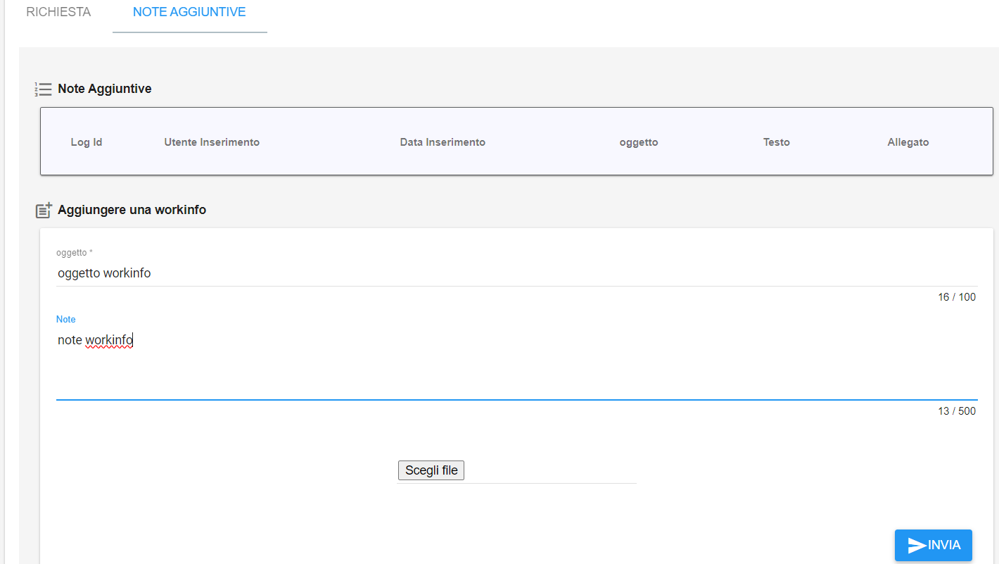
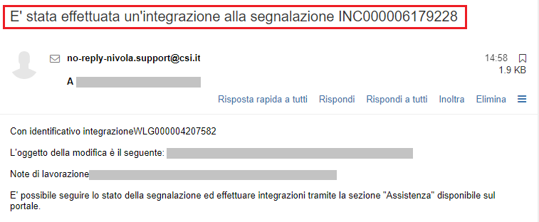

.. _Richiesta_integrazione_informazioni:

**Inserire una richiesta di integrazione informazioni**
=======================================================

E' possibile inserire una richiesta di integrazione informazioni (workinfo).

Cercare il ticket, visualizzarlo, quindi spostarsi nel tab **NOTE AGGIUNTIVE**

Popolare i campi, inserire eventuali allegati, e quindi cliccare su **INVIA**

Un messaggio in verde in alto a destra darà conferma dell'avvenuta operazione.

Verrà automaticamente inviata una mail, simile alla seguente, con oggetto "**E' stata effettuata un'integrazione alla segnalazione INC00000xxxxxxx**""
all'indirizzo di posta elettronica associato all'account che ha aperto il ticket: 

