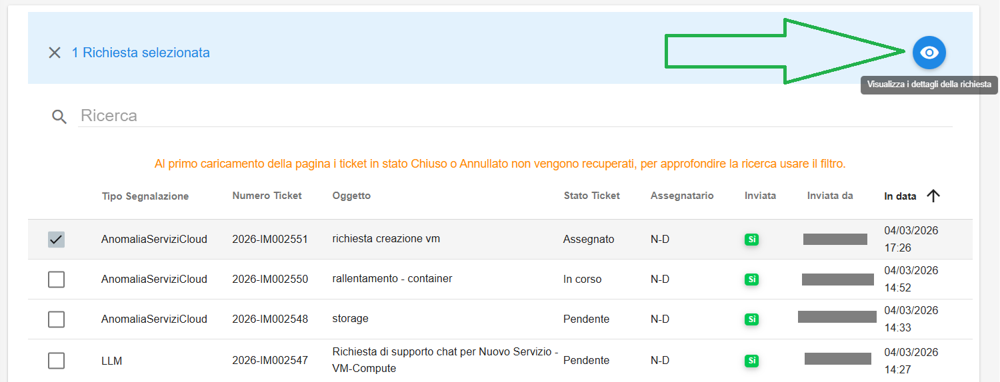
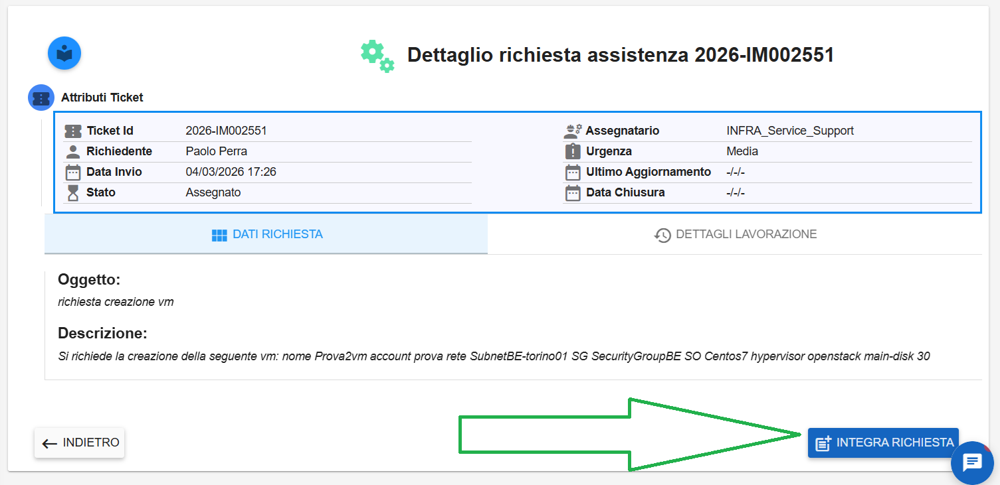
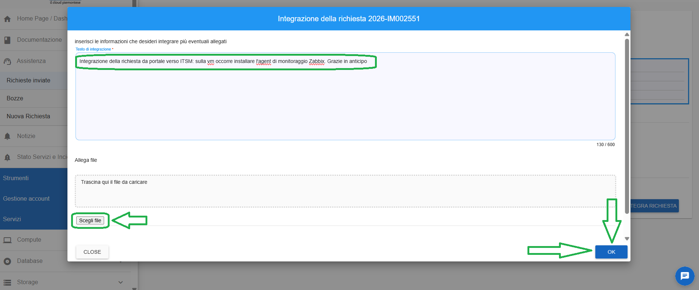
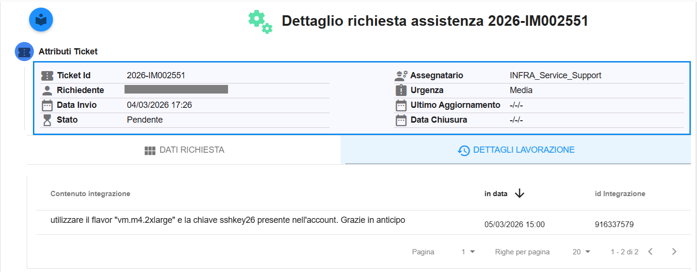
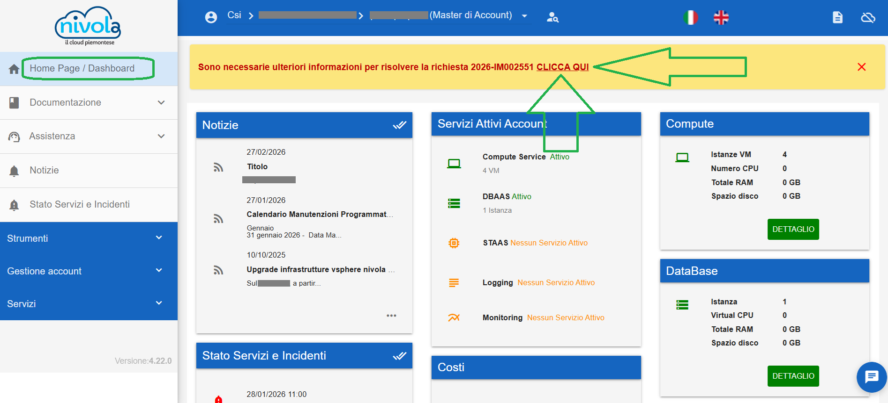
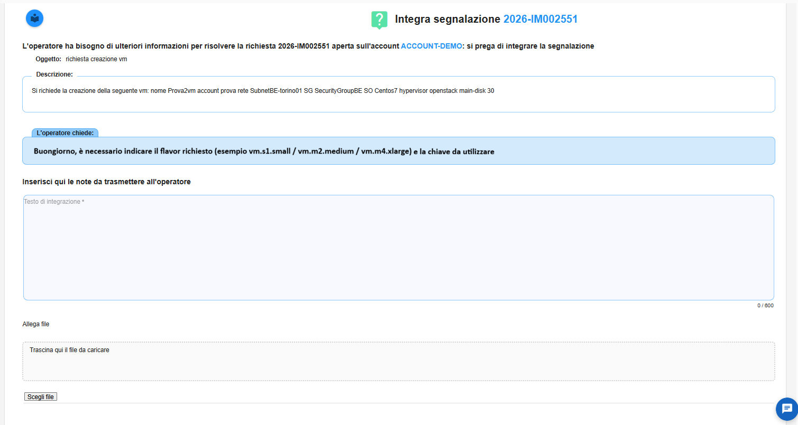
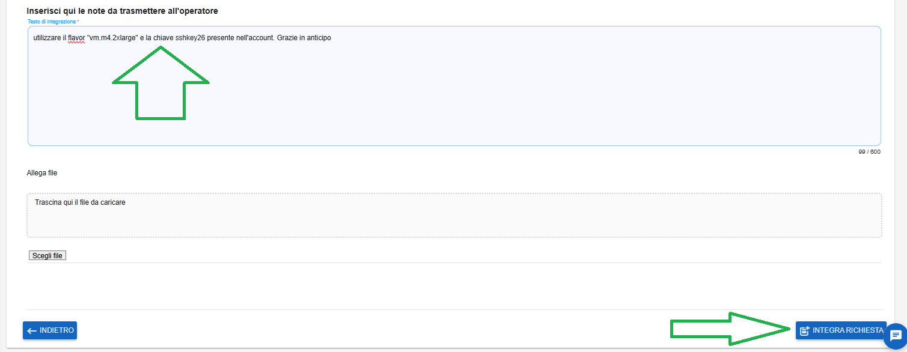
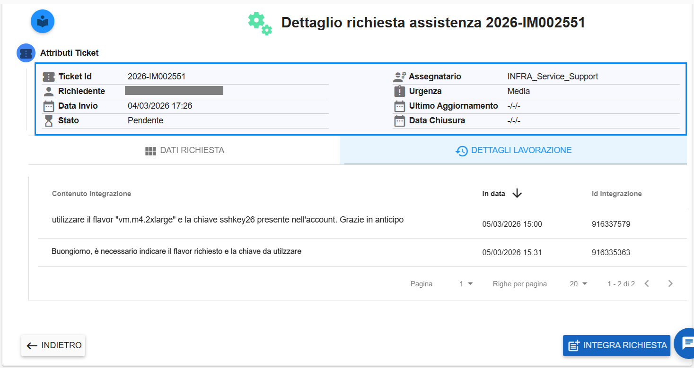

**Integrazione Richieste**
==========================

**1) integrazione necessaria all'utente per integrare una richiesta**

Nel caso in cui i ticket aperti siano incompleti gli operatori di Support / Operation hanno bisogno di richiedere integrazioni 
alle informazioni di partenza quando incomplete e/o ambigue: 

- le integrazioni sono disponibili per ticket il cui stato sia diverso da Risolto o Chiuso

- se la richiesta arriva da ITSM l'avviso arriverà, oltre che via email, attraverso la comparsa di un apposito banner sul portale

|

Selezionare una richiesta e cliccare su **Visualizza i dettagli della richiesta**

|

Una volta entrati nei dettagli della richiesta, cliccare in basso a destra sul pulsante **INTEGRA RICHIESTA**

|

Inserire i dati necessari (eventualmente anche un allegato attraverso il pulsante "Scegli file") e quindi cliccare su **OK**

|

Comparirà il seguente messaggio a conferma della avvenuta operazione. L'informazione verrà inviata all'Operatore ad integrazione del ticket

|

Cliccando su **DETTAGLI LAVORAZIONE** è possibile visualizzare le informazioni aggiornate della richiesta

|

|

**2) integrazione necessaria all'Operatore in caso di informazioni incomplete e/o ambigue**

Quando l'Operatore sospende una richiesta a fronte della mancanza di informazioni che occorre completare, l'utente viene avvertito 
da un apposito banner che compare quando si riaccede al portale, oppure quando ci sposta nella Home Page.
Occorre quindi cliccare sulla voce "**CLICCA QUI**" come da seguente immagine

|

Si atterra nella seguente pagina, in cui sotto la label "**L'operatore chiede:**" compare il testo con le informazioni necessarie all'Operatore
per poter prendere in carico la richiesta

|

Sotto la label "**Inserisci qui le note da trasmettere all'operatore**"" è presente il box in cui inserire le informazioni richieste
(eventualmente inserire se necessario un allegato attraverso il pulsante “Scegli file”).
Quindi cliccare su **INTEGRA RICHIESTA** in basso a destra

|

Comparirà il seguente messaggio a conferma della avvenuta operazione

|

Cliccando su **DETTAGLI LAVORAZIONE** è possibile visualizzare le informazioni aggiornate della richiesta

|

**Si segnala che il banner, quando visualizzato in seguito all'accesso al portale, compare indipendemente dall'account visualizzato in quel momento**
