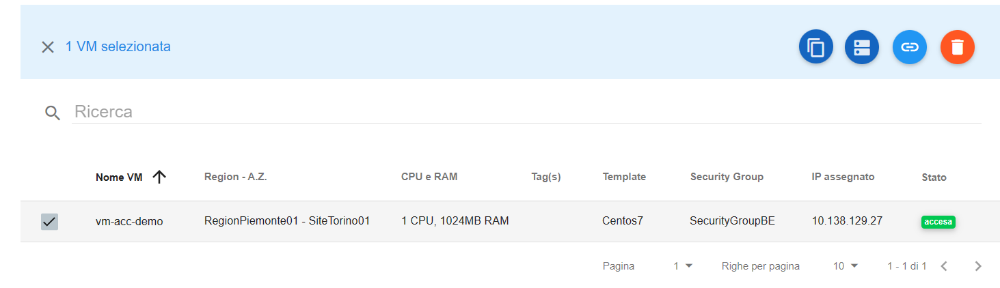
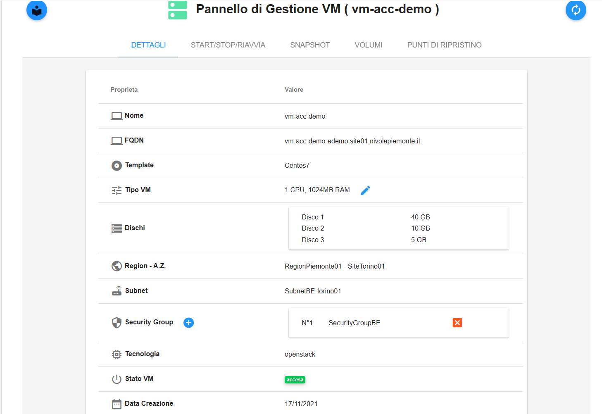
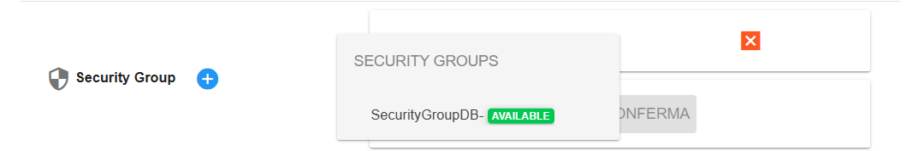

**Modificare Security Group di una Virtual Machine**
====================================================

La funzione rientra nel menù **Servizi**. La **Modifica del Security Group** è 
attivabile dalla parte sinistra dello schermo, cliccando sulla label **VM** sotto **Compute**

.. image:: img/VM_innesco_crea.png

|

Il sistema popolerà la parte destra del video con l'**Elenco delle VM**.
Per attribuire un nuovo **Security Group** ad una VM, procedere in questo modo:

1. Selezionare la VM

|

2. Fare clic sul pulsante **Pannello di gestione VM**

.. image:: img/VM_Pannello_controllo.png

|   

3. Dal **Pannello di Gestione VM**, verificare di essere posizionati sul tag **DETTAGLI**

|

4. Premendo il pulsante **“+”** a destra della label **Security Group** si apre una maschera per aggiungere un Security Group 
esistente alla VM.
Dopo averlo selezionato e premuto il pulsante **CONFERMA** si creerà l’associazione.

L'operazione non è immediata: durante il processo, la VM assumerà uno stato temporaneo. Tornata in stato running,
il Security Group appena aggiunto sarà visibile.

|

5. Per eliminare un **Security Group** assegnato alla VM, premere la **“X”** rossa a sinistra del gruppo già associato.

