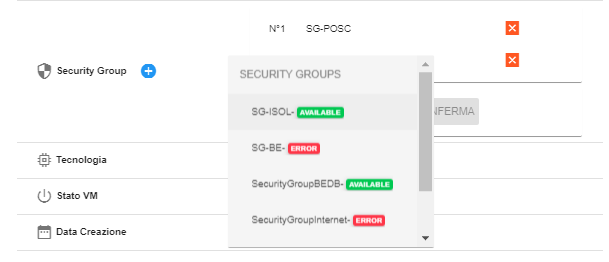
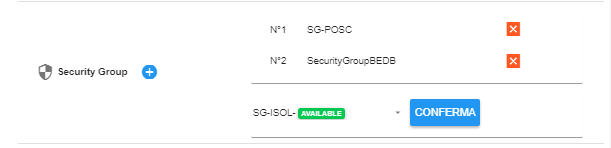

.. _Modificare_SG:

**Modificare Security Group**
=============================
La funzione rientra nel **servizio compute**. La **Modifica del Security Group** è 
attivabile dalla parte sinistra dello schermo, cliccando sulla label **VM** sotto **Compute**

.. image:: img/VM_innesco_crea.png

A seguito di un clic su **V**, il sistema popolerà la
parte destra del video con l'**Elenco delle VM**.
Per attribuire un nuovo *Security Group**, procedere in questo modo:

1. Individuare il sever dall’**Elenco VM**, mettendo una spunta a fianco del nome;

.. image:: img/Ricerca_VM_a.png

2. Fare clic sul pulsante:

.. image:: img/VM_Pannello_controllo.png

3. Raggiungere la sezione **"Security Group"**;
    
.. image:: img/VM_Pannello_dettagli.png

4. Premere il pulsante **"+"**;

.. image:: img/Add_VM.png

5. Indicare il nuovo security Group, tra le diverse opzioni:

6. Terminare, premendo il pulsante  **CONFERMA**:

