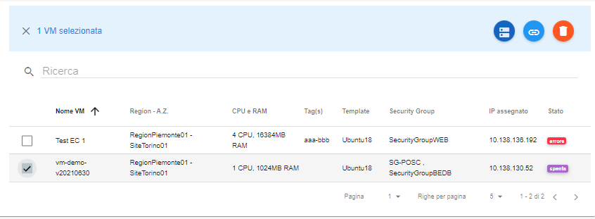
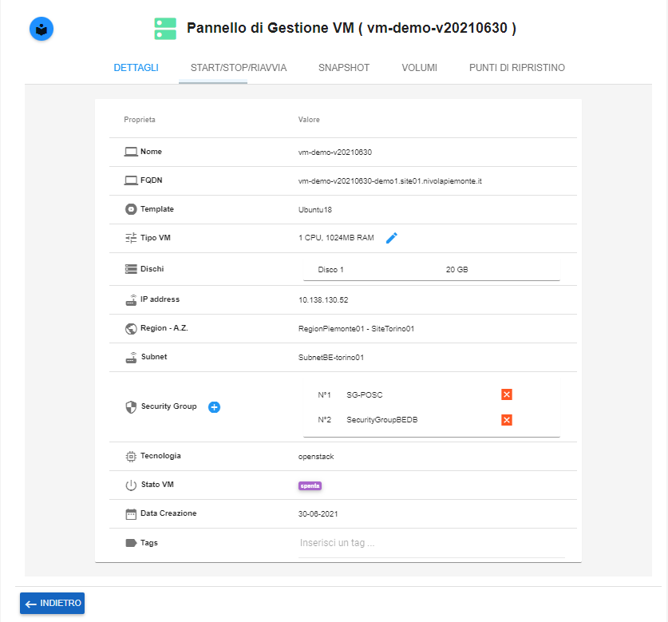

.. _Rimuovere_SG:

**Rimuovere Security Group**
============================
La funzione rientra nel **servizio compute**. La **Rimozione del Security Group** è 
attivabile dalla parte sinistra dello schermo, cliccando sulla label **VM**, sotto **Compute**

.. image:: img/VM_innesco_crea.png

A seguito di un clic su **VM**, il sistema popolerà la
parte destra del video con l'**Elenco delle VM**.

Per rimuovere *Security Group**, dall'istanza, procedere in questo modo:

1. Individuare il sever, dall’**Elenco VM**, mettendo una spunta a fianco del nome;

2. Fare clic sul pulsante:

3. Raggiungere la sezione **"Security Group"**;
    

4. Premere, il pulsante **"X"**, a fianco dell'oggetto da rimuovere;

5. Il sistema eliminerà, dalla lista, il SG.

