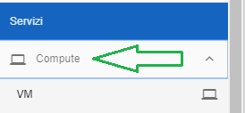
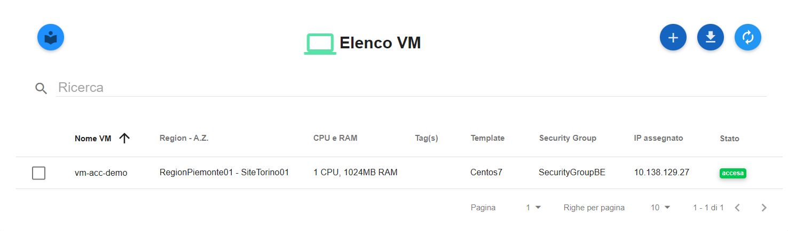
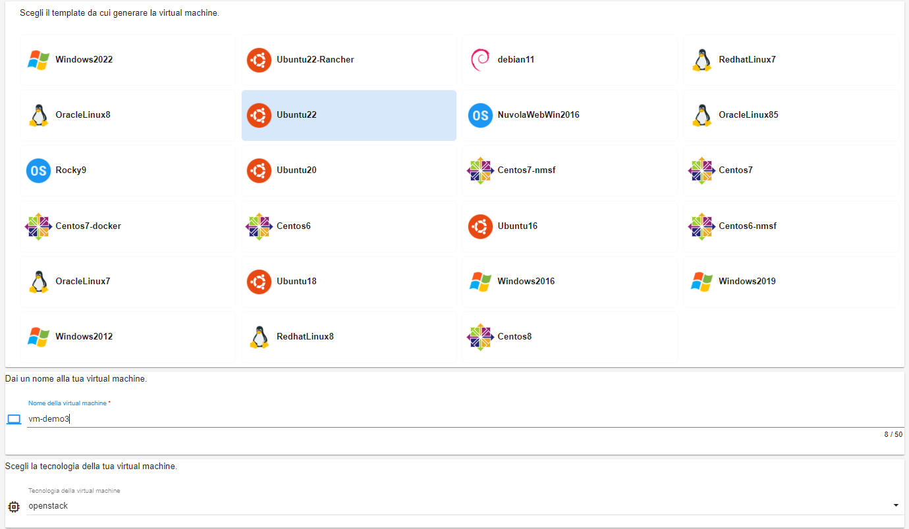
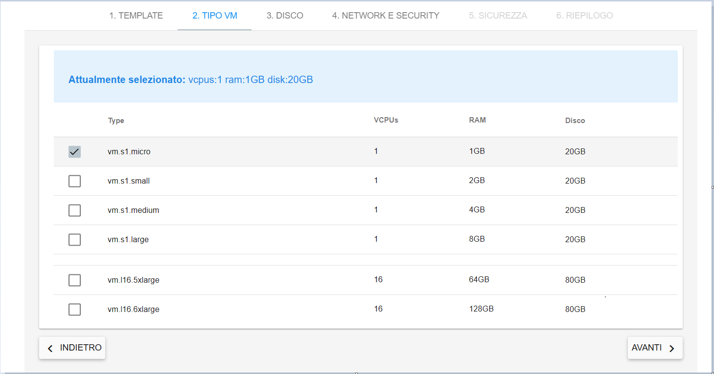
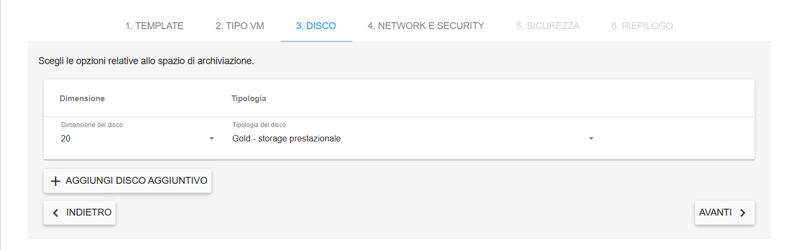
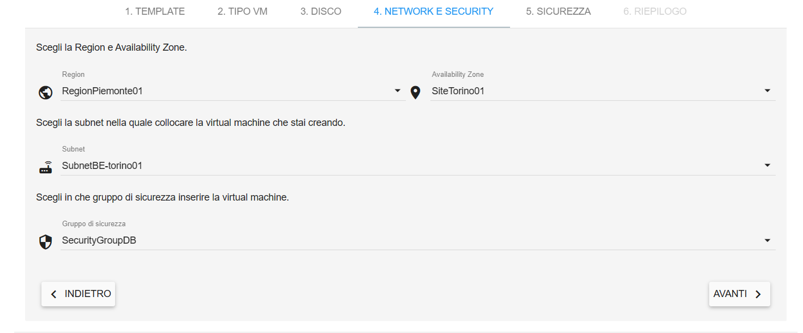
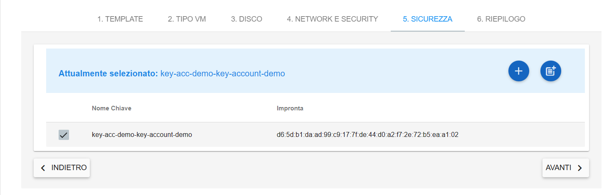
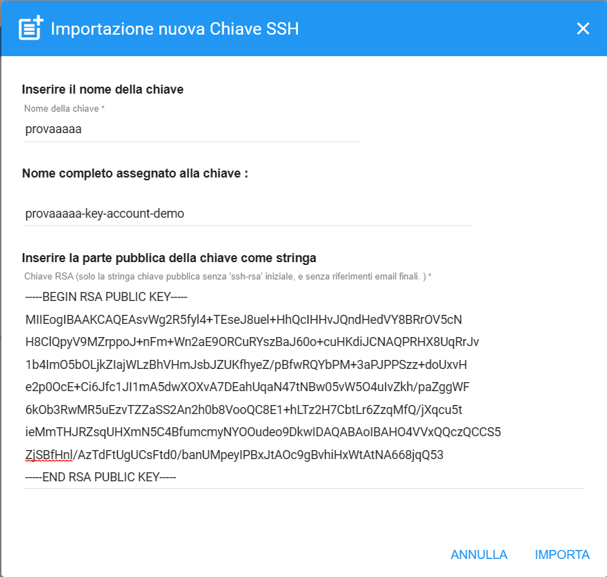
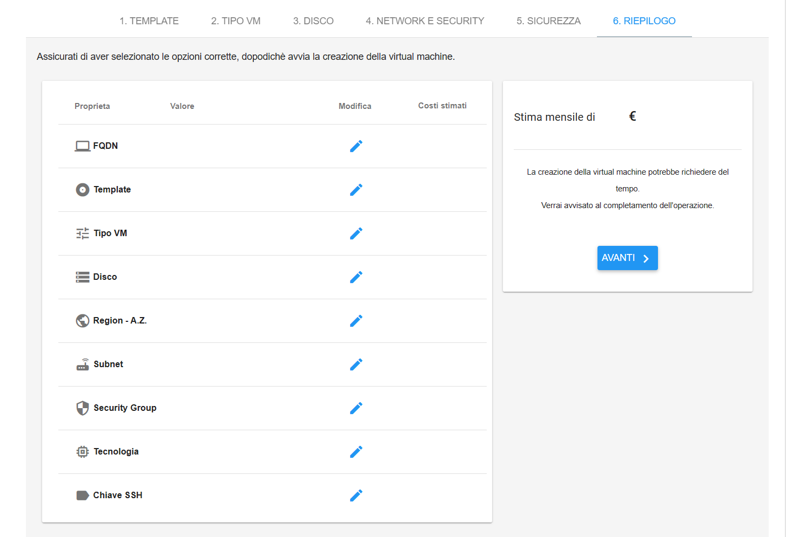
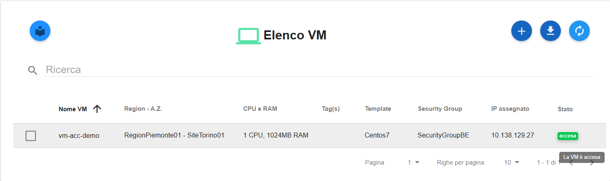

.. _Creare_VM:

**Creare Virtual Machine**
===========================
La funzione rientra nel **servizio compute**. La **creazione Vm** è attivabile dalla parte
sinistra dello schermo, cliccando sulla label **VM** sotto **Compute**

A seguito di un clic su **VM**, il sistema popolerà la
parte destra del video con l'**Elenco delle VM**.

Per la creazione del server, dalla lista, procedere in questo modo:

1. Fare clic sul pulsante **"+"**:

.. image:: img/Add_VM.png

2. Inserire il **Nome della virtual machine** nella textbox e scegliere il **TEMPLATE**
   da cui generare la virtual machine. Per farlo è necessario selezionare su uno degli OS proposti.
   Per alcuni template è necessario sceglere anche il tipo di tecnologia (hypervisor), selezionabile
   dall'ultima combo box in basso. In ultimo cliccare sul pulsante **AVANTI**;

3. Specificare il type, la CPU, la RAM e il Disco sfruttando il **CheckBox** in testa ad ogni riga esposta
dal portale e cliccare sul pulsante **AVANTI**;

4. Indicare dimensione del disco ed eventualmente, aggiungere altri dischi,
sfruttando il pulsante **AGGIUNGI DISCO AGGIUNTIVO**. Al termine,
proseguire cliccando su **AVANTI**;

5. Sfruttando le combo box proposte, inserire: **Region, Availability Zone,
Subnet e Gruppo di sicurezza**.  Al termine cliccare su **AVANTI**;

6. In questa fase è obbligatorio generare una **CHIAVE SSH** da associare alla
virtual machine, per farlo, Nivola mette a disposizione 3 metodi distinti.

**SCEGLIENDO UNA DELLE CHIAVI DALLA LISTA**

Con questa soluzione il sistema propone una serie di **chiavi ssh** da cui scegliere.
L'operatore potrà individuare la chiave sfruttando la checkbox
e successivamente, concludere premendo **AVANTI**;

**CREANDO CHIAVE SSH EX NOVO**

Con questo metodo si chiede al sistema di generare direttamente una
nuova **chiave ssh**;

La funzione inizia premendo il tasto **"+"**

.. image:: img/Add_VM.png

Nella casella di testo, **inserire il nome della nuova chiave**
dando modo al sistema di dare un nome alla chiave
aggiungendo il suffisso "key", il nome dell'account al termine della stringa
digitata. Terminare premendo **CREA CHIAVE**

.. image:: img/Keyssh-ex-novo.png

dopo di che distinguerla nella lista e premere **AVANTI**;

**IMPORTANDO LA CHIAVE SSH**

Premere il tasto per l'importazione

**Inserire il nome chiave**, immettere la chiave precedentemente generata
da un sistema esterno a Nivola, nel campo di testo  **Inserire la chiave** e
premere **IMPORTA**;

Conclusa la generazione della **chiave ssh**, utilizzare la checkbox per
selezionarla dalla lista e premere **AVANTI**;

7. Controllare gli attributi del server da creare
e validarli premendo sul pulsante **AVANTI** sulla destra.
Il portale procederà alla creazione della **VM** utilizzando i parametri
inseriti dall'operatore;

8. Attendere qualche secondo e il server, comparirà nell’**ELENCO VM**.
Lo stato iniziale della nuova **Virtual Machine** sarà **acceso** e
quindi disponibile.

