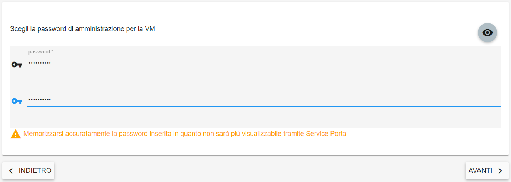

**Creare Virtual Machine**
===========================
La funzione rientra nel menù **Servizi**. La **creazione VM** è attivabile dalla parte
sinistra dello schermo, cliccando sulla label **VM** sotto **Compute**

.. image:: img/VM_innesco_crea.png

|

A seguito di un clic su **VM**, il sistema popolerà la
parte destra del video con l'**Elenco delle VM**.

.. image:: img/VM_Elenco.png

|

**Attenzione si ricorda che la creazione di una nuova VM non attiva automaticamente i servizi di backup, monitoraggio e logging**

|

Per la creazione della Virtual Machine procedere seguendo i seguenti passi:

1. Fare clic sul pulsante **"+"**:

.. image:: img/Add_VM.png

|

2. Scegliere il **TEMPLATE** da cui generare la virtual machine, selezionando uno degli OS proposti nell’ elenco. 
Inserire il **Nome della VM** nel primo textbox e scegliere, per alcuni Template, anche il tipo di tecnologia (**hypervisor**), 
selezionabile dall’ultima combo box in basso. Per proseguire con la creazione cliccare sul pulsante **AVANTI**

.. image:: img/11.1_VM_template.png

|

3. Specificare il **Type** della VM, che comprende **CPU, RAM e Disco**. Sfruttare il CheckBox a sinistra di ogni riga esposta sul 
portale e cliccare sul pulsante **AVANTI**

.. image:: img/CpuRamDisco_VM.png

|

4. Indicare dimensione del disco ed eventualmente, aggiungere altri dischi,
sfruttando il pulsante **AGGIUNGI DISCO AGGIUNTIVO**. Al termine,
proseguire cliccando su **AVANTI**

.. image:: img/Disco_VM.png

|

5. Sfruttando le combo box proposte, inserire: **Region, Availability Zone,
Subnet e Gruppo di sicurezza**.  Al termine cliccare su **AVANTI**

.. image:: img/Network_Security_VM.png

|

6. In caso di Virtual Machine **LINUX** è obbligatorio **scegliere** o **generare** una **CHIAVE SSH** da associare alla 
Virtual Machine. Una volta scelta una chiave già presente o generata (creazione o importazione), 
premere il pulsante **AVANTI**

.. image:: img/key-ssh-selezionata-da-lista.png

Invece in caso di Virtual Machine **WINDOWS** è obbligatorio impostare una password da associare all'utenza amministrativa. 
Quindi premere il pulsante **AVANTI**

|

7. Controllare le configurazioni della Virtual Machine da creare siano corretti e confermare premendo sul 
pulsante **AVANTI** sulla destra. Il portale procederà alla creazione della **VM** utilizzando i parametri inseriti

.. image:: img/Riepilogo_VM.png

|

8. Attendere qualche secondo e il server comparirà nell’ **ELENCO VM**. Quando lo stato della nuova 
**Virtual Machine** sarà acceso, potrà essere utilizzata.

.. image:: img/VM-Lista-ready.png
