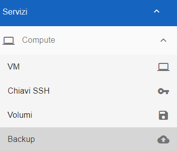
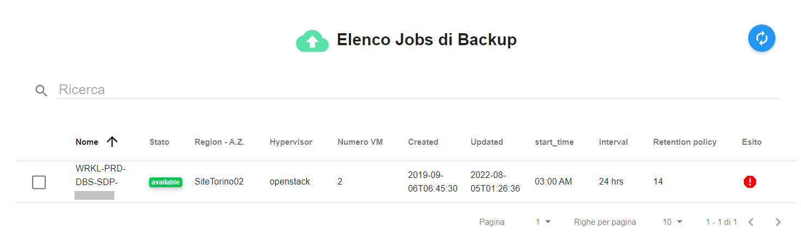
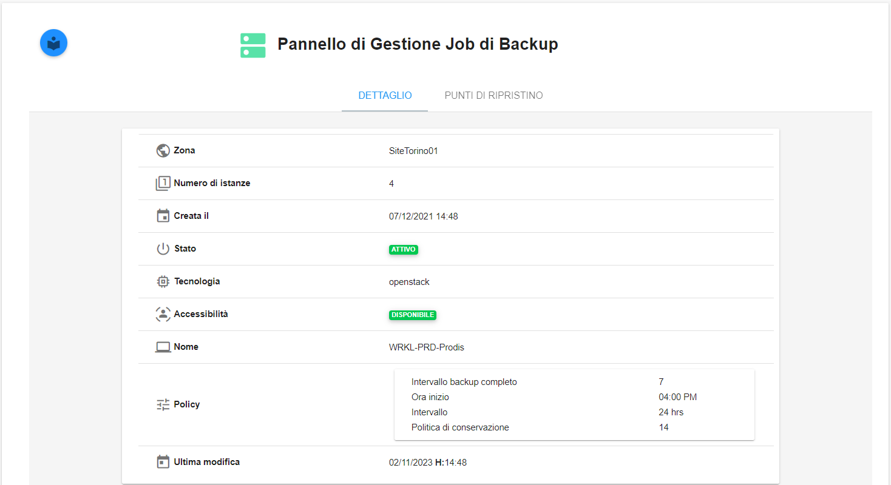
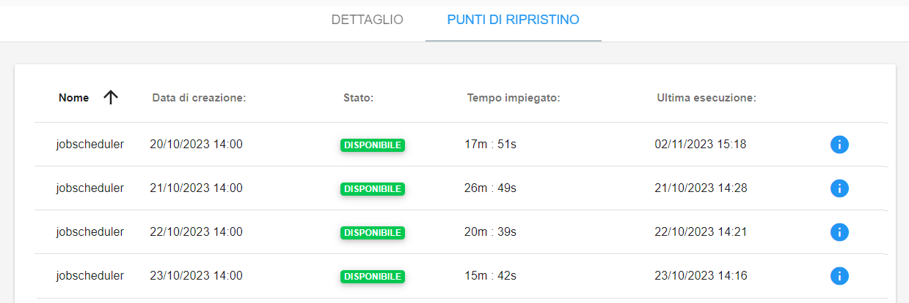
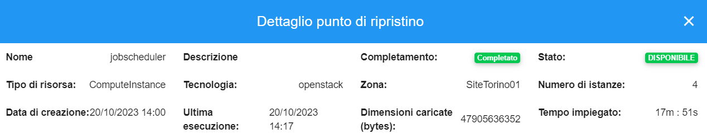

.. _Jobs di Backup:

**Jobs di Backup**
******************

La gestione dei **Jobs di Backup** rende disponibile la funzionalità di visualizzazione dei backup dall'account per mezzo del
Service Portal.

La funzione è attivabile dalla parte sinistra dello schermo, cliccando sulla label **Backup** sotto **Compute**

A seguito di un clic su **Backup**, il sistema popolerà la parte destra del video con l' **Elenco Jobs di Backup**. 

Selezionando un **Job di Backup** e cliccando sull'icona del dettaglio in alto a destra

.. image:: img/03_dettaglio.png

è possibile visionare la pagina relativa al **Pannello di Gestione Job di Backup**

Spostandosi nel tab **PUNTI DI RIPRISTINO** è possibile visionare l'elenco dei **jobscheduler**

In corrispondenza di ogni **jobscheduler** cliccando sul simbolo delle informazioni sulla destra

Si accede al **Dettaglio punto di ripristino**

