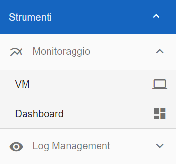
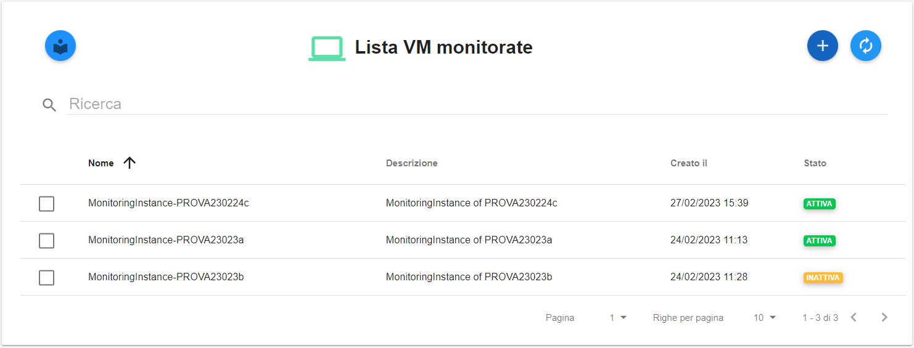

.. _Monitoraggio:

**Monitoraggio (master di account)**
************************************

La gestione del **Monitoraggio** rende disponibile la funzionalità di monitoraggio delle Virtual Machine per mezzo del
Service Portal.

La funzione è attivabile dalla parte sinistra dello schermo dal menù **Strumenti**, cliccando sulla label **VM** sotto **Monitoraggio**.

A seguito di un clic su **VM**, il sistema popolerà la parte destra del video con la **Lista VM monitorate** (se già presenti).

**Abilitare il Monitoraggio**
===============================

A seguito di un clic su **VM** (sotto **Strumenti -> Monitoraggio**), il sistema popolerà la parte destra del video con la **Lista VM monitorate** (se già presenti).

       .. image:: img/11.25_ListaVM_MonintorDX.png

Per effettuare l'abilitazione procedere in questo modo:

        1.Fare clic sul pulsante **+**

        .. image:: img/Add_VM.png
.
        2. Individuare la VM dall’elenco **Associa un nuovo servizio di monitoraggio**, mettendo una spunta a fianco del nome

        .. image:: img/11.25_Associa_Monitor.png
.
        3. Cliccare su pulsante **RICHIEDI L'ASSOCIAZIONE DEL SERVIZIO**
.
        4. All'interno della finestra **Conferma attivazione servizio** cliccare sul pulsante **CONFERMA**

        .. image:: img/11.25_Conferma_Servizio.png
.
        5. Appariranno i seguenti messaggi di conferma rispettivamente in alto a destra e in centro allo schermo

        .. image:: img/11.25_DX_MonitoringOk.png
.
        .. image:: img/11.25_DX_MonitoringCentro.png
.
        6. Cliccare sul tasto **CHIUDI**
.
        7. la VM comparirà in elenco con stato **ATTIVA**

        .. image:: img/11.25_MonitoringOK.png

        

        

**Disabilitare il Monitoraggio**
===============================

Per disabiliare il **monitoraggio** della Virtual Machine, procedere come segue:

    1. Individuare la VM dalla **Lista VM monitorate**, mettendo una spunta a fianco del nome;

       .. image:: img/11.25_Disattiva_selezVMdx.png
.
    2. Cliccare su pulsante in alto a destra **DISATTIVA IL MONITORAGGIO**

        .. image:: img/Pulsante_cancella.png
.
    3. All'interno della finestra **Conferma disattivazione servizio** cliccare sul pulsante **CONFERMA**

        .. image:: img/11.25_Disattiva_Servizio.png
.
    4. Appariranno i seguenti messaggi di conferma rispettivamente in alto a destra e in centro allo schermo

        .. image:: img/11.25_DX_MonitoringNO.png
.
        .. image:: img/11.25_DX_MonitoringCentroNO.png
.
    5. Cliccare sul tasto **CHIUDI**
.
    6. la VM comparirà in elenco con stato **INATTIVA**

        .. image:: img/11.25_MonitoringNO.png
