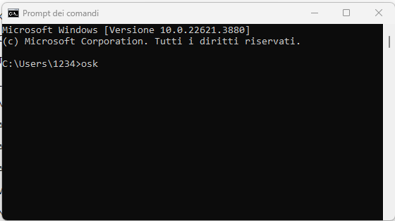
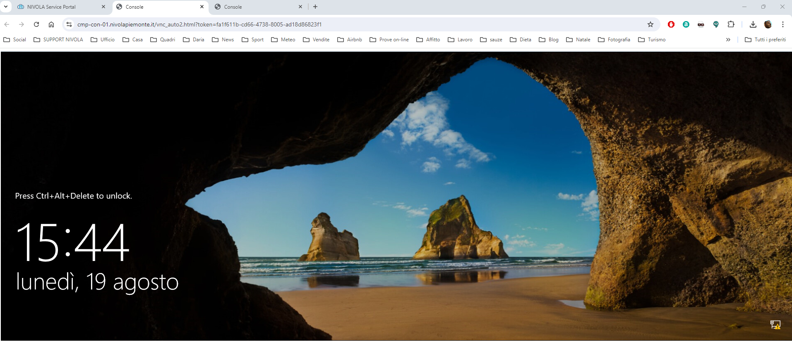
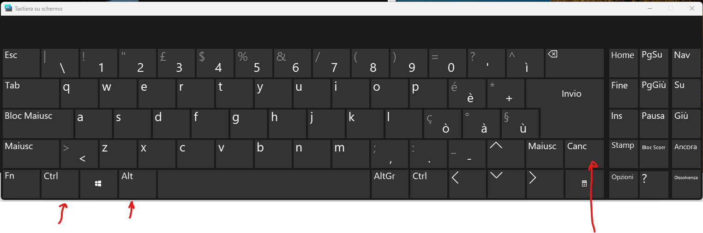
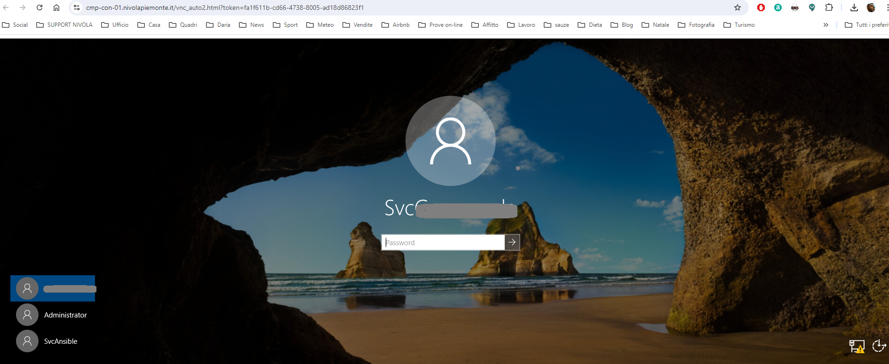

**Accedere alla Virtual Machine da portale (master di account)**
================================================================

**VM Linux**
************

I requisiti necessari sono avere una  **login** e una **password** forniti dal **Nivola Support Center**.
Acclarata questa condizione, procedere come segue:

Per accedere a una Virtual Machine Linux procedere con le seguenti operazioni:

    1. Cercare e Selezionare, dall’**Elenco VM**, l'host a cui accedere

       .. image:: img/Ricerca_VM.png

    2. Cliccare su tasto **"Connetti"**

      .. image:: img/11.2_ConnettiIcona.png
    
    3. Comparirà la schermata di accesso in cui autenticarsi

      .. image:: img/11.2_ConsoleSshBrowser.png

|

|

**VM Windows**
**************

Per accedere a una Virtual Machine Windows procedere con le seguenti operazioni:

    1. Cercare e Selezionare, dall’**Elenco VM**, l'host a cui accedere

       .. image:: img/11.2_ConnettiIconaDO.png

    2. Cliccare su tasto **"Connetti"**

      .. image:: img/11.2_Connetti.png

|

A quel punto si apre la consolle di accesso della VM Microsoft.

Per inviare il CTRL-ALT-CANC aprire un Prompt dei comandi sul proprio PC (CMD da avvio sul proprio PC) e digitare il comando OSK per aprire la tastiera su schermo:

|

A questo punto si apre la tastiera Virtuale, quindi cliccare sulla finestra della VM in consolle, come nell’esempio sotto riportato:

|

Sulla tastiera su schermo cliccare con il mouse CTRL-ALT-CANC

|

A questo punto entrate sulla VM con l’utenza e la PSW amministrativa per l’accesso:

|

|

**Macchine MAC Os**
*********************************

Per l'accesso alla consolle del server windows dal portale con mac la sequenza dei tasti da digitare è:

fn+ctrl+alt+del

non c'è bisogno di aprire tasiere virtuali ulteriori.

|

|

**Accesso tramite CLI**
***********************

Utilizzare il comando:

**beehive ssh nodes connect FQDN_VM oppure IP**

Esempio FQDN:
hostname-acronimoAccount.site01.nivolapiemonte.it
