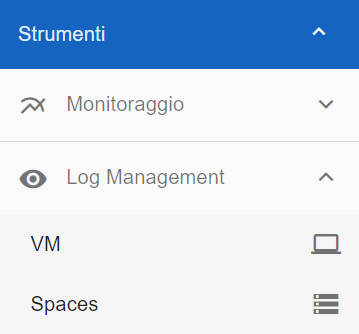
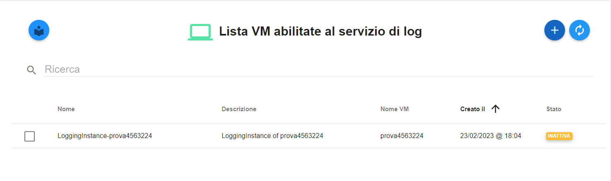
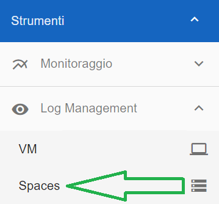
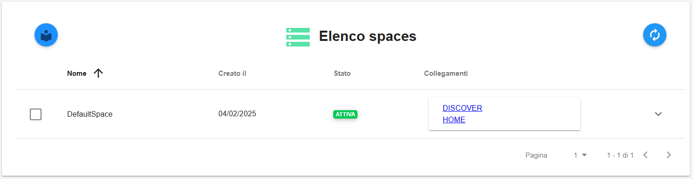
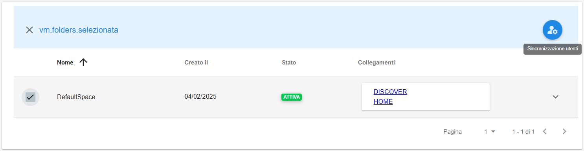
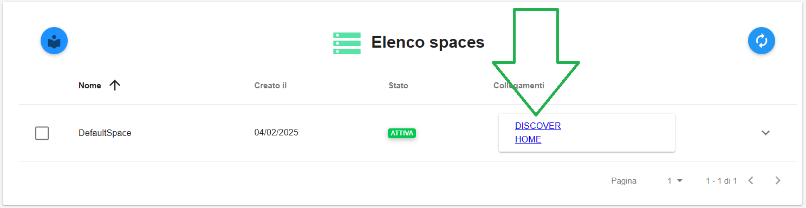
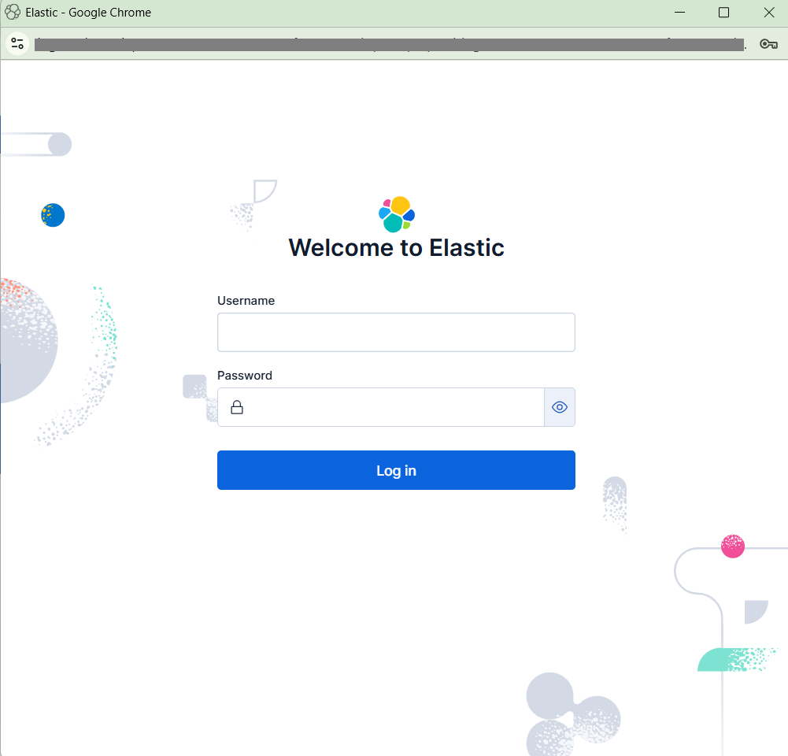

.. _Log_Management:

**Logging VM (master di account)**
**********************************

La gestione del **Logging** rende disponibile la funzionalità di gestione dei log delle Virtual Machine per mezzo del
Service Portal.

La funzione è attivabile dalla parte sinistra dello schermo dal menù **Strumenti**, cliccando sulla label **VM** sotto **Log Management**.

A seguito di un clic su **VM**, il sistema popolerà la parte destra del video con la **Lista VM abilitate al servizio di log** (se già presenti).

|

**Abilitare il Logging VM**
***************************

A seguito di un clic su **VM** (sotto **Strumenti -> Log Management**), il sistema popolerà la parte destra del video con la **Lista VM abilitate al servizio di log** 
(se già presenti).

       .. image:: img/11.30_ListaVM_LoggingDX.png

Per effettuare l'abilitazione procedere in questo modo:

        1.Fare clic sul pulsante **+**

        .. image:: img/Add_VM.png

|

        Nel caso non risultasero presenti Spaces Kibana attivi nell'account sarà impossibile proseguire, e sarà quindi necessario seguire le istruzioni riportate nel messaggio

        .. image:: img/11.30_Associa_Logging2.png

|

        2. Individuare la VM dall’elenco **Associa un nuovo servizio di log**, mettendo una spunta a fianco del nome

        .. image:: img/11.30_Associa_Logging.png

|

        3. Cliccare su pulsante **RICHIEDI L'ASSOCIAZIONE DEL SERVIZIO**

|

        4. All'interno della finestra **Conferma attivazione servizio** cliccare sul pulsante **CONFERMA**

        .. image:: img/11.30_Conferma_Servizio.png

|

        5. Appariranno i seguenti messaggi di conferma rispettivamente in alto a destra e in centro allo schermo

        .. image:: img/11.30_DX_LoggingOk.png

        .. image:: img/11.30_DX_LoggingCentro.png

|

        6. Cliccare sul tasto **CHIUDI**

|

        7. dopo alcuni secondi di attesa la VM comparirà in elenco con stato **ATTIVA**

        .. image:: img/11.30_LoggingOK.png

|

**Disabilitare il Logging VM**
******************************

Per disabiliare il **logging** della Virtual Machine, procedere come segue:

    1. Individuare la VM dalla **Lista VM abilitate al servizio di log**, mettendo una spunta a fianco del nome;

       .. image:: img/11.30_Disattiva_selezVMdx.png
    
    |

    2. Cliccare su pulsante in alto a destra **CANCELLA ISTANZA DI LOGGING**

        .. image:: img/Pulsante_cancella.png

    |

    3. All'interno della finestra **Conferma disattivazione servizio** cliccare sul pulsante **CONFERMA**

        .. image:: img/11.30_Disattiva_Servizio.png

    |

    4. Appariranno i seguenti messaggi di conferma rispettivamente in alto a destra e in centro allo schermo

        .. image:: img/11.30_DX_LoggingNO.png

        .. image:: img/11.30_DX_LoggingCentroNO.png

    |

    5. Cliccare sul tasto **CHIUDI**

    |

    6. la VM non comparirà più in elenco

        .. image:: img/11.30_LoggingNO.png

|

**Spaces**
**********

**LOGWATCH** rende disponibile un motore di ricerca utilizzato per l'analisi e ricerca dei dati di log.

La funzione è attivabile dalla parte sinistra dello schermo dal menù **Strumenti**, cliccando sulla label **Spaces** sotto **Log Management**.

A seguito di un clic su **Spaces**, il sistema popolerà la parte destra del video con l'**Elenco spaces** (se già presenti)

|

Selezionando uno space (utilizzando l'apposita casella alla sinistra del nome) è possibiile cliccare sull'icona in alto a destra 
(la cui descrizione passandoci sopra col mouse è "Sincronizzazione utenti") per effettuare la **Sincronizzazione**

(apparirà un ulteriore messaggio per confermare l'operazione richiesta)

Per accedere al portale **LOGWATCH**, occorre cliccare sulla relativa voce in blu **DISCOVER HOME**

si verrà automaticamente indirizzati alla relativa pagina di autenticazione

