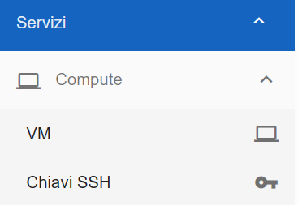
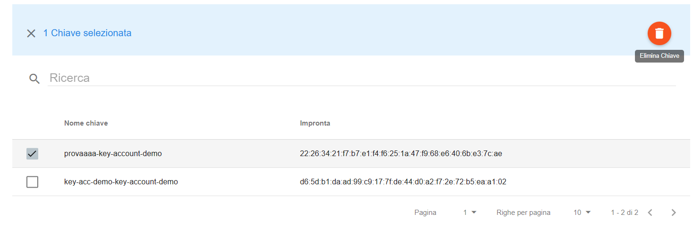
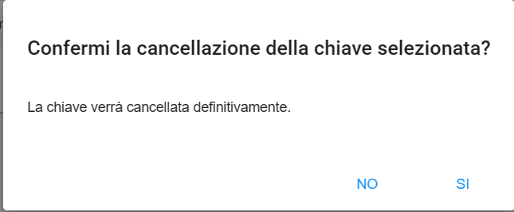

.. _Gestione_chiavi_ssh:

**Creare o Cancellare chiavi SSH**
**********************************
La funzione è raggiungibile da **Servizi** → **Compute** → **Chiavi SSH**

E' possibile creare **Chiavi SSH** attraverso 2 metodi [1]_ [2]_
ma per entrambi è necessario rispettare questi vincoli:

- Il **nome della chiave ssh** deve essre **univoco** in tutto il sistema

- Il **nome della chiave ssh** non può superare i 40 caratteri

- Nel **nome della chiave ssh** oltre le lettere e i numeri
  gli unici caratteri particolari ammessi sono **"_"** e **"-"**

|

.. [1]
**Creazione direttamente da Nivola**
====================================

Dalla schermata **Elenco Chiavi SSH**, premere tasto **+** in alto a destra

.. image:: img/Add_VM.png

Si apre una maschera di **Creazione nuova Chiave SSH** in cui inserire il **Nome** della nuova chiave e si visualizza 
il **nome completo** che il sistema assegna alla chiave

.. image:: img/Crea-keyssh-ex-1.png

Premere sul bottone **CREA CHIAVE** per confermarne la creazione. Verrà scaricato in automatico **il file .pem** della 
chiave e si visualizzerà nell’elenco delle chiavi SSH.

.. image:: img/Crea-keyssh-ex-novo2.png

|

.. [2]
**Creazione attraverso l'import**
=================================

Per **importare** una **chiave SSH** nel proprio account, seguire i seguenti passi:

Premere il pulsante in alto a destra

.. image:: img/Crea-ssh-da-lista.png

Inserire il **Nome della chiave** da importare e visualizzare il **Nome completo assegnato dal sistema**
Inserire la **parte pubblica** della chiave RSA seguendo le indicazioni fornite dal portale
Premere il bottone **IMPORTA** per concludere l’operazione

.. image:: img/Importa-key-ssh.png

|

**Cancellare Chiave SSH**
=========================

Per **cancellare** una **Chiave SSH**, procedere seguendo i passi:

Selezionarla dal checkbox laterale sinistro al campo **Nome chiave**
Premere il **cestino in alto a destra** che si visualizza post selezione chiave

Il sistema chiederà **conferma** della **cancellazione**

Premendo su **SI**, la chiave verrà **eliminata definitivamente** dal sistema
