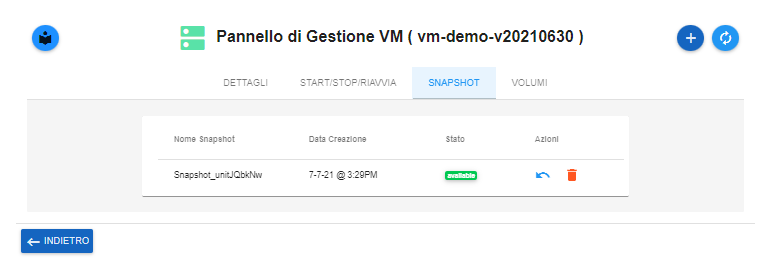

.. _Elenco_Snapshot:

**Elenco Snapshot**
===================
La funzione rientra nel **servizio compute**. La **Creazione Snapshot** è attivabile dalla parte
sinistra dello schermo, cliccando sulla label **VM** sotto **Compute**

.. image:: img/VM_innesco_crea.png

A seguito di un clic su **VM**, il sistema popolerà la
parte destra del video con l'**Elenco delle VM**.
Per la vedere l'elenco degli **snapshot**, procedere in questo modo:

1. Individuare il sever dall’**Elenco VM**, mettendo una spunta a fianco del nome;

.. image:: img/Ricerca_VM_a.png
    
2. Usare il bottone **Pannello gestione VM**;

.. image:: img/Pulsante_dettagli.png

3. Optare per il tabstrip **"SNAPSHOT"**;
    
.. image:: img/VM_Pannello_dettagli.png

4. Il sistema metterà a disposizione l'elenco delle **"SNAPSHOT"** a disposizione;

