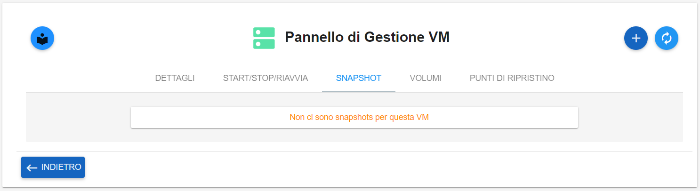
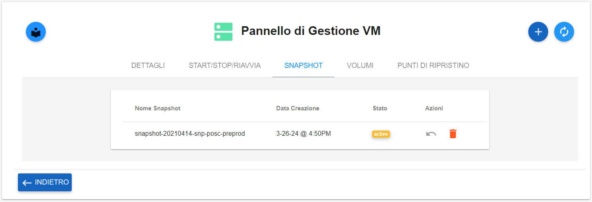

**Creare Snapshot**
===================

La funzione rientra nel menù **Servizi**. La creazione Snapshot è attivabile dalla parte 
sinistra dello schermo, all'interno dei menù facenti parte di **VM** sotto **Compute**

.. image:: img/VM_innesco_crea.png

|    

A seguito di un clic su **VM**, il sistema popolerà la
parte destra del video con l'**Elenco delle VM**.
Per la creazione dello **snapshot**, procedere in questo modo:

|

1. Selezionare la VM

.. image:: img/Snap_elenco_vm.png

|

2. Fare clic sul pulsante **Pannello gestione VM**

.. image:: img/Pulsante_dettagli.png

|

3. Dal **Pannello di Gestione VM**, selezionare il tab **SNAPSHOT**:

|

4. Premere il tasto **+**:

.. image:: img/Add_VM.png

|

5. Scrivere il nome dell'oggetto e cliccare su  **CREA SNAPSHOT**:

.. image:: img/Snap_Indica_nome.png

|

6. Dopo che il sistema avrà segnalato la creazione, proseguire utilizzando il pulsante  **Refresh**:

.. image:: img/Pulsante_refresh.png 

|

7. La snapshot creata apparirà nell'elenco:

