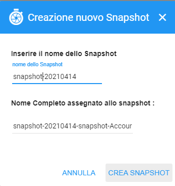

.. _Creare_Snapshot:

**Creare Snapshot**
===================
La funzione rientra nel **servizio compute**. La **Creazione Snapshot** è attivabile dalla parte
sinistra dello schermo, cliccando sulla label **VM** sotto **Compute**

.. image:: img/VM_innesco_crea.png

A seguito di un clic su **VM**, il sistema popolerà la
parte destra del video con l'**Elenco delle VM**.
Per la creazione dello **snapshot**, procedere in questo modo:

1. Selezionare la VM

.. image:: img/Snap_elenco_vm.png

2. Fare clic sul pulsante:

.. image:: img/Pulsante_dettaglio.png

3. Dal pannello di Gestione VM, selezionare la voce **SNAPSHOT**:

.. image:: img/Snap_gestione.png

4. Premere il tasto **+**:

.. image:: img/Add_VM.png

5. Scrivere il nome dell'oggetto e cliccare su  **CREA SNAPSHOT**:

6. Dopo che il sistema avrà segnalato la creazione, proseguire utilizzando il pulsante  **Refresh**:

.. image:: img/Pulsante_refresh.png 

7. La snapshot, creata, apparirà nell'elenco.

.. image:: img/Snap_elenco_create.png 

