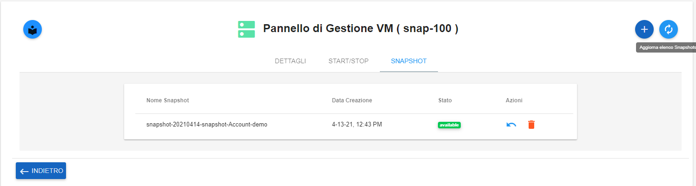

.. _Modificare_Snapshot:

**Modificare Snapshot**
===================
La funzione rientra nel **servizio compute**. La **Creazione Snapshot** è attivabile dalla parte
sinistra dello schermo, cliccando sulla label **VM** sotto **Compute**

.. image:: img/VM_innesco_crea.png

A seguito di un clic su **VM**, il sistema popolerà la
parte destra del video con l'**Elenco delle VM**.
Per la creazione dello **snapshot**, procedere in questo modo:

1. Selezionare la VM

.. image:: img/Snap_elenco_vm.png

2. Fare clic sul pulsante:

.. image:: img/VM_Pannello_controllo.png

3. Dal pannello di Gestione VM, selezionare la voce **SNAPSHOT**:

.. image:: img/Snap_gestione.png

4. Premer il tasto **+**:

.. image:: img/Add_VM.png

5. Scrivere il nome dell'oggetto e premere  **CREA SNAPSHOT**:

.. image:: img/Add_VM.png

6. Il sistema segnalerà la creazione, premendo il pulsante  **Refresh**:

7. La snapshot creata, apparirà nell'elenco

