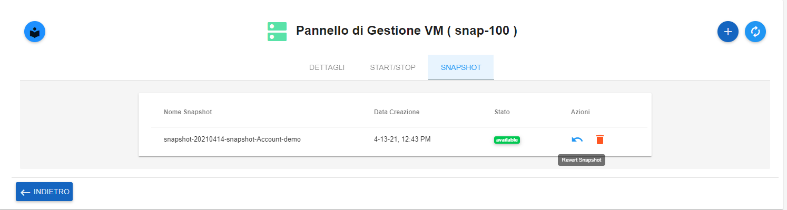
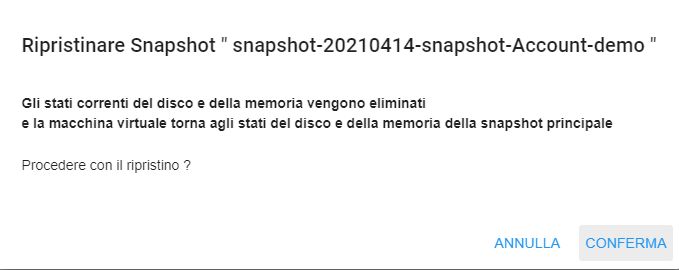

.. _Modificare_Snapshot:

**Modificare Snapshot**
=======================
La funzione rientra nel **servizio compute**. La **modifica Snapshot** è attivabile dalla parte
sinistra dello schermo, cliccando sulla label **VM** sotto **Compute**

.. image:: img/VM_innesco_crea.png

A seguito di un clic su **VM**, il sistema popolerà la
parte destra del video con l'**Elenco delle VM**.
Per modificare lo **snapshot**, procedere in questo modo:

1. Selezionare la VM

.. image:: img/Snap_elenco_vm.png

2. Fare clic sul pulsante:

.. image:: img/VM_Pannello_controllo.png

3. Dal pannello di Gestione VM, selezionare la voce **SNAPSHOT**:

.. image:: img/Snap_gestione.png

4. Premere il tasto **revert snapshot**:

7. L'operazione ripristino avverrà, premendo il tasto **CONFERMA**:

