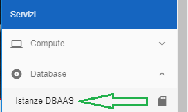

**Lavorare con il Database as a Service**
*****************************************

I **Database as a Service** sono servizi gestiti, costituiti da ambienti virtuali
dedicati  in differenti configurazioni e tecnologie, con differenti livelli di
affidabilità e ridondanza in funzione delle esigenze del Cliente.

|

.. toctree::
   :maxdepth: 2
 
   14.1_Creare_DBAAS.rst
   14.2_Gestire_DBAAS.rst
   14.3_Cancellare_DBAAS.rst
   14.4_Visualizzare_Backup_DBAAS.rst
   14.5_Accedere_DBAAS.rst
