.. _Creare_DBAAS:

**Creare istanze Database as a Service**
****************************************

La funzione rientra nel menù **Servizi**. La **creazione di Istanze DBAAS** è attivabile dalla parte
sinistra dello schermo, cliccando sulla label **Istanze DBAAS** sotto **Database**

.. image:: img/DBAAS_innesco.png

|

A seguito di un clic su **Istanze DBaaS** il sistema popolerà la
parte destra del video con l'**Elenco Dbaas**

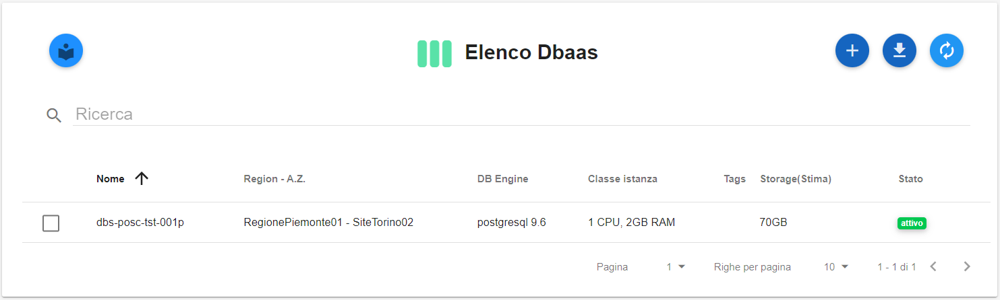

|

Per creare una **Istanza DBaaS** procedere seguendo i passaggi elencati:

1. Fare clic sul pulsante **+**:

.. image:: img/Add_VM.png

|

2. Selezionare l’engine tra le opzioni proposte dal portale e un codice progressivo di tre cifre nel formato 
“001, 002, …”. Il portale compilerà in automatico il campo dedicato al **nome dell’istanza** in modo da evitare duplicati. 
Al termine cliccare sul pulsante **AVANTI**

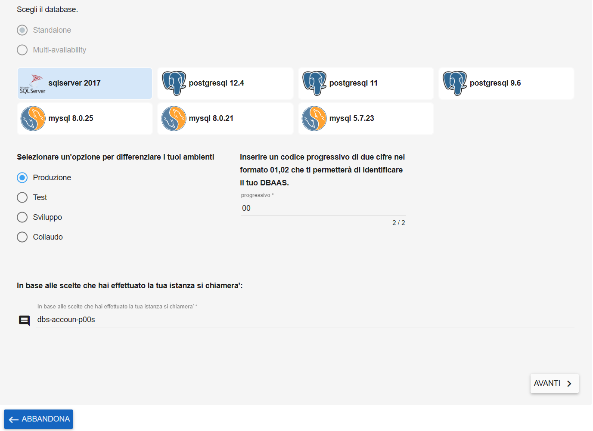

|

3. Nel caso che una distribuzione software sia disponibile su entrambi gli hypervisor (vsphere e openstack) compariranno due icone con lo stesso nome:
passandoci sopra col mouse sarà possibile ottenere l'informazione relativa all'hypervisor

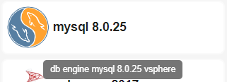

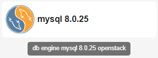

|

4. Scegliere la dimensione delle risorse da assegnare all'istanza di DBaaS
mettendo un flag nella *check box* relativa ed infine
cliccare sul pulsante **AVANTI**

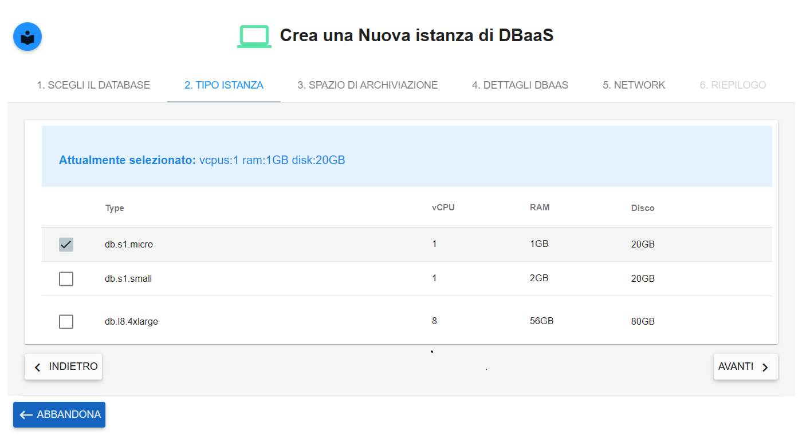

|

5. Nella sezione **SPAZIO DI ARCHIVIAZIONE**,
indicare la **dimensione** selezionandolo da uno dei valori proposti
nella combo box

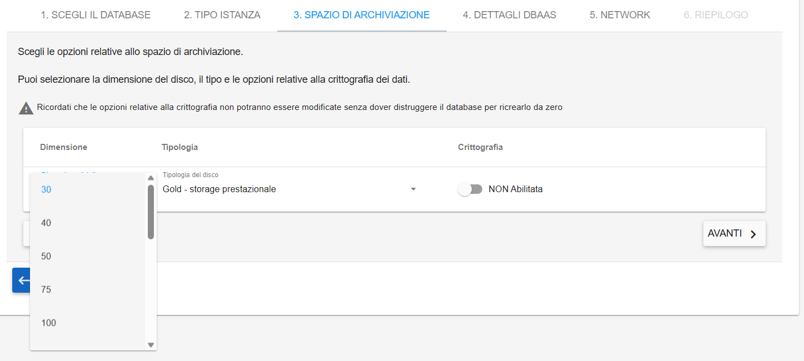

|

6. Nella stessa sezione, attraverso la combo box,
precisare la **tipologia** dello spazio di archviazione
e cliccare sul pulsante **AVANTI**

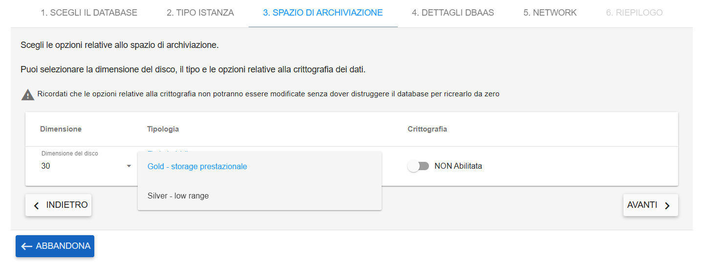

|

7. utilizzare il flag sotto la label **Crittografia** nel caso occorra abilitare la crittografia del Dbaas
(nella mail che viene inviata automaticamente al Supporto Nivola è presente l'informazione relativa all'eventuale richiesta 
di crittografia, in quanto tale configurazione verrà effettuata in un secondo momento).
Al termine cliccare sul pulsante **AVANTI**

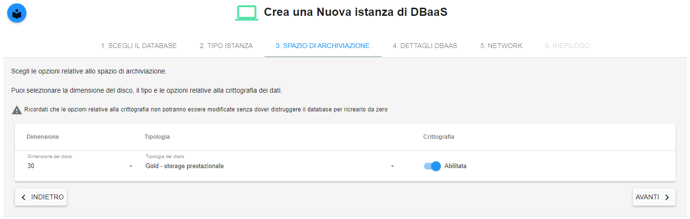

|

8. Assegnare al sistema la **porta di ascolto** convalidando il valore di default. 
Al termine cliccare sul pulsante **AVANTI**

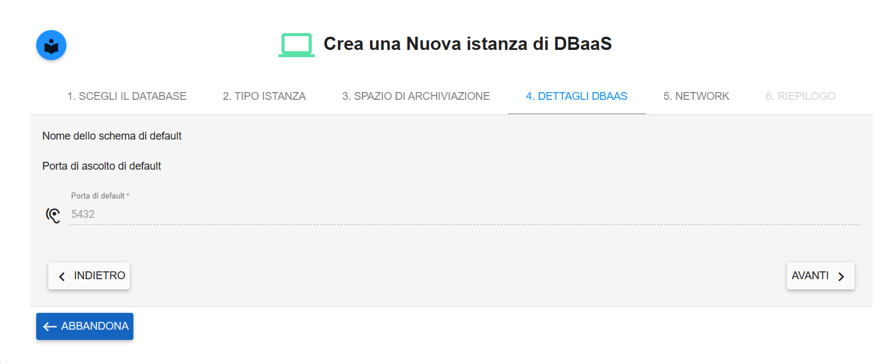

|

9. Attraverso le combo box, presenti nella pagina, specificare:
**Region, Availability Zone, Subnet e Gruppo di sicurezza**.
Al termine cliccare sul pulsante **AVANTI**

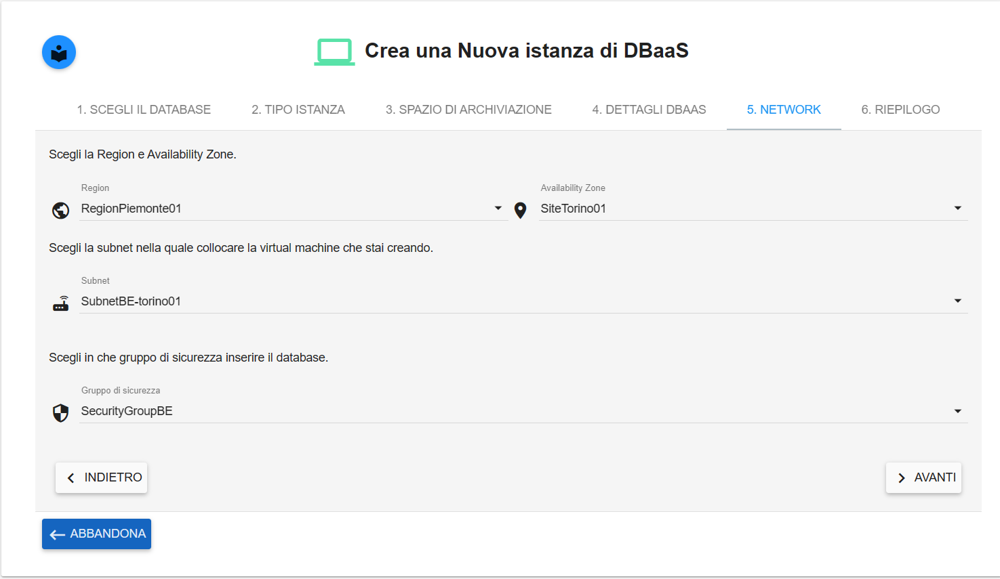

|

10. Nel caso in cui il database sia di tipo **Postgres** oppure **Oracle** comparirà il seguente tab aggiuntivo di configurazione da compilare:

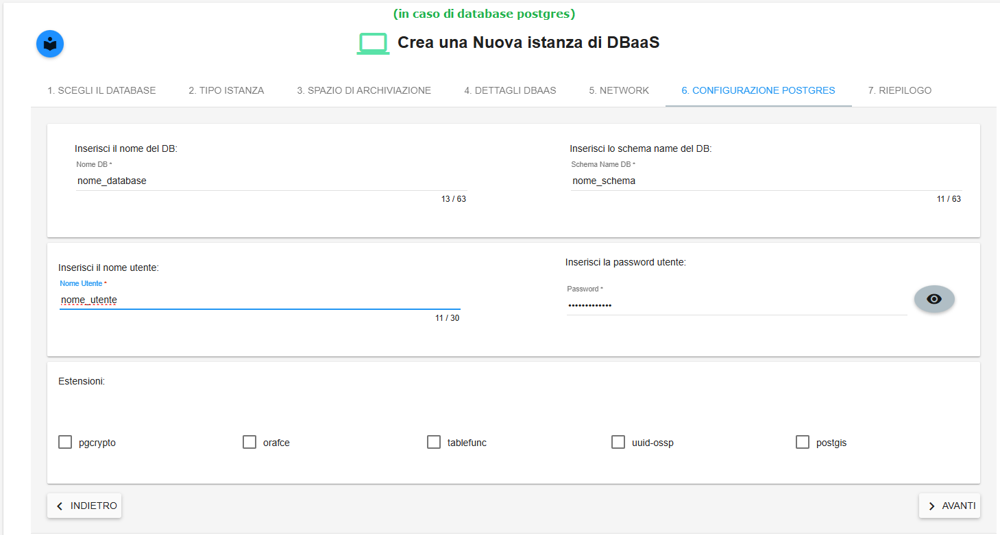

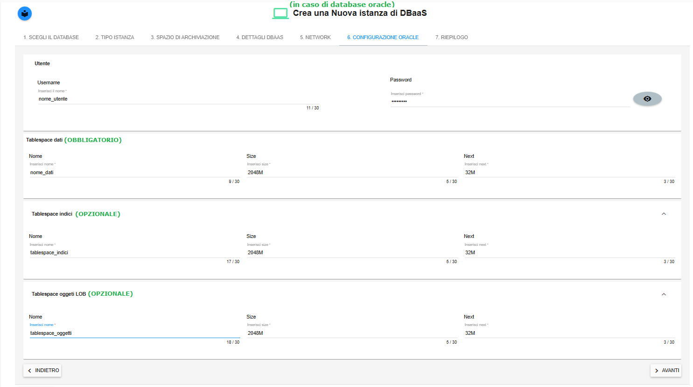

|

11. Nella schermata del Riepilogo, dopo aver controllato i parametri inseriti nel processo 
di creazione, cliccare su **CONFERMA E CREA L’ISTANZA** per materializzare virtualmente la nuova istanza.

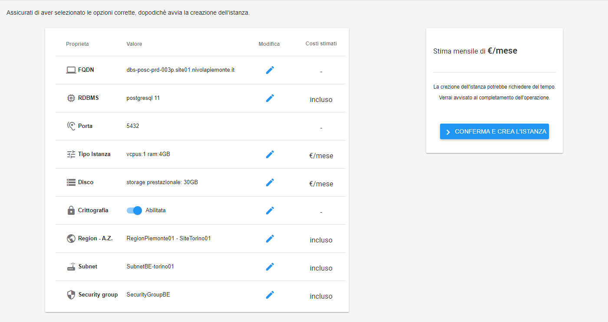
