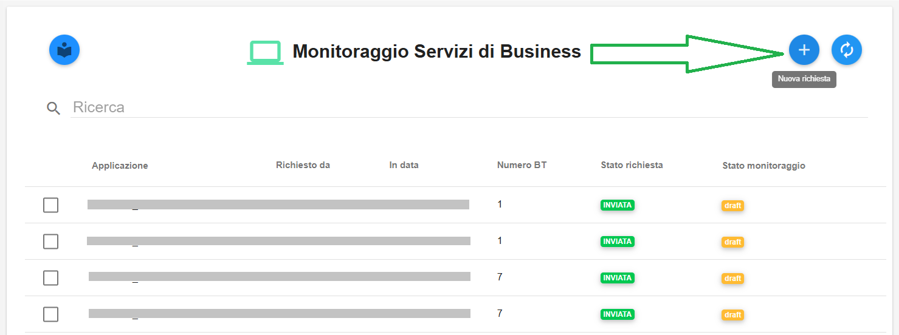
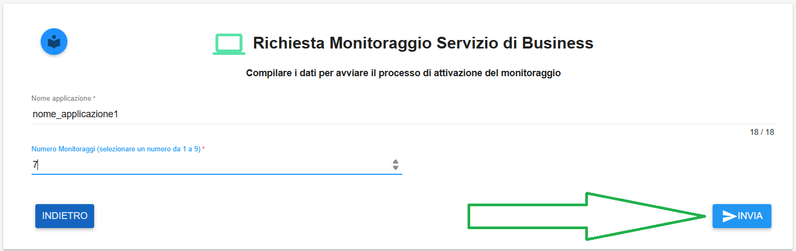
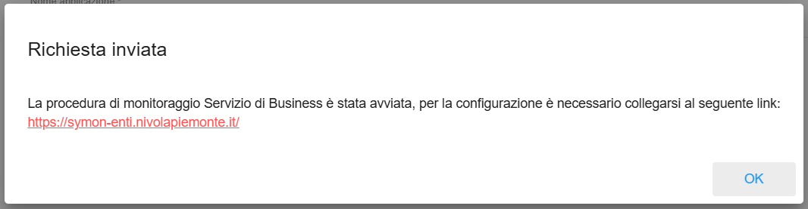
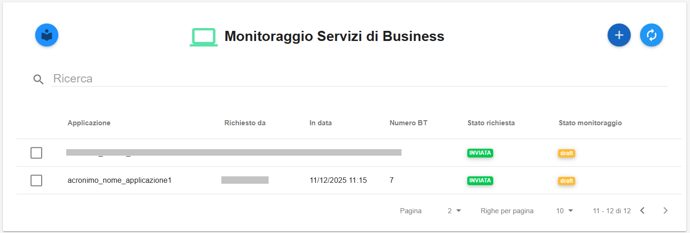

**Creazione Monitoraggio di Business Transactions**
***************************************************

La funzione rientra nel menù **Strumenti**. IL Monitoraggio di Business Transactions è attivabile dalla parte
sinistra dello schermo, cliccando sulla label **Servizi di Business** sotto la label **Monitoraggio**.

.. image:: img/14.5_MonBussTrans1.png

|

Cliccare sul simbolo in alto a destra a forma di **+** la cui descrizione passandoci sopra col mouse è **Nuova richiesta**:

|

Si accede alla pagina **Richiesta Monitoraggio Servizio di Business**:

.. image:: img/14.5_MonBussTrans4.png

|

Una volta compilati i campi richiesti, cliccare sul tasto **INVIA** in basso a destra:

|    

Comparirà la seguente schermata di conferma, comprensiva del link di accesso al sistema **SyMon**:

|   

Dopo aver cliccato sul tasto **OK** in basso a destra, comparirà il seguente messaggio di conferma:

|    

La richiesta apparirà in elenco:

