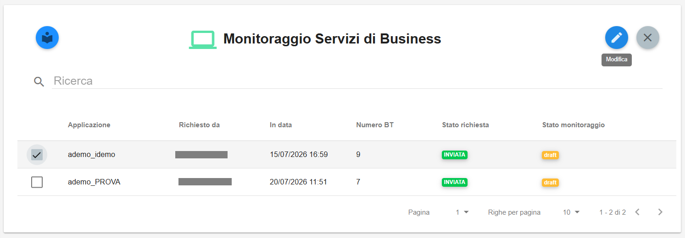
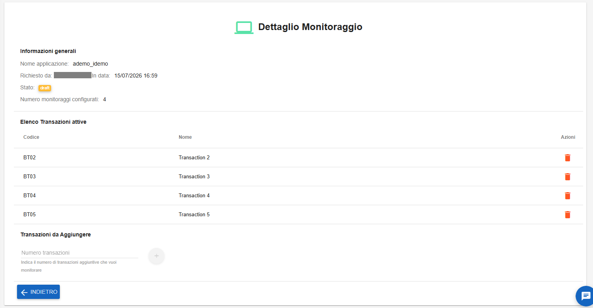
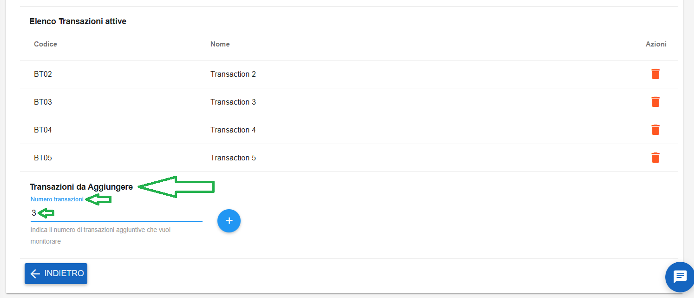
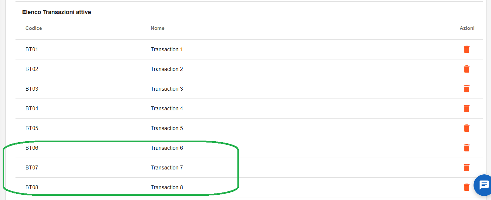
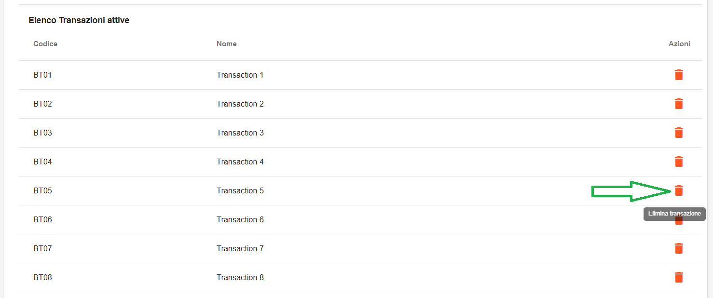
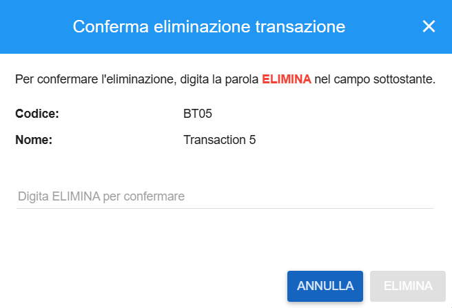
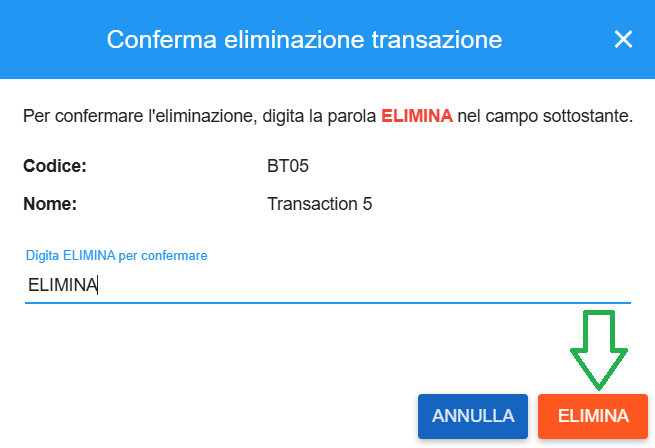

**Modificare un Monitoraggio Servizi di Business**
==================================================

Per modificare un Monitoraggio Servizi di Business occorre cliccare sul pulsante a in alto a destra a forma di matita, 
la cui descrizione passandoci sopra col mouse è **Modifica**:

|

Si accederà alla pagina **Dettaglio Monitoraggio**, da cui è possibile effettuare le modifiche richieste:

|

|

**Aggiunta transazione**
========================

Andare in fondo alla pagina alla voce **Transazioni da Aggiungere**. In **Numero transazioni** inserire il valore numerico desiderato:

|

Quindi premere sul tasto "+". Comparirà il seguente messaggio di conferma:

|

Le transazioni inserite compariranno in elenco:

|

**Cancellazione transazione**
=============================

Andare nell'Elenco Transazioni attive, individuare la transazione da cancellare e cliccare sul simbolo del cestino arancione, 
la cui descrizione passandoci sopra col mouse è **Elimina transazione**:

|

Comparirà questa schermata intermedia, in cui è necessario scrivere "ELIMINA" per poter per attivare l'omomimo tasto:

|    

Cliccando su Elimina, comparirà il seguente messaggio di conferma:

